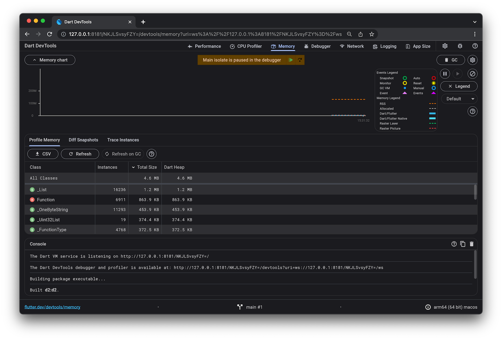

https://www.ambitionbox.com/profiles/flutter-developer/interview-questions

https://medium.com/@kalidoss.shanmugam/flutter-interview-questions-and-answers-for-experienced-developers-171a7cbbfef5

flutter architecture interview questions

https://github.com/thisissandipp/flutter-interview-questions (Great questinons included).

https://www.interviewbit.com/flutter-interview-questions/

https://www.wecreateproblems.com/interview-questions/flutter-interview-questions#heading-2 (Great
questinons included).

https://www.turing.com/interview-questions/flutter

https://devharshmittal.medium.com/flutter-interview-questions-2025-from-zero-to-hero-part-1-the-foundations-c934a46785d0

https://devharshmittal.medium.com/flutter-interview-questions-2025-from-zero-to-hero-part-2-the-core-skills-8e8ee6d8787a

https://devharshmittal.medium.com/building-a-scalable-design-system-in-flutter-part-3-265d2f97909a

https://devharshmittal.medium.com/flutter-interview-questions-2025-part-3-the-pro-level-364f5fc54ee7

https://www.linkedin.com/posts/gauhun_flutter-interview-question-activity-7334813458800005120-JQOn

https://webandcrafts.com/interview-questions/flutter

https://github.com/justsandip/flutter-interview-questions

https://github.com/Devinterview-io/flutter-interview-questions

https://shirsh94.medium.com/top-100-flutter-interview-questions-and-answers-2026-775b5fb5e4dc

Flutter Interview Guide 2026
https://github.com/debasmitasarkar/flutter_interview_guide_2026

https://github.com/Nada-gaber/flutter_interview_questions

https://www.linkedin.com/pulse/top-flutter-interview-questions-andanswers-anand-gaur-air5c

# Flutter FAQ : https://docs.flutter.dev/resources/faq (check questions and answers)

Here is the list of questions from the document, formatted as requested.

## Please give a brief introduction about your technical experience & projects.

## What are the different launch modes in Android?

Android provides different launch modes to control how activities are created and managed in the
back stack:

- **standard** – Default mode. A new instance of the activity is created every time it is launched.
- **singleTop** – If an instance of the activity is already at the top of the stack, no new instance
  is created; otherwise, a new one is created.
- **singleTask** – Only one instance of the activity exists in the system. If it exists, it is
  brought to the front, and all activities above it are cleared.
- **singleInstance** – The activity is launched in its own separate task. No other activities can be
  part of this task.
- **singleInstancePerTask** – Similar to `singleInstance`, but allows multiple instances across
  different tasks while ensuring only one per task.

## What is ProGuard, and why is it used?

ProGuard is an Android tool that **shrinks, optimizes, and obfuscates code** to reduce APK size,
improve performance, and make reverse engineering harder.

## How would you design a booking service system and manage slot selection in Flutter?

I would design the booking system with a backend that manages slot availability and validates
bookings using transactions to prevent double-booking. In Flutter, I would:

- Fetch available slots from the backend.
- Display slots in a selectable UI (chips/grid).
- Manage selection using state management (Provider, Bloc, or Riverpod).
- Confirm booking by calling an API, letting the backend re-verify the slot to ensure accuracy and
  prevent conflicts.

## How do you securely store and retrieve a user's private key in a Flutter wallet app?

Store the private key using **platform-secure storage** (`flutter_secure_storage`), which relies on
Android Keystore and iOS Keychain. Encrypt the key at rest, decrypt it only in memory when needed,
protect access with biometrics, avoid logging, and clear it from memory immediately after use. *
*Never store private keys in SharedPreferences or local storage.**

## How to keep a wallet app secure against attacks?

To secure a wallet app:

- Store private keys in device secure hardware (Keystore/Keychain).
- Protect the app with PIN or biometrics.
- Encrypt all sensitive data and use HTTPS/TLS for network calls.
- Block rooted/jailbroken devices and prevent screenshots.
- Implement 2FA and rate limits, and monitor suspicious transactions.
- Never store private keys in SharedPreferences; use secure storage.

## What are the advantages of using Firebase Realtime Database?

- **Real-time sync:** Data updates are synchronized across all connected devices instantly.
- **Offline capabilities:** Data is cached locally for offline access.
- **Automatic scaling:** Handles large datasets without manual server management.
- **NoSQL database:** Uses JSON-based key-value storage for fast and flexible access.

## How do you handle real-time data updates in Flutter?

- **Streams & StreamBuilder:** Listen to real-time changes asynchronously.
- **WebSockets:** Establish persistent connections for real-time communication.
- **Firebase Firestore:** Provides real-time updates via snapshots.
- **State management (Provider, Riverpod, Bloc):** Efficiently manage and update UI with real-time
  data.

## What are the limitations of Firebase Realtime Database?

- **Limited queries:** Supports only simple key-value lookups.
- **Scalability issues:** Can become slow with a large number of concurrent users.
- **Data structure sensitivity:** Poor structuring can impact performance.
- **No built-in analytics:** Lacks detailed analytics tools compared to Firestore.

## What is the difference between Firebase Realtime Database and Firestore for real-time data in Flutter?


## If your Flutter app is crashing only in release mode, how do you debug it?

- Run `flutter run --release` and check device logs via `adb logcat`.
- Android: Use the Android Studio Logcat or the command line adb logcat to catch native-level
  crashes.
- iOS: Use the Xcode Device Console to view system logs for your connected iPhone.
- Ensure no `assert` statements or debug-only code is being used.
- Use crash reporting tools like **Sentry** or **Firebase Crashlytics** to capture release crashes.

## How would you optimise a list of 10,000+ items in a Flutter app?

- Use `ListView.builder` with `itemCount` for lazy loading.
- Use `const` widgets to avoid unnecessary rebuilds.
- Implement `AutomaticKeepAliveClientMixin` if list items maintain state.
- Consider pagination: Do not fetch all 10,000 items from your backend at once. Use a package like
  infinite_scroll_pagination to load data in smaller chunks (e.g., 20–50 items) as the user reaches
  the bottom of the list. to reduce memory usage.

## Explain how isolate works in Flutter and when you would use it.

- **Isolates** provide multithreading in Flutter; they do not share memory.
- **Use cases:** Heavy computations like parsing large files, encryption, or image processing.
- Use `compute()` for simple one-off tasks and `Isolate.spawn` for complex or long-lived tasks.

## What is your approach to testing a Flutter application?

- **Unit tests:** For business logic and pure functions.
- **Widget tests:** For UI and interaction using `WidgetTester`.
- **Integration tests:** End-to-end flows with `integration_test` or `flutter_driver`.
- **Mocks:** Use `mockito` or `mocktail` for dependencies.
- **CI automation:** Run tests via GitHub Actions, Bitrise, or other CI tools.

## What are some performance optimization techniques you've applied in production apps?

- Use `const` widgets to reduce rebuilds.
- Avoid rebuilding large widget trees (use `shouldRebuild`, `Selector`, etc.).
- Lazy Loading Lists: For large datasets, use ListView.builder or GridView.builder to ensure only
  visible items are built. or use pagination
- Cache images using `cached_network_image`.
- Compress images and limit FPS in animations.
- Use `RepaintBoundary` to isolate heavy rendering areas.

## How would you architect a Flutter app with multiple modules or teams working on it?

- Use a **feature-based folder structure** (e.g., `features/user`, `features/dashboard`).
- Apply **clean architecture** with proper separation of data, domain, and presentation layers.
- Use **internal packages** or a **monorepo** (`packages/feature_x`) for modularization.
- Keep shared components in a **core module** or shared library.

## How do you handle background tasks and notifications on Android?

- Use **WorkManager**, **Foreground Services**, or **AlarmManager** for scheduled/background tasks.
- Example: Schedule recurring tasks like pill reminders with WorkManager, respecting exact time and
  battery optimization constraints.

## How do you reduce APK or IPA size?

- Remove unused assets and fonts.
- If you must distribute APKs directly, use the split flag to create separate files for each CPU
  architecture (e.g., ARM, ARM64). Use `flutter build apk --split-per-abi`.
- Enable ProGuard/R8: In android/app/build.gradle, set minifyEnabled and shrinkResources to true to
  remove unused native code and resources.
- Compress images (e.g., TinyPNG).
- Tree Shaking: Use the --tree-shake-icons flag during release builds to strip out unused icons from
  icon fonts like Material Icons.
- Use deferred components or code-splitting where supported.
- Avoid large third-party libraries unless necessary.

## Describe your process when upgrading a Flutter project to a new version.

- Backup and Branching: Always commit your current code and create a new Git branch before starting
  to allow for easy reversal if the upgrade fails.
- Execute `flutter upgrade` in your terminal to fetch the latest stable release of the Flutter and
  Dart SDKs.
- Check `pubspec.yaml` for outdated packages.
- Identify Outdated Packages: Run `flutter pub outdated` to see which dependencies have newer
  versions and identify potential breaking changes.
- Run the app and resolve breaking changes.
- Follow Flutter migration guides for major updates.

## What is the use of const in Flutter widgets?

Using `const` makes widgets **immutable**, reduces unnecessary rebuilds, and improves performance by
reusing the same widget instance.

## What is the purpose of mainAxisAlignment and crossAxisAlignment?

Used to **align children** inside `Row` and `Column` widgets along the main and cross axes.

## What is the WillPopScope widget used for?

- The `WillPopScope` widget in Flutter is used to handle the system back button or back gesture,
  allowing you to decide whether the screen should be popped.

## Material vs Cupertino Widget

- **Material widgets:** Follow Android’s design guidelines.
- **Cupertino widgets:** Provide iOS-style UI components.
- Use **Material** for Android look and **Cupertino** for iOS look.

## What are custom widgets in Flutter, and why are they important?

Custom widgets are **user-defined widgets** that encapsulate UI components for **reusability and
maintainability**.  
Benefits:

- Reduce code duplication
- Improve readability
- Enhance modularity
- Simplify complex UI

They can be `StatelessWidget` or `StatefulWidget` depending on state management needs.

## What is the difference between GetBuilder, Obx, and GetX in GetX?

- **GetBuilder:** use GetBuilder when you want to update the state of a widget manually from your
  controller, with update(),
- **Obx:** Obx stands for Observer Widget. It automatically updates the UI when an Rx (observable)
  variable changes.no need to call update() manually.
- **GetX:** GetX is similar to Obx but provides more structure and additional features, like
  initializing and managing the controller within the widget.Use GetX when you need reactive state
  management along with dependency handling in a more organized way.

## How do you pass arguments between screens in GetX?

- Get.to(NextScreen(), arguments: "Hello GetX"); var data = Get.arguments

## What are Bindings in GetX?

- Bindings help manage dependencies automatically when a screen is opened. They allow you to
  initialize and inject controllers or services at the right time, without manually creating them
  inside your UI.

## What are the core components of the Bloc architecture?

- **Bloc / Cubit:**  
  Handles the **business logic** and manages state.
    - `Bloc` uses **events** to trigger state changes.
    - `Cubit` is a simpler version that updates state directly without events.

- **Events (Bloc only):**  
  Represent **user actions or triggers** (e.g., button clicks) that cause state changes.

- **States:**  
  Represent the **different UI states** emitted by the Bloc or Cubit (e.g., loading, success,
  error).

- **BlocProvider:**  
  Provides the Bloc or Cubit instance to the widget tree, making it accessible to child widgets.

- **BlocBuilder:**  
  Rebuilds the UI in response to **new states**.

- **BlocListener:**  
  Listens to state changes and is used for **side effects** (e.g., navigation, showing dialogs)
  without rebuilding the UI.

## How do you integrate Stripe in a Flutter app?

You can integrate Stripe in a Flutter app in two main ways:

- **Using Stripe Flutter SDK (Native Integration):**  
  Use the official Stripe Flutter SDK to build **native payment flows**.
    - Provides better UI/UX
    - Gives more control over the payment process
    - Supports features like Apple Pay / Google Pay

- **Using Web (Stripe Checkout / WebView):**  
  Redirect users to a **Stripe-hosted payment page** or open it in a WebView.
    - Easier to implement
    - Fully **PCI-compliant** (Stripe handles sensitive data)
    - Less customization compared to SDK

---

## What is a PaymentIntent in Stripe?

- A **PaymentIntent** represents a payment that a customer intends to make.
- It manages the **entire payment lifecycle**, including authentication, processing, and
  confirmation.

#### Key Points:

- Created on the **server-side** for security
- The client receives a **`client_secret`** to complete the payment
- Supports **SCA (Strong Customer Authentication)**
- Tracks payment status (e.g., requires_payment_method, succeeded, failed)

## Have you used social login? If yes, how to apply social logins?

- **Yes**, social login can be implemented using platform-specific SDKs such as:
    - Google Sign-In
    - Apple Sign-In
    - Facebook Login

- The general flow:
    - Use platform SDKs to authenticate the user
    - Obtain an **authentication token**
    - Send the token to **Firebase or your backend** for verification

- In Flutter:
    - Packages like `google_sign_in` and `sign_in_with_apple` handle the login flow
    - They return user credentials after successful authentication

---

## Important steps for Firebase Authentication

- Enable required **login providers** in the Firebase Console
- Add **Firebase configuration** to your Flutter app
- Install the `firebase_auth` package
- Initialize Firebase in your app
- Implement **login and signup methods**
- Handle **authentication errors** properly
- Listen to **auth state changes** (e.g., user logged in/out)
- Secure backend access using **Firebase Security Rules**

---

## Common issues faced while implementing social login in Flutter

- Invalid **SHA-1** or **SHA-256** keys (especially for Google Sign-In)
- Incorrect **Facebook app configuration**
- Platform-specific setup issues:
    - Missing entries in `Info.plist` (iOS)
    - Missing configuration in `AndroidManifest.xml` (Android)
- Expired or invalid **OAuth tokens**
- Not handling cases where users **deny permissions**

---

## What permissions are required for location services in Flutter?

**Android permissions:**

```xml

<uses-permission android:name="android.permission.ACCESS_FINE_LOCATION" /><uses-permission
android:name="android.permission.ACCESS_COARSE_LOCATION" /><uses-permission
android:name="android.permission.FOREGROUND_SERVICE" /><uses-permission
android:name="android.permission.ACCESS_BACKGROUND_LOCATION" />
```

**iOS permissions (Info.plist):**

```xml

<key>NSLocationWhenInUseUsageDescription</key><string>We need your location to show nearby places.
</string><key>NSLocationAlwaysUsageDescription</key><string>We need your location to provide
accurate results.
</string>
```

## How do you track the user's live location in Flutter?

Use the **Geolocator** package to get a stream of location updates:

```dart
StreamSubscription<Position>? positionStream;

void startLocationTracking() {
  positionStream = Geolocator.getPositionStream(
    locationSettings: LocationSettings(accuracy: LocationAccuracy.high),
  ).listen((Position position) {
    print("Live Location: ${position.latitude}, ${position.longitude}");
  });
}

void stopLocationTracking() {
  positionStream?.cancel();
}
```

## How do you calculate the distance between two locations in Flutter?

Use the **Geolocator.distanceBetween()** method:

```dart

double distanceInMeters = Geolocator.distanceBetween(
    startLatitude, startLongitude,
    endLatitude, endLongitude
);
```

## Have you worked on an iOS app? Permissions, certificates & profiles?

- Permissions are added in **Info.plist** (camera, location, etc.)

- For app signing:
    - Create **certificate** and **provisioning profile** in Apple Developer Portal

- **Certificate:** Signs the app
- **Provisioning profile:** Links app ID, certificate, and allowed devices

---

## What happens if you call setState() inside build()?

- Causes an **infinite loop** (build → setState → build...)
- Avoid it by updating state in:
    - Callbacks (e.g., button click)
    - Async widgets like **FutureBuilder**

## What is the difference between setState(), Provider, and Bloc for state management in Flutter?

* **setState():** Manages local widget state; triggers rebuilds but doesn’t persist state across
  widget recreation.
* **Provider:** Simple, scalable solution for app-wide state using dependency injection.
* **Bloc (Business Logic Component):** Uses streams to handle state changes reactively; ideal for
  complex applications with structured state management.

## What are Flutter's best practices for writing clean and maintainable code?

* Follow **MVVM** or **Clean Architecture** for separation of concerns.
* Use **Dart linting** for consistent code standards.
* Write **reusable widgets** to avoid duplication.
* Implement **dependency injection** with `get_it` or `riverpod`.
* Use **async/await** properly for asynchronous operations.
* Keep widgets **small and modular** for better readability.

## Which are the most popular apps that use Flutter?

* NotebookLM · Google Pay · Google Earth · Google Ads · Google Classroom · YouTube Create · Google
  Cloud · Google One

## What is an AspectRatio widget used for?

* The **AspectRatio widget** in Flutter is a powerful tool that allows us to control the **aspect
  ratio** of a child widget.
* It's particularly useful for maintaining a **width-to-height ratio**, ensuring consistent
  proportions across different screen sizes and orientations.
* Example: For a square widget:

```dart
AspectRatio
(
aspectRatio: 1.0,
child: Container(color: Colors.
blue
)
,
)
```

## How do you handle platform-specific code in Flutter?

* Use **Platform Channels** to communicate between Flutter and native Android (Kotlin/Java) or iOS (
  Swift/Obj-C) code for accessing device-specific features.
* **MethodChannel:** For one-time method calls, e.g., fetching current battery level or device name.
* **EventChannel:** For continuous data streams, e.g., sensor data, location updates.

## Explain the difference between BlocBuilder and BlocConsumer.

- BlocBuilder handles building widgets based on state changes and is used for UI rendering.
  BlocConsumer is a combination of a BlocBuilder and a BlocListener, allowing it to both build
  widgets and execute side effects (like showing a Snackbar or navigation) based on state changes.

## Which widget allows us to refresh the screen?

- The RefreshIndicator Widget enables us to refresh the screen. When the user pulls down on the
  widget, the onRefresh callback is triggered, which typically involves fetching new data from a
  server or updating the UI somehow

## How do you upload a **1GB+ video** without blocking the UI?

-
    - Use `Isolate` for background processing.
- Implement **chunked uploading** with `dio` or `http`.
- Store the temporary file in the cache (`path_provider`).
- Use Firebase Storage, AWS S3, or Cloudflare R2 for resumable uploads.

## How do you handle **multiple large image uploads** in Flutter?

- Use `flutter_image_compress` to reduce size.
- Batch process images in `compute()` to avoid UI freeze.
- Optimize network calls with `dio` using parallel requests (`Future.wait`).

## What is the difference between **obfuscation and encryption** in Flutter?

- **Obfuscation** scrambles method/class names to prevent reverse engineering.
- **Encryption** protects data at runtime using AES/RSA algorithms

## what is the difference between listview builder widgets and SliverList.builder? (check on google again)

- ListView.builder: A high-level, standalone widget for displaying a scrollable list. Efficient for
  large lists — it builds items on demand (lazy loading). Handles its own scrolling, viewport, and
  padding. More limited in customization: doesn’t easily support advanced scroll effects (like
  collapsing app bars).
- sliverlist builder: A low-level sliver, meaning it’s a piece of a scrollable area — not a full
  widget on its own. Must be used inside a CustomScrollView via its slivers list. Allows combining
  with other slivers (SliverAppBar, SliverGrid, SliverToBoxAdapter) for advanced scroll effects.
  Uses SliverChildBuilderDelegate to lazily build its children, making it efficient for large or
  dynamic lists.

## Talk about listviews in flutter, what is the difference between widgets and slivers.

- ListViews in Flutter are used to display scrollable lists. Regular ListView widgets are
  high-level, standalone scrollable lists that handle their own scrolling. Slivers, like SliverList,
  are low-level building blocks that represent a piece of a scrollable area inside a
  CustomScrollView, allowing advanced scroll effects and combining multiple scrollable components.

## Building Instagram Reels-like feature with PageView & video_player

- Use **PageController** with `onPageChanged` to detect the active page
- **Preload videos** for current, previous, and next pages to reduce loading delays
- **Dispose** off-screen `VideoPlayerController`s to free resources
- **Initialize and play** the video only when scrolling stops on the current page
- Optionally, show a **loading indicator** until the video is ready

## What is Flutter In-App Purchase?

- Flutter In-App Purchase allows apps to sell digital content, subscriptions, or features directly
  inside the app on iOS and Android. You use platform-specific stores (Google Play Store, Apple App
  Store) via packages like in_app_purchase to handle purchase flow, verify transactions, and deliver
  content securely.

## What types of in-app purchases are supported in Flutter? What is the difference between *

*consumable, non-consumable, and subscription** purchases?

- Flutter supports two main types of in-app purchases via the in_app_purchase package: Consumable –
  Items that can be bought, used, and bought again (e.g., coins, tokens). Non-Consumable – One-time
  purchases that unlock permanent features (e.g., premium upgrade, ad remova). Subscriptions –
  Recurring purchases for time-based access to content or features (e.g., monthly or yearly plans)."

## How do you get directions between two locations in Flutter?

- Use the Google Directions API.

## How would you execute multiple asynchronous tasks in parallel and wait for all of them to complete?

- Use Future.wait():
  Future<void> fetchAllData() async {
  List responses = await Future.wait([
  fetchData1(),
  fetchData2(),
  fetchData3(),
  ]);
  }

## How do you enable background location tracking in Flutter for Android and iOS?

- Add permissions in AndroidManifest.xml: (ACCESS_COARSE_LOCATION,
  ACCESS_FINE_LOCATION, ACCESS_BACKGROUND_LOCATION)
  Add the foregroundServiceType="location" inside <service>:
  Add the following keys in Info.plist:
  <key>NSLocationWhenInUseUsageDescription</key>
  <string>We use your location to provide better services</string>
  <key>NSLocationAlwaysUsageDescription</key>
  <string>We need background location access to track your movement</string>
  <key>UIBackgroundModes</key>
  <array>
  <string>location</string>
  </array>

## What is the difference between foreground and background location tracking?

- 

## How would you solve the "setState() called after dispose()" error?

- if (mounted) {
  setState(() {
  data = newData;
  });}
  Or use a Completer to ensure async operations are complete before the widget is disposed.

## I will share the number list in chat Please tell me how to get an odd number list from this list

- List<int> numbers = [1, 2, 3, 4, 5];
  List<int> numbers = [1, 2, 3, 4, 5];
  numbers.removeWhere((num) => num.isEven);
  print(numbers)

## I will share the code in chat Please tell me what output is for the below code

- String text = "Flutter";
  text.replaceAll("F", "D");
  print(text)

## What happens if you use setState() inside initState()?

- Using setState() inside initState() is generally unnecessary and can cause errors because the
  widget is still being initialized. If needed, you should schedule it using
  WidgetsBinding.instance.addPostFrameCallback to update state after the first build.

## Can I use the global key on multiple widgets?

- Runtime error: Multiple widgets cannot have the same GlobalKey.
  A GlobalKey must be unique per widget.

## How would you troubleshoot a deep linking issue in iOS?

- To troubleshoot deep linking issues in iOS, I first check that the URL scheme or Universal Link is
  correctly configured in the Xcode project and Info.plist. Then I verify that the associated domain
  is set up properly and the apple-app-site-association file is accessible. I also test the link in
  Safari, ensure the app delegate handles the URL correctly, and use logs to confirm the deep link
  is received and parsed as expected.

## What is BLE (Bluetooth Low Energy)

- BLE (Bluetooth Low Energy) is a wireless communication protocol designed for low-power
  applications, such as IoT devices, smartwatches, fitness trackers, and medical sensors. It
  consumes significantly less power than Classic Bluetooth, making it ideal for applications
  requiring prolonged battery life.

## What permissions are required for BLE in Flutter (Android & iOS)?

- <uses-permission android:name="android.permission.BLUETOOTH" />

<uses-permission android:name="android.permission.BLUETOOTH_ADMIN" />
<uses-permission android:name="android.permission.BLUETOOTH_SCAN" />
<uses-permission android:name="android.permission.BLUETOOTH_CONNECT" />
<uses-permission android:name="android.permission.ACCESS_FINE_LOCATION" />
For iOS:
<key>NSBluetoothAlwaysUsageDescription</key>
<string>App needs Bluetooth access</string>

## What is the difference between Write Without Response and Write With Response in BLE?

- Write With Response: The device acknowledges the data sent. Reliable but slower.
  Write Without Response: The device does not send an acknowledgment. Faster but may cause
  data loss

## What are GATT services and characteristics in BLE?

- GATT (Generic Attribute Profile) defines how BLE devices communicate.
  Service: A collection of characteristics (e.g., Heart Rate Service).
  Characteristic: A specific data point (e.g., Heart Rate Measuremen

## Why do some BLE operations require a delay between them?

- BLE communication is asynchronous, and some operations (like reading characteristics or
  writing values) require time to process. Without delays, multiple requests may overlap and fail.

## Why is ACCESS_FINE_LOCATION required for BLE scanning on Android?

- Android considers BLE scanning as a location-based activity, so it requires location permissions
  for scanning nearby BLE devices.
  Android 6+ (API 23+): Requires ACCESS_FINE_LOCATION
  Android 10+ (API 29+): ACCESS_BACKGROUND_LOCATION (for background scanning)
  Android 12+ (API 31+): BLUETOOTH_SCAN and BLUETOOTH_CONNECT

## How do you differentiate between multiple BLE devices of the same type?

- You can distinguish devices using:
  Device ID (MAC address on Android, UUID on iOS)
  Service UUIDs (e.g., Heart Rate Service, Battery Service)
  RSSI (Signal Strength) - To estimate proximity.

## What is an MTU in BLE, and how do you set it in Flutter?

- MTU (Maximum Transmission Unit) defines the maximum size of a single BLE packet.
  ● The default MTU is 23 bytes, but can be increased for faster data transfer.
  flutterReactiveBle.requestMtu(deviceId: deviceId, mtu: 512).then((mtu) {
  print('MTU set to: $mtu');
  });
  Higher MTU = Faster data transfer, but depends on device support

## What are notification channels, and why are they needed in Android?

- Notification channels are used in Android 8.0 (API 26+) to categorize notifications. Every
  notification must be assigned to a channel, which defines its behavior, such as importance, sound,
  and vibration. They help users control notification settings per category and ensure consistent
  notification management across the app.
- for example: news_alerts (news alerts), reminders, promotions.

## What is MQTT, and why is it used in IoT?

- **MQTT (Message Queuing Telemetry Transport):**  
  A lightweight **publish-subscribe messaging protocol**

- **Why used in IoT:**
    - Designed for **low-bandwidth, high-latency, and unreliable networks**
    - Enables **efficient communication** between IoT devices and cloud services
    - **Minimal power consumption**, ideal for battery-powered devices

## What is the difference between MQTT and HTTP in AWS IoT?

- MQTT: Lightweight, publish/subscribe protocol designed for real-time messaging. Maintains a
  persistent connection, supports bidirectional communication. Efficient for devices with limited
  bandwidth or battery. HTTP: Request/response protocol, stateless. Each message requires a new
  connection. Less efficient for frequent or real-time updates. Key Difference: MQTT is ideal for
  real-time, low-latency IoT communication, while HTTP is better for occasional, request-driven data
  exchange.

## What are the limitations of AWS IoT Core with MQTT?

- Message size limit: Maximum payload size is 128 KB.
  Limited topic depth: AWS IoT allows up to 7-level topic hierarchy.
  Connection limits: Each account has a quota on concurrent connections.
  Cost considerations: Frequent high-volume messaging can lead to increased costs.
  No retained messages: AWS IoT Core does not support MQTT retained messages.

## What is SQLite, and why is it used in Flutter?

- **SQLite:**  
  A lightweight, embedded database **no separate server needed**

- **Use in Flutter:**
    - Provides **local data storage** for offline persistence
    - Commonly used via the `sqflite` package to **interact with the database**

## How do you check if a table exists in SQLite?

- Future<bool> doesTableExist(Database db, String tableName) async {
  final result = await db.rawQuery(
  "SELECT name FROM sqlite_master WHERE type='table' AND name=?",
  [tableName]
  );
  return result.isNotEmpty;
  }

## How do you handle migrations in SQLite with Flutter?

- Migrations are handled using the onUpgrade callback in openDatabase:
  Future<Database> initDB() async {
  String path = join(await getDatabasesPath(), 'my_database.db');
  return await openDatabase(
  path,
  version: 2, // Increment version
  onUpgrade: (db, oldVersion, newVersion) async {
  if (oldVersion < 2) {
  await db.execute("ALTER TABLE users ADD COLUMN email TEXT");
  }
  },
  );
  }

## What is the Flutter rendering pipeline and how does it work? Explain the process from widget creation to rendering on the screen.

- Flutter Rendering Pipeline Flutter’s rendering pipeline is the process by which your widgets are
  converted into pixels on the screen. It has several layers:

1. Widget Layer You create widgets (StatelessWidget or StatefulWidget). Widgets are immutable
   configurations describing the UI.
2. Element Tree Flutter converts widgets into elements. Elements are mutable objects that hold the
   widget instance and its position in the tree. This tree keeps track of stateful widgets and
   updates when widgets rebuild.
3. RenderObject Tree Elements create RenderObjects, which are responsible for layout, painting, and
   hit-testing. The RenderObject tree is mutable and maintains actual UI layout information.
4. Layout Phase Each RenderObject calculates its size and position based on constraints from its
   parent. Flutter traverses the RenderObject tree top-down to determine layout.
5. Painting Phase Each RenderObject paints itself onto a canvas. The painting is batched into layers
   for efficient compositing.
6. Compositing & Rasterization The Flutter Engine (C++ layer with Skia) composites layers and
   converts them into pixels. These pixels are sent to the GPU for rendering on the screen. Summary
   Flow Widget tree → Element tree → RenderObject tree → Layout → Paint → Compositing → Screen
   pixels

---

## Flutter’s Architecture (Internal Framework Structure)

### 1. **Framework Layer (Dart)**

- **Widgets**: The building blocks of UI. Everything in Flutter is a widget (stateless, stateful,
  inherited).
- **Rendering Layer**: Manages layout, painting, and compositing of widgets into a render tree.
- **Animation & Gestures**: Provides APIs for smooth animations and handling user input.
- **Foundation Library**: Core Dart classes, collections, async utilities, and base types.

### 2. **Engine Layer (C++)**

- **Skia Graphics Engine**: Handles rendering of shapes, text, and images directly to the screen.
- **Text Rendering**: Provides low-level text layout and font rendering.
- **Dart Runtime**: Executes Dart code, manages garbage collection, and supports JIT (for
  development) and AOT (for release).
- **Platform Channels**: Bridges communication between Dart and native code (Android/iOS).

### 3. **Embedder Layer (Platform-specific)**

- **Role**: Integrates Flutter into the host operating system.
- **Responsibilities**:
    - Event loop management (touch, keyboard, mouse).
    - Input/output handling.
    - Platform-specific APIs (camera, sensors, file system).
- **Examples**:
    - On Android: Uses JNI to connect with system services.
    - On iOS: Uses Objective-C/Swift to integrate with UIKit.

## Layered Overview

| Layer         | Language | Responsibilities                                      |
|---------------|----------|-------------------------------------------------------|
| **Framework** | Dart     | Widgets, rendering, animation, gestures, foundation   |
| **Engine**    | C++      | Skia graphics, text rendering, Dart runtime, channels |
| **Embedder**  | Native   | OS integration, event loop, platform APIs             |

---

## What are the main layers in Flutter?

Widget Layer – UI components.

Rendering Layer – Handles layout, painting.

Foundation Layer – Basic classes, async, collections, and services.

Engine Layer – Skia rendering and platform interface.

Embedder Layer – Runs the engine on different platforms.

## Explain the Flutter widget tree.

Answer: Flutter builds a widget tree, where every UI element is a widget. Widgets are lightweight
and immutable; the tree is rebuilt on state changes, and the framework efficiently updates only
affected parts via Element and RenderObject trees.

## Explain Flutter state management approaches

Answer: Flutter separates UI and state. Common approaches:

setState – Simple local state.

Provider / ChangeNotifier – Lightweight reactive state.

Bloc / Cubit – Event-driven state with separation of UI and logic.

Riverpod – Improved dependency injection and reactive state.

## What is the difference between InheritedWidget and Provider?

InheritedWidget – Built-in Flutter widget for sharing data down the widget tree.

Provider – A wrapper over InheritedWidget offering simpler syntax, dependency injection, and rebuild
management.

## What is the role of Flutter Engine?

Answer: The engine handles rendering (Skia), platform channels, text layout, and low-level graphics,
providing the bridge between Dart code and native platforms.

## Explain reactive programming in Flutter

Answer: UI reacts to state changes automatically. Streams, ValueNotifier, or RxDart can notify
listeners when data changes, triggering UI rebuilds.

## How do you structure a large Flutter project?

Answer: Common approaches:

Feature-based: Separate folders per feature (screens, models, providers/blocs).

Layered: Separate UI, business logic, and data layers.

Clean Architecture: Layers like presentation, domain, data; separation of concerns and testable
code.

## Explain the role of widgets in Flutter's architecture.

- Widgets are the basic building blocks of Flutter’s UI. They are immutable descriptions of the
  interface, defining how the UI should look and behave. Flutter’s architecture uses the widget tree
  to manage these descriptions, and whenever state changes, widgets are rebuilt. The widget layer
  sits at the top of the rendering pipeline, which eventually translates widgets into elements,
  render objects, and finally pixels on the screen.

## how to improve app perfomance to make it fast

- To make a Flutter app fast, use const widgets, efficient state management to rebuild only
  necessary widgets, lazy-load lists, cache images and data, and offload heavy computations to
  isolates. Profiling with DevTools helps find and fix performance bottlenecks.

## How do you ensure data synchronization between a local SQLite database and a remote server?

- Timestamp-based Sync:
  Store a last_updated timestamp in the local database.
  Fetch new/updated records from the server based on last_updated.
  Two-way Sync Strategy:
  Send local changes to the server.
  Pull new data from the server.
  Merge conflicts if the same record is modified on both sides.
  Use Background Services:
  Use workmanager or flutter_background_fetch to sync periodically.
  REST API-based Sync:
  Use the http or dio package to fetch data and update the local database

## How do you handle offline mode with SQLite and synchronize when back online?

- Detect Network Status:
  Use connectivity_plus to check internet availability.
  final connectivityResult = await Connectivity().checkConnectivity();
  Queue Offline Requests:
  Store unsynced requests in SQLite with a sync_status column (0 for pending, 1 for
  synced).
  Sync When Online:
  When online, send pending requests to the server and update sync_status.
  Use a Background Sync Service:
  Implement workmanager to sync data periodically in the background

## Which method is used to upload a file or image in Flutter?

- In Flutter, you typically use the http package’s MultipartRequest or Dio package to upload files
  or images to a server.

## How do you navigate between screens in Flutter?

- Navigator.push()

## What is the default axis for Column and Row widgets?

- Column: Vertical (MainAxisAlignment.vertical).
- Row: Horizontal (MainAxisAlignment.horizontal).

## How do you handle null safety in Dart?

- In Dart, null safety is handled by using non-nullable types by default, adding ? for nullable
  types, and using the ! operator to assert non-null values. You also use null-aware operators
  like ?., ??, and ??= to safely work with nullable variables.

## Have you used social login in Flutter? How do you implement it?

- Yes, using firebase_auth, google_sign_in, flutter_facebook_auth, etc

## How do you handle API calls efficiently in Flutter?

- Using Dio or http, caching responses, and handling errors with try-catch.

## What is BLOC, and how does it differ from Provider?

- BLoC uses streams and events, while Provider is a simpler state management solution.

## How do you optimize list rendering in Flutter?

- Using ListView.builder, const widgets, and AutomaticKeepAliveClientMixin

## How to manage dependencies in a Flutter project?

- Using pubspec.yaml and dependency_overrides if needed.

## What is deep linking in Flutter?

- It allows opening a specific screen in an app from an external URL.

## Have you worked on an iOS app? Where do you add permissions?

- Yes, in ios/Runner/Info.plist

## How do you generate iOS profiles and certificates?

- Using Apple Developer Account → Certificates, Identifiers & Profiles

## What is isolate in Dart, and how does it help in performance?

- Isolate is used for parallel execution to avoid blocking the main UI thread.

## How does Flutter handle memory management?

- Using Dart's garbage collector and efficient widget rebuilding.

## How to prevent widget rebuilding in Flutter?

- Use const widgets, ValueKey, AutomaticKeepAliveClientMixin, and select() in state management.

## Explain how to handle background tasks in Flutter.

- Using workmanager or flutter_background_service packages.

## How do you handle socket connections in Flutter?

- Using web_socket_channel or socket.io-client-dart.

## How do you implement push notifications in Flutter?

- Using firebase_messaging or onesignal_flutter

## How would you debug performance issues in Flutter?

- Using Flutter DevTools, Performance Overlay, and profiling tools.

## what is debounce in dart.

- In Dart, debounce is a technique to delay executing a function until a certain period has passed
  since the last call, preventing it from being called too frequently—commonly used with search
  inputs or scroll events.

## Convert a JSON string to a Dart model.

- To convert a JSON string to a Dart model, you first create a model class with a fromJson factory
  constructor, then use jsonDecode from dart:convert.

## Optimize a large list to avoid excessive memory usage.

- Use lazy loading (pagination) with ListView.builder().

## How would you design an offline-first app?

- Use hive or sqflite for local storage.
- Cache API responses using dio_cache_interceptor.
- Sync data with the server when online

## How would you ensure security in a Flutter app?

- Use HTTPS for API calls. ○ Store sensitive data in Flutter Secure Storage instead of
  SharedPreferences. ○ Obfuscate Dart code using dart compile options

## What is the Android Manifest file?

- A configuration file (AndroidManifest.xml) that declares permissions, activities, services, and
  app metadata.

# 🚀 Flutter Interview Questions and Answers 💡

# Flutter Overview and Key Concepts

## 1. What is Flutter? How Does It Work? Is It a Language?

Flutter is a free, open-source UI framework by Google for building cross-platform apps from a single
codebase. It uses **Dart** as its programming language and runs on a custom rendering engine called
**Skia**.

🔹 **Not a language** – Flutter is an SDK, not a programming language.  
🔹 **Works across platforms** – Build apps for Android, iOS, web, desktop, and more.  
🔹 **Fast & smooth UI** – Uses its own widgets instead of native components for high performance.

## 2. What is Flutter Inspector?

Flutter Inspector is a built-in tool that helps **debug and analyze** your app's UI. It shows the *
*widget tree**, layout details, and helps you fix design issues.

Think of it like a **magnifying glass** for your app's UI—helping you see how everything is
structured and rendered.

## Features of Flutter Inspector:

- Select widget mode
- Toggle platform
- Show paint baselines
- Show debug paint
- Refresh widget
- Enable slow animations
- Show/hide performance overlay

## 3. Advantages of Flutter 🚀

✅ **Beautiful UI** – Customizable widgets with smooth animations.  
✅ **Fast Development** – *Hot reload* lets you see changes instantly.  
✅ **Single Codebase** – Write once, run on Android & iOS.  
✅ **High Performance** – Compiles to native ARM code for fast execution.  
✅ **Rich Widget Library** – Pre-built widgets for quick UI building.  
✅ **Strong Community** – Plenty of plugins, support, and resources.

---

## 4. Features of Flutter ✨

🔹 **Hot Reload** – See updates instantly without restarting the app.  
🔹 **Flexible & Scalable** – Works for mobile, web, and desktop.  
🔹 **Native Performance** – Optimized for smooth experiences.  
🔹 **Rich Widget Library** – Pre-built and customizable widgets.  
🔹 **Easy Integration** – Works with Firebase, APIs, and native code.

---

## 5. Limitations of Flutter ⚠️

❌ **Large App Size** – Includes its own engine, making apps bigger.  
❌ **Limited Native API Access** – Custom platform code may be needed.  
❌ **Performance for Heavy Graphics** – Not ideal for advanced 3D/AR apps.  
❌ **Library Gaps** – Some native features require custom plugins.

## 6. What is Dart?

Dart is a **general-purpose, object-oriented** programming language developed by **Google** in 2011.
It’s designed for building web and mobile apps and is the **core language** of Flutter.

🔹 **C-style syntax** – Easy for JavaScript & Java developers.  
🔹 **Fast execution** – Uses **JIT (Just-in-Time)** for development and **AOT (Ahead-of-Time)** for
production.  
🔹 **Strong typing** – Helps catch errors early.

---

## 7. What is Flutter SDK?

- The Flutter SDK (Software Development Kit) is a framework developed by Google for building
  cross-platform mobile applications. It provides a complete set of tools, libraries, and resources
  to
  create native-like user interfaces (UI) for both Android and iOS platforms using a single
  codebase.

## 8. Why Does Flutter Use Dart?

Flutter **chose Dart** because it’s:

✅ **Declarative & programmatic** – No need for XML or JSX.  
✅ **Fast performance** – JIT for fast development, AOT for high-speed production.  
✅ **Cross-platform friendly** – Works on Android, iOS, web, and desktop.

💡 **But building apps takes time** because Flutter compiles to native machine code using **Xcode (
iOS)** and **Gradle (Android)**.

---

## 9. Full Form of API

🔹 **API** – Application Programming Interface

## 10. Difference Between Package and Plugin in Flutter:

- **Package:** Contains only Dart code.
- **Plugin:** A special kind of package that includes native Kotlin/Java (for Android) or
  Swift/Objective-C (for iOS) code.

### Examples:

#### Package:

- `http`: API for making HTTP requests from a Flutter app.
- `shared_preferences`: Store and retrieve key-value pairs in persistent storage.
- `intl`: Internationalization and localization support.

#### Plugin: (You need a plugin when you need to communicate with native OS.)

- `camera`: Access the device's camera, take pictures, and record videos.
- `firebase_messaging`: Receive and handle push notifications using Firebase Cloud Messaging.
- `google_maps_flutter`: Display interactive maps using the Google Maps API.

## 11. Dart Compilation Modes: AOT and JIT

### **JIT (Just-in-Time) Compilation**

✅ **Pros:**

- Allows **hot reload** for fast development.
- Provides **runtime debugging tools**.
- Offers **better peak performance** in long-running apps.

❌ **Cons:**

- **Slower startup time** due to runtime compilation.
- Uses **more memory** as it includes the JIT compiler.

🔹 **Best for:** Development and testing.

### **AOT (Ahead-of-Time) Compilation**

✅ **Pros:**

- **Faster startup times**, ideal for production.
- Produces **smaller binaries**, reducing memory usage.
- Ensures **consistent performance** without runtime overhead.

❌ **Cons:**

- **No debugging tools** at runtime.
- **No hot reload**, requiring full rebuilds for changes.

🔹 **Best for:** Production releases.

## 12. Flutter Widgets:

- Widgets are the **building blocks** of a Flutter app’s UI. They define **how things look and
  behave**. When the app’s state changes, Flutter **rebuilds the widget tree** to update the UI
  automatically.

## 10. Interface in Dart

Dart does not have an `interface` keyword. Instead, you can achieve interface-like behavior using
the `abstract` keyword.

```dart
abstract class Animal {
  void makeSound();
}

class Dog implements Animal {
  @override
  void makeSound() {
    print("Bark");
  }
}

void main() {
  Dog dog = Dog();
  dog.makeSound(); // Output: Bark
}
```

### 11. GraphQL vs REST

🔹 **GraphQL** → Flexible API that allows clients to request specific data from a single endpoint.  
✅ Efficient data fetching  
✅ Scalable & flexible  
❌ Requires learning & setup

🔹 **REST** → Uses multiple fixed endpoints (GET, POST, etc.) to serve data.  
✅ Simple & widely used  
✅ Easy to cache  
❌ Can over-fetch or under-fetch data

**Key Difference:** GraphQL gives **exact data** as requested, while REST may return **fixed,
predefined data** from multiple endpoints.

### 12. What is an Extension?

An **extension** allows you to **add new methods** to existing classes **without modifying** their
original code.

🔹 Useful for adding functionality to built-in types (e.g., `String`, `List`).  
🔹 Helps keep code **clean** and **organized**.

**Example:**

```dart
extension StringExtension on String {
  String get capitalizeFirst => '${this[0].toUpperCase()}${substring(1)}';
}

void main() {
  print('hello'.capitalizeFirst); // Output: Hello
}
```

## 13. Dart – Standard Input and Output

### Input

In Dart, you can take standard input from the user via the `stdin.readLineSync()` function. You need
to import the `dart:io` library.

```dart
import 'dart:io';

void main() {
  print("Enter your name:");
  String? name = stdin.readLineSync();
  print("Hello, $name!");
}
```

### Output

Use the `print` statement or `stdout.write()` method to display output in the console.

```dart
void main() {
  // Printing using print statement
  print("Welcome!");

  // Printing using stdout.write
  stdout.write("Welcome again!");
}
```

## 14. What is the `late` keyword used for?

The `late` keyword in Dart is used to declare a non-nullable variable that will be initialized
later. It supports lazy initialization of variables and throws a `LateInitializationError` if the
variable is used before being initialized.

```dart
late String description;

void main() {
  description = "This is a late variable";
  print(description);
}
```

## 15. What is Generic in Dart?

Generics in Dart allow you to create reusable functions, classes, and types that can work with
multiple data types, while still providing type safety.

```dart
class Dropdown<T> {
  final List<T> items;

  Dropdown(this.items);
}

// Using the generic class
void main() {
  Dropdown<String> stringDropdown = Dropdown(['Apple', 'Banana', 'Cherry']);
  Dropdown<int> intDropdown = Dropdown([1, 2, 3, 4, 5]);
}
```

Generics ensure that you cannot add a string to an `intDropdown` or vice versa, providing type
safety and reusability.

# Dart and Flutter Key Concepts

### 15. What is `Expanded` and `Flexible` in Flutter?

🔹 **Expanded** → Forces the child to take **all available space** in a `Row`, `Column`, or `Flex`.  
🔹 **Flexible** → Allows the child to **take space if needed**, but doesn’t force it to fill
everything.

**Example:**

```
 Row(
      children: [
        Expanded(child: Container(color: Colors.red)), // Takes full space
        Flexible(child: Container(color: Colors.blue)), // Takes only needed space
      ],
    );
```

**Key Difference:** `Expanded` fills **all** space, while `Flexible` only takes **as much as needed
**.

### 16. `Flex` Widget in Flutter

🔹 **Definition:** `Flex` arranges its children **horizontally** (`Axis.horizontal`) or **vertically
** (`Axis.vertical`), similar to `Row` and `Column`.

🔹 **Key Difference:** Unlike `Row` and `Column`, `Flex` **requires** an explicit `direction`.

**Example:**

```
Flex(
  direction: Axis.horizontal, // Change to Axis.vertical for vertical layout
  children: [
    Container(width: 100, height: 100, color: Colors.red),
    Container(width: 200, height: 100, color: Colors.green),
    Container(width: 50, height: 100, color: Colors.blue),
  ],
)
```  

**When to Use?**  
✅ When dynamically deciding between **horizontal or vertical** layout.

### 17. **`didChangeDependencies()` vs `didUpdateWidget()` (Short & Clear)**

🔹 **`didChangeDependencies()`** → Called when **dependencies change** (like `Theme.of(context)`,
`MediaQuery`, or `Provider`).  
✅ Runs **after `initState()`** and when an **inherited widget updates**.

🔹 **`didUpdateWidget()`** → Called when **the parent widget passes new props** (like updated
`counter` value).  
✅ Runs when **the parent rebuilds with new data**.

| Feature             | `didChangeDependencies()`         | `didUpdateWidget()`                     |
|---------------------|-----------------------------------|-----------------------------------------|
| **Triggered When?** | Theme, locale, provider changes   | Parent widget updates props             |
| **Runs After?**     | `initState()` & dependency change | Parent `setState()` updates child props |
| **Use Case?**       | Listen for external changes       | Handle new props from parent            |

🚀 **Rule of Thumb:**

- Use **`didChangeDependencies()`** for **theme, locale, provider changes**.
- Use **`didUpdateWidget()`** when **parent widget updates child props**.

### **18. What Does `context.mounted = false` Mean?**

- **Meaning:** It means the widget is **no longer in the widget tree** (removed or disposed).
- **Why Important?** Before calling `setState()`, check `if (context.mounted)` to avoid errors.

---

### **19. `as` vs `is` in Dart**

🔹 **`as` (Type Casting)** → Converts an object from one type to another.  
✅ Use when **you’re sure** the object is of that type.

```
var obj = 'Hello';
String str = obj as String; // Safe because obj is a String
```

🔹 **`is` (Type Checking)** → Checks if an object is of a certain type.  
✅ Returns `true` or `false`.

```
var obj = 'Hello';
if (obj is String) {
  print('obj is a String'); // ✅ True
}
```  

🚀 **Rule of Thumb:**

- Use **`is`** to **check** before casting.
- Use **`as`** when **you’re sure** of the type.

# Dart and Flutter Key Concepts

### **15. What is State & Why Use State Management Instead of `setState`?**

#### **State in Flutter**

- State is **data** that affects a widget’s **appearance and behavior**.
- Example: A button’s color changing after being clicked is a **state change**.

#### **Using `setState()`**

- ✅ **Directly updates** state and **rebuilds** the widget.
- ❌ **Inefficient** for large apps because it rebuilds the **entire widget tree**.

#### **Why Use State Management?**

- **Efficient** → Only updates **specific widgets**, not the whole tree.
- **Scalable** → Works well for **large apps**.
- **Popular Solutions** → `Provider`, `Riverpod`, `Bloc`.

---

### **16. `var` vs `dynamic` in Dart**

🔹 **`var` (Type Inference)** → **Type is fixed** after assignment.  
✅ Value **can change**, but **type cannot**.

```
var name = 'Flutter';
name = 'Dart'; // ✅ Allowed
// name = 123; // ❌ Error: Can't assign int to a String variable
```

🔹 **`dynamic` (Flexible Type)** → **Type and value can change** anytime.  
✅ Useful when **type is unknown** at compile time.

```
dynamic value = 'Hello';
value = 42; // ✅ Allowed (Type changed from String to int)
```

🚀 **Rule of Thumb:**

- Use **`var`** when type is **known**.
- Use **`dynamic`** when type is **uncertain**.

### **17. `Future` vs `Future.microtask` in Flutter**

#### **`Future`**

- Runs **after all microtasks** are completed.
- Used for **asynchronous operations** (e.g., API calls, file reading).

```dart
void main() {
  Future(() => print('future 1'));
  Future(() => print('future 2'));
  print('main');
  // Output: main, future 1, future 2
}
```

#### **`Future.microtask`**

- Runs **before any `Future`** tasks.
- Useful for **high-priority small tasks** (e.g., state updates).

```dart
void main() {
  Future(() => print('future 1'));
  Future(() => print('future 2'));
  Future.microtask(() => print('microtask 1'));
  Future.microtask(() => print('microtask 2'));
  print('main');
  // Output: main, microtask 1, microtask 2, future 1, future 2
}
```

🚀 **Rule of Thumb:**

- Use **`Future.microtask`** for small high-priority tasks.
- Use **`Future`** for general asynchronous operations.

---

### What is `FutureOr` in Dart/Flutter?

- FutureOr = maybe async, maybe sync
- **Definition:**  
  `FutureOr<T>` is a type that **can hold either a value of type `T` or a `Future<T>`**.

- **Use case:**  
  Useful when a function might **return immediately** (synchronously) or **return later** (
  asynchronously) without creating two different function signatures.

#### Example:

```dart
import 'dart:async';

FutureOr<int> getValue(bool async) {
  if (async) {
    return Future.value(42); // async
  }
  return 42; // sync
}

void main() async {
  print(await getValue(true)); // 42 (from Future)
  print(getValue(false)); // 42 (sync value)
}
```

### **19. Queues in Dart**

🔹 **Definition:**

- A **FIFO (First-In-First-Out)** data structure.
- Elements are **processed in order** of addition.

🔹 **Example:**

```dart
import 'dart:collection';

void main() {
  Queue<String> queue = Queue<String>();

  queue.addAll(["A", "B", "C"]);
  print(queue); // {A, B, C}

  queue.addFirst("First");
  queue.addLast("Last");
  print(queue); // {First, A, B, C, Last}

  queue.removeFirst();
  queue.removeLast();
  print(queue); // {A, B, C}
}
```

🚀 **When to Use Queues?**

- **Task scheduling**
- **Message processing**
- **Managing ordered data**

## 21. Routes vs Route Generator in Flutter

### Routes

- **Definition:** Static map of route names to widgets.
- **Limitation:** Cannot pass arguments to widgets or implement custom `PageRoute`.

### Route Generator

- **Definition:** Dynamically generates routes, allowing for passing arguments and implementing
  custom navigation logic.
- **Usage:** Implemented using the `onGenerateRoute` property of `MaterialApp`.

#### Example

```dart
void main() {
  runApp(
    MaterialApp(
      routes: {
        '/': (_) => HomePage(),
        '/foo': (_) => FooPage(),
      },
      onGenerateRoute: (settings) {
        if (settings.name == '/bar') {
          final value = settings.arguments as int;
          return MaterialPageRoute(builder: (_) => BarPage(value));
        }
        return null;
      },
    ),
  );
}
```

### HomePage

```dart
class HomePage extends StatelessWidget {
  @override
  Widget build(BuildContext context) {
    return Scaffold(
      appBar: AppBar(title: Text('HomePage')),
      body: Center(
        child: Column(
          children: [
            ElevatedButton(
              onPressed: () => Navigator.pushNamed(context, '/foo'),
              child: Text('Go to FooPage'),
            ),
            ElevatedButton(
              onPressed: () => Navigator.pushNamed(context, '/bar', arguments: 42),
              child: Text('Go to BarPage'),
            ),
          ],
        ),
      ),
    );
  }
}
```

### FooPage

```dart
class FooPage extends StatelessWidget {
  @override
  Widget build(_) => Scaffold(appBar: AppBar(title: Text('FooPage')));
}
```

### BarPage

```dart
class BarPage extends StatelessWidget {
  final int value;

  BarPage(this.value);

  @override
  Widget build(_) => Scaffold(appBar: AppBar(title: Text('BarPage, value = $value')));
}
```

## 22. Push vs PushNamed Methods

### push

- **Definition:** Requires a `Route` object.
- **Usage:** Used for navigating to routes dynamically created at runtime.

### pushNamed

- **Definition:** Requires a `String` argument, the name of the route.
- **Usage:** Used for navigating to routes defined in the `routes` map or `onGenerateRoute`.

## Enum in Dart

- In Dart, an enum (short for enumeration) is a special type used to represent a fixed set of
  constant values.
- They enhance code readability and type safety by replacing "magic strings" or
  numbers with named identifiers.

### Simple enum: Simple enums are best for representing fixed states (e.g., status, days of the week).

#### Example

```dart
enum Status { active, inactive, pending }

void main() {
  Status currentStatus = Status.active;

  switch (currentStatus) {
    case Status.active:
      print('The status is active');
      break;
    case Status.inactive:
      print('The status is inactive');
      break;
    case Status.pending:
      print('The status is pending');
      break;
  }
}
```

### Enhanced enum: (Dart 2.17+) allow adding fields, constructors, and methods, making them more expressive and powerful.

#### Example

```dart
enum VehicleType {
  car('Four wheels'),
  bike('Two wheels'),
  truck('Heavy vehicle');

  final String description;

  const VehicleType(this.description);

  void showInfo() {
    print('This vehicle has: $description');
  }
}

void main() {
  VehicleType selected = VehicleType.bike;

  print('Selected vehicle: $selected');
  selected.showInfo(); // Output: This vehicle has: Two wheels
}
```

### **24. Casting in Dart**

#### **🔹 Definition**

- **Casting** is converting an object from one type to another.
- **Explicit Cast:** Uses `as` for manual conversion.
- **Implicit Cast:** Dart **automatically** converts types if it's safe.

---

### **📌 Explicit Casting (Using `as`)**

Used when we are sure of the type.

```dart
void main() {
  Object x = 12;
  int y = x as int; // Explicit cast from Object to int
  print(y.runtimeType); // Output: int
}
```

⚠️ **Be Careful!**  
If `x` isn't actually an `int`, Dart throws an error.

---

### **📌 Implicit Casting (Automatic Conversion)**

Dart automatically converts compatible types.

```dart
void main() {
  int integer = 10;
  double doubleValue = integer.toDouble(); // Implicit conversion
  print(doubleValue); // Output: 10.0
}
```

🚀 **When to Use?**

- **Use explicit casting (`as`)** when you're sure of the type.
- **Implicit casting** happens automatically for safe conversions.

## 25. Implicit Interface in Dart

### Definition

- **Definition:** Defined using abstract classes.
- **Usage:** Any class extending the abstract class must implement all its abstract methods.

### Example

```dart
abstract class Printable {
  void print();
}

class Document implements Printable {
  @override
  void print() {
    print('Printing a document...');
  }
}

class Image implements Printable {
  @override
  void print() {
    print('Printing an image...');
  }
}
```

## 26. `assert` in Dart

### Definition

- assert is a debugging tool that checks if a condition is true.
- If false, it throws an AssertionError (only in debug mode).

### Example

```dart
void greet(String name) {
  assert(name != null, "Name cannot be null");
  print("Hello, $name!");
}

void main() {
  greet("Alice"); // Assertion passes, "Hello, Alice!" is printed
  greet(null); // Assertion fails, throws AssertionError with message
}
```

### 28. **📌 Why Mixins in Dart?**

- Mixins are a way to reuse a class's code in multiple class hierarchies.
  ✅ **Dart doesn’t support multiple inheritance** – Mixins provide reusable functionality without
  affecting class hierarchy.  
  ✅ **Used to share behavior between classes** without creating a base class.

---

### **📌 Mixin Example Using `on`**

```dart
class Musician {
  musicianMethod() {
    print('Playing music!');
  }
}

mixin MusicalPerformer on Musician {
  performerMethod() {
    print('Performing music!');
    super.musicianMethod();
  }
}

class SingerDancer extends Musician with MusicalPerformer {}

void main() {
  SingerDancer().performerMethod();
}
```

📌 **Key Point:** `on` ensures that the mixin is only used by classes extending `Musician`.

---

### **📌 Mixin Example Using `with`**

```dart
mixin Musician {
  void playInstrument(String instrumentName) {
    print('Plays the $instrumentName');
  }
}

class Virtuoso with Musician {}

void main() {
  Virtuoso().playInstrument('Guitar');
}
```

📌 **Key Point:** `with` allows adding mixin functionality to any class.

### 13. **📌 Spacer in Flutter**

✅ **Definition:** A `Spacer` widget is used in a `Row`, `Column`, or `Flex` layout to take up
available space **between** or **around** widgets.

✅ **Why use `Spacer`?**

- Helps **align** widgets dynamically without using **SizedBox** or **Expanded**.
- Distributes available space **proportionally** when multiple `Spacer`s are used.

---

### **📌 Example 1: Basic Usage**

```dart
class MyWidget extends StatelessWidget {
  const MyWidget({super.key});

  @override
  Widget build(BuildContext context) {
    return Row(
      children: <Widget>[
        Text('Start'),
        Spacer(), // Takes up remaining space
        Text('End'),
      ],
    );
  }
}
```

📌 **Behavior:** `Start` aligns to the left, `End` aligns to the right.

---

### **📌 Example 2: Using Multiple Spacers**

```
Row
(
children: [
Text('A'),
Spacer(flex: 1), // Takes 1x space
Text('B'),
Spacer(flex: 2), // Takes 2x space
Text('C'),
],
);
```

📌 **Behavior:** `B` is positioned **twice as far** from `C` as `A` is from `B`.

### **📌 14. Stateful vs Stateless Widget in Flutter

** or What are the types of widgets present in Flutter?

---

### **📌 Stateless Widget**

✅ **Definition:** A widget that **does not change** over time.  
✅ **State:** Immutable (fixed once created).  
✅ **Common Use Cases:** UI elements like `Text`, `Icon`, `ElevatedButton`, etc.

#### **Example: Stateless Widget**

```dart
class MyStatelessWidget extends StatelessWidget {
  @override
  Widget build(BuildContext context) {
    return Center(
      child: Text('I am Stateless!'),
    );
  }
}
```

📌 **Behavior:** Always shows `"I am Stateless!"` and never updates.

---

### **📌 Stateful Widget**

✅ **Definition:** A widget that **can change** over time.  
✅ **State:** Mutable (changes when `setState()` is called).  
✅ **Common Use Cases:** Counters, animations, user inputs.

#### **Lifecycle Methods in Stateful Widget**

1️⃣ **`createState()`** → Creates the state object.  
2️⃣ **`initState()`** → Called once when the widget is inserted.  
3️⃣ **`didChangeDependencies()`** → Called when inherited widgets change.  
4️⃣ **`build()`** → Rebuilds the UI when `setState()` is triggered.  
5️⃣ **`didUpdateWidget()`** → Called when widget is updated.  
6️⃣ **`deactivate()`** → Called before widget is removed from the tree.  
7️⃣ **`dispose()`** → Cleans up resources before widget is removed.

#### **Example: Stateful Widget**

```dart
class MyStatefulWidget extends StatefulWidget {
  @override
  _MyStatefulWidgetState createState() => _MyStatefulWidgetState();
}

class _MyStatefulWidgetState extends State<MyStatefulWidget> {
  int _counter = 0;

  void _incrementCounter() {
    setState(() {
      _counter++; // Updates UI
    });
  }

  @override
  Widget build(BuildContext context) {
    return Column(
      children: [
        Text('Counter: $_counter'),
        ElevatedButton(
          onPressed: _incrementCounter,
          child: Text('Increment'),
        ),
      ],
    );
  }
}
```

📌 **Behavior:** Clicking the button updates the `_counter` value, triggering `build()`.

---

### What is `setState()` in Flutter?

- `setState()` is used to update the state of a StatefulWidget and trigger a UI rebuild.
- Why use: To notify Flutter that the UI needs to be rebuilt after state changes.
- Without setState?: UI won’t update even if the state changes.

### `pubspec.yaml` vs `pubspec.lock` in Flutter.

- `pubspec.yaml`
    - This is the project configuration file where you declare:
        - Project metadata (name, description, version).
        - Dependencies (packages your app needs).
        - Dev dependencies (tools for testing, linting, etc.).
        - Assets (images, fonts, etc.).

- `pubspec.lock` (auto-generated)
    - This is the lock file generated automatically when you run `flutter pub get`.
    - Not manually edited: It records the exact versions of all dependencies (including transitive
      ones).
    - Ensures consistency: Guarantees that everyone working on the project uses the same versions,
      avoiding “works on my machine” issues.

### `main()` vs `runApp()` in Flutter

- `main()`
    - the entry point of every dart program, including flutter apps.

- `runApp()`
    - The runApp() function takes the provided widget and makes it the root of the widget tree.

## 18. Method vs Function in Dart

- Method:
    - A method is a function defined inside a class and is associated with an object.
    - Methods are functions that provide behavior for an object.
        - Provides behavior for objects.
    - Location: Declared inside a class body.
    - Types:
        - Instance methods (operate on object data)
        - Static methods (belong to the class, not an instance)

- Function:
    - A function is a top-level function which is declared outside of a class or an inline function
      that is created inside another function or inside method.
    - Location: Declared outside of any class (top-level)
    - Example: main() is the most common top-level Dart Function.

Key Difference: Method belongs to a class, function is independent

## **📌 19. Types of Keys in Flutter**

### **📌 Why Use Keys?**

Keys **help Flutter identify and differentiate widgets** during tree rebuilds.  
They prevent **unnecessary rebuilds** and **maintain state correctly**.

---

### **📌 1️⃣ ValueKey**

✅ **Definition:** Uses a **specific value** (`String`, `int`, etc.) to identify a widget.  
✅ **Usage:** Helps when widgets **depend on dynamic values** (like list items).

#### **Example: ValueKey in a ListView**

```
ListView(
children: items.map((item) => Text(item, key: ValueKey(item))).toList(),
);
```

📌 **Best for:** Lists with unique values.

---

### **📌 2️⃣ ObjectKey**

✅ **Definition:** Uses an **object's memory location** to identify widgets.  
✅ **Usage:** Differentiates **different instances** of the same object type.

#### **Example: ObjectKey in a List**

```
ListView(
children: items.map((item) => Text(item.name, key: ObjectKey(item))).toList(),
);
```

📌 **Best for:** When **objects contain the same data** but are **different instances**.

---

### **📌 3️⃣ UniqueKey**

✅ **Definition:** Generates a **unique identifier** for each widget.  
✅ **Usage:** Used for **new dynamically created widgets** (prevents duplication).

#### **Example: UniqueKey in Dynamic Widgets**

```
ElevatedButton(
onPressed: () {
setState(() {
widgets.add(Container(key: UniqueKey(), color: Colors.blue));
});
},
child: Text('Add Widget'),
);
```

📌 **Best for:** When you want **each widget to be unique**, even with the same content.

---

### **📌 4️⃣ GlobalKey**

✅ **Definition:** A special key that allows **access to a widget's state globally**.  
✅ **Usage:** Used for **forms, scaffold drawers, and accessing StatefulWidget state**.

#### **Example: GlobalKey for a Form**

```
final GlobalKey<FormState> _formKey = GlobalKey<FormState>();

Form(
key: _formKey,
child: TextFormField(
validator: (value) => value!.isEmpty ? 'Enter something' : null,
),
);

ElevatedButton(
onPressed: () {
if (_formKey.currentState!.validate()) {
print('Form is valid!');
}
},
child: Text('Submit'),
);
```

📌 **Best for:** **Forms, scaffold state, or accessing widget state from anywhere**.

---

### **📌 Key Usage Scenarios**

| **Scenario**            | **Best Key** |
|-------------------------|--------------|
| Unique list items       | `ValueKey`   |
| Object instances        | `ObjectKey`  |
| Dynamic widget creation | `UniqueKey`  |
| Accessing widget state  | `GlobalKey`  |

🚀 **Conclusion:**

- Use **`ValueKey` for list items**.
- Use **`ObjectKey` when instances contain similar data**.
- Use **`UniqueKey` for dynamic widgets**.
- Use **`GlobalKey` when you need widget state access**.

## Future.wait in Dart

- Future.wait in Dart is a way to run multiple asynchronous operations at the same time and wait
  until all of them are complete.
- **Why use**: Future.wait is useful when you need to perform multiple asynchronous operations and
  proceed only when all of them are complete.
    - **For example**: Loading data from multiple sources (e.g.,
      network requests, file reads) before displaying it.
    - Performing multiple database operations.
- **Output**: It returns a list of results in the same order as the futures.
- If any future completes with an error, then the returned future completes with that error. If
  further futures also complete with errors, those errors are discarded.

### Example

```dart
Future<void> fetchData() async {
  List<String> results = await Future.wait([
    fetchUser(),
    fetchPosts(),
  ]);

  print(results); // ['User data loaded', 'Posts loaded']
}
```

## Difference Between Hot Reload, Hot Restart, and Full Restart in Flutter

### Hot Reload

- **What it does**: Injects updated source code into the Dart VM and rebuilds the widget tree.
- **State**: Preserves current app state (variables, navigation, scroll position).
- **Does not rerun**: `main()` or `initState()`.
- **Use case**: Quick UI changes, small logic tweaks.
- **Example**: Changing a `Text` widget’s content updates instantly without resetting the app.

---

### Hot Restart

- **What it does**: Loads code changes into the VM and restarts the Flutter app.
- **State**: Loses app state (everything resets), but **keeps the same Dart VM instance**.
- **Does rerun**: `main()` and all initializers.
- **Use case**: When you change global variables, initialization logic, or need a clean slate.
- **Example**: Modifying `main()` or app‑level configuration requires hot restart.

---

### Full Restart

- **What it does**: Completely recompiles and restarts the app, including native code.
- **State**: Entire app and VM are reset.
- **How**: You stop and start the run configuration (like pressing the stop ▶️ run button).
- **Use case**: Needed when changes affect platform channels, native code, or dependencies.

## **📌 23. Difference Between Set and List**

### **📌 Set**

✅ **Stores unique elements.**  
✅ **Unordered collection.**

### **📌 List**

✅ **Can have duplicate elements.**  
✅ **Ordered collection.**

### **📌 Example**

```dart

Set<int> mySet = {1, 2, 3, 4, 5, 5}; // Removes duplicate 5
List<int> myList = [1, 2, 3, 4, 5, 5]; // Keeps duplicate 5
```  

📌 **Use Set for uniqueness, List for maintaining order.**

## 24. Stream and Future in Dart

#### **Stream**

- **Purpose:** Delivers **multiple values** or events over time (e.g., real-time updates).
- **Types:**
    - **Single-subscription:** One listener at a time.
    - **Broadcast:** Multiple listeners can subscribe.

#### **Future**

- **Purpose:** Delivers **one value** (or error) when an asynchronous operation finishes (e.g.,
  network requests).
- **Features:**
    - `Future.value()`: Provides a predefined value.
    - `Future.error()`: Provides an error.
    - `.then()`: Runs when completed successfully.
    - `.catchError()`: Runs when an error occurs.

#### **Key Differences**

- **Stream:** Many values over time, like a video stream, chat messages, etc.
- **Future:** One result, like downloading a file, fetching data, etc.

## 25. What is a List?

- **Definition:** A collection of objects that can include duplicates and maintains order.

## 26. What is a HashMap?

- **Definition:** An unordered collection of key-value pairs based on a hashtable. Keys must be
  unique objects.
- In summary, a HashMap is an efficient, unordered collection in Dart that allows for quick access
  to values using unique keys, making it ideal for many use cases where fast lookups are required.

## 27. What is a Set?

- **Definition:** A collection of unique elements; no duplicates allowed.

## 28. What is an Iterable?

- **Definition:** A collection of elements that can be accessed sequentially.
- **Usage:** Abstract class; can be instantiated by creating a List or Set.

### 29. Flutter `Future` vs `Completer`

#### `Future`

- **Definition:** Represents a delayed computation or result that will be available in the future.
- **Usage:** Used to retrieve results from asynchronous operations.

#### `Completer`

- **Definition:** A way to create and control a `Future` manually.
- **Usage:** Allows you to complete a `Future` with a value or an error programmatically.

### Example

```dart
void main() {
  // Example Future usage
  Future<int> fetchData() {
    return Future.delayed(Duration(seconds: 2), () => 42);
  }

  fetchData().then((value) => print('Fetched data: $value'));

  // Example Completer usage
  Completer<int> completer = Completer<int>();

  fetchDataWithCompleter(completer);

  completer.future.then((value) => print('Completed with completer: $value'));
}

void fetchDataWithCompleter(Completer<int> completer) {
  Future.delayed(Duration(seconds: 3), () {
    completer.complete(84);
  });
}
```

### Output

```
Fetched data: 42
Completed with completer: 84
```

In this example, `fetchData` returns a `Future` that completes after a delay,
while `fetchDataWithCompleter` uses a `Completer` to manually complete a `Future`.

## **📌 30. What is an Instance?**

✅ **Definition:** An **instance** is an object created from a class.  
✅ **Usage:** Holds **its own state & behavior** based on class properties & methods.

### **📌 Example**

```dart
class Car {
  String model;

  Car(this.model); // Constructor

  void showModel() {
    print('Car model: $model');
  }
}

void main() {
  Car myCar = Car('Tesla'); // Creating an instance
  myCar.showModel(); // Output: Car model: Tesla
}
```

📌 **Each instance is independent with its own data.**

## What is `internal` in Dart?

- Dart does not have an internal keyword. 
- Instead, Dart uses library-level privacy using _ (underscore) to restrict access within a file (library).

## `extends` vs `implements` vs `with` in Dart

- `extends`:
  - extends is used to create a child class that inherits properties and methods from a parent class. 
  - Used for inheritance, Child class gets all features of parent class, Child can override methods.

in short, extends is used in Dart for inheritance, allowing a child class to reuse and override properties and methods of a parent class.

- `implements`:
  - 

## Is `main()` Static or Dynamic?

✅ **Answer:** `main()` is **static** in Dart.  
✅ **Reason:** It acts as the **entry point** of a Dart program and is called by the Dart runtime to
start execution.

---

## Constructor & Types in Dart

> A **constructor** is a special method used to **create and initialize an object**.

---

### Types of Constructors in Dart

#### 1. 🔹 Default Constructor

* Automatically created if not defined

```dart id="c1"
class Person {
  String name = "Unknown";
}

void main() {
  var p = Person();
}
```

---

#### 2. 🔹 Parameterized Constructor

* Takes values while creating object

```dart id="c2"
class Person {
  String name;

  Person(this.name);
}
```

---

#### 3. 🔹 Named Constructor

* Multiple constructors with different names

```dart id="c3"
class Person {
  String name;

  Person(this.name);

  Person.guest() : name = "Guest";
}
```

---

#### 4. 🔹 Constant Constructor

* Creates compile-time constant object

```dart id="c4"
class Person {
  final String name;

  const Person(this.name);
}
```

---

### 5. 🔹 Factory Constructor

* Controls object creation (can return existing object)

```dart id="c5"
class Logger {
  factory Logger() {
    return Logger._internal();
  }

  Logger._internal();
}
```

---

## One-line (Interview Ready)

> A constructor is used to initialize objects in Dart, and types include default, parameterized, named, constant, and factory constructors.


## What is `fromJson` and `toJson`?

#### `fromJson` and `toJson` in Dart

- **`fromJson`:** Method used to convert JSON (text) into Dart objects.
- **`toJson`:** Method used to convert Dart objects into JSON (text).

## What is a Factory?

- A factory constructor is used to control object creation.
- It may return an existing object or a new one, instead of always creating a new instance.

---

### **📌 Example: Singleton Pattern**

```dart
class Singleton {
  static Singleton? _instance;

  // ✅ Factory constructor ensures only one instance
  factory Singleton() {
    _instance ??= Singleton._internal();
    return _instance!;
  }

  Singleton._internal();
}

void main() {
  Singleton singleton1 = Singleton();
  Singleton singleton2 = Singleton();

  print(identical(singleton1, singleton2)); // Output: true
}
```

##  Override vs Overloading in Dart

### **✅ Override**

📌 **Definition:** A subclass replaces a method from its superclass with a new implementation.  
📌 **Usage:** Used to modify or extend inherited behavior.

```dart
class Parent {
  void greet() {
    print('Hello from Parent');
  }
}

class Child extends Parent {
  @override
  void greet() {
    print('Hello from Child');
  }
}

void main() {
  Child child = Child();
  child.greet(); // Output: Hello from Child
}
```

---

### **❌ Overloading (Not Supported in Dart)**

📌 **Definition:** Method overloading (same method name with different parameters) is **not allowed**
in Dart.  
📌 **Alternative:** Dart uses **optional and named parameters** to achieve similar functionality.

```dart
class Calculator {
  int add(int a, [int? b]) {
    return b != null ? a + b : a;
  }
}

void main() {
  Calculator calc = Calculator();
  print(calc.add(5)); // Output: 5
  print(calc.add(5, 10)); // Output: 15
}
```

📌 **Key Takeaways:**  
✅ **Override** allows modifying superclass methods.  
❌ **Overloading** is **not supported**, but **optional/named parameters** provide flexibility.

## What is `super` in Dart?

- super is used to access properties and methods of the parent (base) class.

```dart
class Animal {
  String type = "Animal";
}

class Dog extends Animal {
  void printType() {
    print(super.type);
  }
}
```

## What is a Typedef in Dart?

- Typedef is used to create a custom name for a type (usually a function) to make code simpler.
- This can be super useful when you’re dealing with complex function signatures or when you want to make your code more expressive.

### Example

```dart
typedef Compare<T> = int Function(T a, T b);

int sort(int a, int b) => a - b;

void main() {
  assert(sort is Compare<int>); // True!
}
```

In this example, `typedef` `Compare<T>` is defined as a function type that takes two parameters of
type `T` and returns an `int`. It simplifies the use of the `sort` function in the `List.sort()`
method.

## What are Anonymous Functions?

- Anonymous functions (also called lambdas or closures) are functions in Dart that do not have a name. Since Dart treats functions as first-class objects, they can be assigned to variables, passed as arguments, or returned from other functions.

### Example

```dart
void main() {
  // Using an anonymous function
  var addNumbers = (int a, int b) {
    return a + b;
  };

  // Calling the anonymous function
  print(addNumbers(3, 7)); // Output: 10
}
```

In this example, `addNumbers` is an anonymous function that adds two numbers. It's defined and used
right where it's needed.

## Can we send data from a GET request to the server?

- Yes, you can send data in a GET request, but it is sent through the URL as query parameters, not in the request body.

```
GET /api/resource?param1=value1&param2=value2
```

## Types of API Methods

- **GET** → Read (Fetch data from server)
- **POST** → Create (Send new data to server)
- **PUT** → Update (Replace entire resource)
- **PATCH** → Update (Modify partial data)
- **DELETE** → Remove (Delete data from server)

## Constant Constructor in Dart

- A constant constructor in Dart allows you to create compile-time constant objects, meaning the object's value is determined at compile time rather than at runtime. This improves performance and memory usage by reusing instances when possible.

## Sealed Class

- A sealed class prevents it from being extended, implemented, or mixed in outside its own library.
- All subclasses must be defined within the same library or file.
- Sealed classes are implicitly abstract, so they cannot be instantiated directly.

A sealed class restricts inheritance to a fixed set of subclasses, which must be declared in the same file.

## Immutable vs Mutable Class

- **Immutable Class:** 
  - An immutable class is a class whose objects cannot be changed after creation.
  - Once created → data stays the same
  - All fields are final, no setters, value set only via constructor.
- **Mutable Class:** 
  - A mutable class allows its object data to change after creation
  - Fields are not final, Has setters or direct modification.

Immutable classes cannot be modified after creation, while mutable classes allow changes to their data after the object is created.

## RefreshIndicator Widget

- RefreshIndicator is a Flutter widget that provides pull-to-refresh functionality, allowing users
  to refresh content by swiping down on the screen.

## **Build Modes in Flutter**

**“Flutter has different build modes that define how the app is compiled and run depending on
development or production needs.”**

---

### 🔹 **1. Debug Mode**

* Used during **development**
* Supports **hot reload & hot restart**
* Not optimized (slower performance)
* Includes **debugging tools and checks**

`flutter run`

👉 Example use: while writing and testing code

---

### 🔹 **2. Profile Mode**

* Used for **performance testing**
* Almost like release mode but with **some profiling tools enabled**
* No hot reload
* Used to analyze **app performance and frame rendering**

`flutter run --profile`

👉 Example use: checking UI smoothness, memory usage

---

### 🔹 **3. Release Mode**

* Used for **final production build**
* Fully optimized for **performance and size**
* Debugging features removed
* Fastest and most efficient mode

`flutter run --release`

👉 Example use: publishing app to Play Store / App Store

## `NetworkImage` vs `Image.network` in Flutter

- Image.network:
  - It is a widget.
  - Used directly to display an image from the internet
  - Simple and quick to use: `Image.network("https://example.com/image.png");`
  
- NetworkImage:
  - It is an ImageProvider. 
  - It only provides the image data, does NOT display it. 
  - Used inside other widgets like:
    - Image
    - DecorationImage (for BoxDecoration)
    - CircleAvatar (backgroundImage)

Image.network is a widget used to display an image directly from a URL, while NetworkImage is an ImageProvider used to supply image data to other widgets.

## `double.INFINITY`

- In Flutter, double.infinity represents an infinite value and is used to make a widget expand to the maximum size allowed by its parent constraints.

## Fat Arrow Notation in Dart

- In Dart, the fat arrow (`=>`) is a shorthand syntax used to write functions that contain only a single expression.
- It automatically returns the result of that expression.
- No need to use the return keyword.

## `BuildContext` in Flutter

- BuildContext is a reference to the location of a widget in the widget tree and is used to access
  theme, navigation, and inherited widgets.

## `WidgetsApp` vs `MaterialApp` in Flutter

- **`WidgetsApp`:** Provides basic navigation and widget management capabilities without specific
  material design components.
- **`MaterialApp`:** Builds upon `WidgetsApp` by implementing Material Design, offering additional
  widgets and styling for consistent UI across platforms.

in short, WidgetsApp is a basic app configuration widget, while MaterialApp extends it by adding Material Design UI and ready-to-use components.

## `SafeArea` Widget in Flutter

- SafeArea is a widget that keeps your UI inside the visible and safe part of the screen, avoiding areas like: Notch, status bar, Bottom navigation gestures (like iPhone swipe area).
- SafeArea automatically adds padding so your content is not hidden behind system UI.
- Without SafeArea Your UI can go under the notch or status bar

in short, SafeArea is a Flutter widget that prevents UI from overlapping with system areas like the notch, status bar, and gesture areas by automatically adding padding.

## Android and iOS folders in Flutter Project

- **Android Folder:** Contains the entire Android project necessary for building a Flutter
  application for the Android platform. It includes configurations, resources, and native code
  components specific to Android.

- **iOS Folder:** Contains the entire iOS project necessary for building a Flutter application for
  the iOS platform. It includes configurations, resources, and native code components specific to
  iOS.

## 64. `async`, `await`, `.then()`, `.whenComplete()` and `Future` in Dart

- **`async`:** Keyword used to mark a function as asynchronous, allowing it to use `await`.
- **`await`:** Pauses the execution of a function marked with `async` until a `Future` is complete,
  and then returns the result.
- **`.then((value) { ... })`:** Method called on a `Future` object that registers a callback to be
  executed when the `Future` completes successfully.
- **`.whenComplete(() { ... })`:** Method called on a `Future` object that registers a callback to
  be executed when the `Future` completes, regardless of whether it completes successfully or with
  an error.
- **`Future`:** Represents a value or error that will be available at some point in the future. It
  allows asynchronous operations to be performed and provides a way to retrieve their results.

## Difference between FutureBuilder and StreamBuilder

In Flutter, both FutureBuilder and StreamBuilder are specialized widgets that help you build UI
based on asynchronous data, but they differ in the type of async source they listen to.

**FutureBuilder**:

- FutureBuilder is used to handle a single async operation and rebuild UI once when it completes.
- Use case: One-time async operations like fetching data from an API, reading from a file, or
  initializing a service.

**StreamBuilder:**

- StreamBuilder is a Flutter widget that listens to a stream of data and rebuilds the UI whenever
  new data is received, making it useful for real-time updates.
- Use case: Real-time data sources like WebSockets, Firebase Firestore snapshots, or continuous
  sensor readings.

Key Takeaway,

- Use FutureBuilder when you need to handle a single async result.
- Use StreamBuilder when you need to handle multiple async events over time.

---

## Channel Socket in Flutter

- **Definition:** Communication channel facilitating real-time data exchange between Flutter
  applications or between Flutter and native platform components.
- **Types:**
    - **Method Channels:** Synchronous communication channels for invoking methods between Flutter
      and native platform.
    - **Stream Channels:** Asynchronous communication channels for streaming data between Flutter
      and native platform.

## Difference between `async` and `async*` in Dart

- **`async`:**
    - You add the async keyword to a function that does some work that might take a long time. It
      returns the result wrapped in a Future.
    - In Short: async gives you a Future.
    - **Example:**
      ```dart
      Future<int> fetchData() async {
        return 42;
      }
      ```
- **`async*`:**
    - You add the async* keyword to make a function that returns a bunch of future values one at a
      time. The results are wrapped in a Stream.
    - In Short: async* gives you a Stream.
    - **Example:**
      ```dart
      Stream<int> fetchMultipleData() async* {
        yield 1;
        yield 2;
        yield 3;
      }
      ```

## `yield` and `yield*` in Dart

- **`yield`:**
    - yield provides a single value in an Iterable or a Stream.
    - **Example:**
      ```dart
      Iterable<int> generateNumbers() sync* {
        yield 1;
        yield 2;
        yield 3;
      }
      ```
    - The yield statement sends each number into the stream, and the function pauses after each
      yield until it’s called again to fetch the next value.


- **`yield*`:**
    - yield* provides multiple values from another Iterable or Stream.
    - With yield*, you can combine them into one stream or list like this:
    - ** Example:**
        ```dart
        Stream<int> combined() async* {
            yield* Stream.fromIterable([1, 2]);  // Yield all values from the first stream
            yield* Stream.fromIterable([3, 4]);  // Yield all values from the second stream
        }
        ```
    - In this example, the combined stream will emit values 1, 2, 3, 4 in sequence.

## `yield` vs `return` in Dart

- **`yield`:**
    - Returns a value from a generator function and suspends the function's execution.
    - Used for iterative operations that produce a sequence of values.

- **`return`:**
    - Terminates the execution of a function and optionally returns a value.
    - Used to exit from a function once its task is complete.

## Differences between `var`, `final`, and `const` in Dart

- **`var`:**
    - Used for declaring variables with implicit type inference.
    - Allows the variable's value to change.

- **`final`:**
    - Used for declaring variables whose value can be set only once.
    - Typically initialized at runtime and cannot change thereafter.

- **`const`:**
    - Used for declaring compile-time constants whose value is known at compile time.
    - Requires the type to be explicitly specified and remains constant throughout the program.

## Callback Functions and Asynchronous Programming in Dart

- **Callback Function:**
    - A function passed as an argument to another function, to be executed later when a specific
      event or condition occurs.
    - Essential in Dart's asynchronous programming to handle tasks that complete at a later time,
      like fetching data or I/O operations.

## Built-in Libraries in Dart

1. **`dart:core`:**
    - Includes fundamental classes and utilities for Dart programming.
    - Provides basic data types (e.g., `String`, `List`, `Map`) and core functionalities like
      exception handling and basic operators.

2. **`dart:io`:**
    - Facilitates input and output operations in Dart.
    - Allows interaction with files, directories, and system operations.
    - Essential for building applications that require direct interaction with the device's
      filesystem.

3. **`dart:async`:**
    - Provides classes and utilities for asynchronous programming in Dart.
    - Includes futures, streams, and timers for handling asynchronous tasks.
    - Crucial for managing operations that require non-blocking execution and handling asynchronous
      events.

## Memory Management and Garbage Collection in Dart

- **Memory Management in Dart:**
    - Dart utilizes automatic memory management with a garbage collector.
    - Garbage collection automatically identifies and frees up memory that is no longer in use.
    - Developers do not need to manually allocate or deallocate memory, reducing memory-related
      errors and improving developer productivity.
    - Dart's automatic memory management system ensures efficient memory usage across different
      platforms without requiring manual intervention.

## Types of Tests in Flutter

- **Unit Tests:**
    - Unit tests focus on testing individual pieces of logic, typically functions or methods, in
      isolation. The goal is to verify that a specific unit of code behaves as expected. Unit tests
      are fast, as they don't require a UI or external resources, but they do not replicate the real
      environment, so they might not uncover UI-related issues or integration problems.

  **Example:**
    ```dart
    import 'package:flutter_test/flutter_test.dart';

    void main() {
      test('Addition test', () {
        expect(2 + 2, 4); // Testing a simple mathematical operation
      });
    }
    ```
  **When to use:** To ensure that specific logic or functions are working as expected.

- **Widget Tests:**
    - Widget tests are used to test individual widgets in isolation. These tests focus on ensuring
      that the widget is rendered correctly, interacts with user input, and behaves as expected when
      part of the app’s UI. Widget tests simulate a UI environment, making them more robust than
      unit tests for UI-related issues.

  **Example:**
    ```dart
    import 'package:flutter/material.dart';
    import 'package:flutter_test/flutter_test.dart';

    void main() {
      testWidgets('Widget test example', (WidgetTester tester) async {
        // Build the widget
        await tester.pumpWidget(MyWidget());

        // Verify the widget's behavior
        expect(find.text('Hello, World!'), findsOneWidget);  // Check if the widget contains the text
      });
    }
    ```
  **When to use:** To verify that individual widgets are displayed, behave, and interact correctly.

- **Integration Tests:**
    - Integration tests combine unit and widget testing to check how well different parts of the
      application work together. These tests simulate user interactions, connect with databases, and
      validate the flow of data across various components, such as network requests and UI updates.
      They offer a more comprehensive test but can be more complex and slower to run.

  **Example:**
    ```dart
    import 'package:flutter_test/flutter_test.dart';

    void main() {
      testWidgets('Integration test example', (WidgetTester tester) async {
        // Simulate user interaction and verify that the system behaves as expected.
        await tester.pumpWidget(MyApp());
        
        // Example: Simulate tapping a button and checking the resulting screen
        await tester.tap(find.byIcon(Icons.add));
        await tester.pumpAndSettle();
        
        expect(find.text('Updated Data'), findsOneWidget);
      });
    }
    ```
  **When to use:** To test end-to-end functionality, including interactions between multiple widgets
  and external systems (e.g., APIs, databases).

---

### Summary

| **Type of Test**     | **Purpose**                                                                                  | **Scope**                                | **Example Use Case**                                                           |
|----------------------|----------------------------------------------------------------------------------------------|------------------------------------------|--------------------------------------------------------------------------------|
| **Unit Test**        | Verifies the behavior of a single unit of code (e.g., a function).                           | Isolated logic (e.g., functions/methods) | Testing mathematical operations, business logic                                |
| **Widget Test**      | Verifies the behavior and rendering of a single widget in isolation.                         | UI elements (widgets)                    | Ensuring a widget displays correctly or responds to user input                 |
| **Integration Test** | Verifies that multiple components work together as expected in a more realistic environment. | UI, services, databases, network calls   | Testing user interactions and ensuring data is correctly fetched and displayed |

## Deploying a Flutter App on Play Store

- For detailed steps on deploying a Flutter app on Google Play Store, you can refer to
  this [Medium article](https://medium.com/@bernes.dev/deploying-flutter-apps-to-the-playstore-1bd0cce0d15c).

## Deploying a Flutter App on App Store

- For a comprehensive guide on releasing your Flutter app for iOS and Android, you can refer to
  this [Instabug blog post](https://www.instabug.com/blog/how-to-release-your-flutter-app-for-ios-and-android).

## What is IPv4?

- **IPv4 (Internet Protocol version 4):**
    - Fourth version of the Internet Protocol (IP).
    - Uses a 32-bit address scheme, typically represented in dotted decimal format (e.g.,
      192.168.1.1).
    - Widely used to identify devices on a network and route data packets across the Internet.

## MQTT (Message Queuing Telemetry Transport)

- **MQTT:**
    - A lightweight messaging protocol for small sensors and mobile devices.
    - Uses a publish/subscribe architecture.
    - Efficiently sends messages over low-bandwidth networks, making it ideal for IoT (Internet of
      Things) applications.

## Name the famous database packages utilized in Flutter? and SqFlite and Comparison with Hive

- The Famous and Most used database packages in Flutter are: Firebase Database, SqFlite database ,
  hive , ObjectBox etc

- **Sqflite:**
    - A lightweight, SQL-based relational database management system (RDBMS) for Flutter.
    - Supports a wide range of SQL features and is suitable for complex applications.

- **Hive:**
    - A lightweight, NoSQL database for Flutter.
    - Offers fast performance and simplicity, ideal for simpler applications or scenarios requiring
      fast data storage and retrieval.

### Creating Responsive UI in Flutter

To build responsive UI, I used LayoutBuilder and MediaQuery to adapt UI based on screen size. I
implemented breakpoints to switch layouts (single column for mobile, grid for tablet).

I avoid fixed sizes and use Expanded/Flexible for dynamic layouts, ensuring the UI scales well
across different devices.

- **Responsive UI Techniques:**
    - **MediaQuery:** Retrieve device size and orientation.
    - **LayoutBuilder:** Construct UI based on parent constraints.
    - **OrientationBuilder:** Adapt UI based on device orientation.
    - **Expanded/Flexible Widgets:** Manage widget sizes dynamically.
    - **Aspect Ratio Widget:** Maintain aspect ratio of child widgets.
    - **Fractionally Sized Box Widgets:** Size widgets as fractions of the available space.
    - **Custom MultiChild Layouts:** Create custom layouts for different screen sizes.

## Tween Animation in Flutter

- **Tween Animation:**
    - Defines the start and end values of an animation.
    - Interpolates between these values over a specified duration.
    - Utilizes the `Tween` class to animate properties such as opacity, position, and size smoothly.

## SizedBox vs Container

- SizedBox is used for adding fixed space or sizing a widget, while Container is a more powerful
  widget used for layout, styling, padding, and decoration.

## Runes in Dart

- **Runes:**
    - Represent integer code points of Unicode characters in Dart.
    - Useful for handling characters beyond the Basic Multilingual Plane (BMP).
    - Accessed using the `runes` property of the `String` class in Dart.

## Ticker in Flutter

- In Flutter, a Ticker is an object that calls a callback once per animation frame (typically 60
  times per second). It synchronizes UI updates with the device’s refresh rate to ensure smooth
  animations.

## What makes Flutter unique?

- **Single Codebase:** Write once, run anywhere. Flutter allows you to write a single codebase that
  works for Android, iOS, web, and desktop apps, saving time and effort in development.
- **Fast Development with Hot Reload:** Flutter's hot reload feature allows developers to instantly
  see the changes made to the code reflected in the app, speeding up the development process.
- **Expressive and Customizable UIs:** Flutter offers a rich set of customizable widgets and tools
  to create visually appealing and interactive user interfaces.
- **Close-to-Native Performance:** Flutter's architecture and rendering engine enable
  high-performance apps with smooth animations and transitions, providing a native-like experience
  across platforms.
- **No Dependency on Web Browsers:** Unlike some cross-platform frameworks, Flutter doesn't rely on
  web browser technology nor the set of widgets that ship with each device, ensuring consistent
  behavior and appearance across platforms.

## What is tree shaking in Flutter?

Tree shaking in Flutter is the process of removing unused code during build time to reduce app size
and improve performance.

- A process of removing unused code during build time.
- Reduces APK/IPA size by keeping only required code.
- Happens mainly in release builds (AOT compilation).


- Tree Shaking is the optimization technique for removing the unutilized module in the bundle in the
  build process. It is also the code elimination technique used for optimizing our application.
- Command to run the tree shaking in Flutter:
  `flutter build apk --split-debug-info=app --tree-shake-icons`

## What is the difference between InkWell and GestureDetector ?

- **InkWell**: InkWell is used to detect gestures and provides a visual touch feedback (ripple
  effect).
    - Shows ripple (material) effect on tap.
    - Must be used inside a Material widget.
    - Commonly used for buttons, cards, list items
- **GestureDetector**: GestureDetector is used to detect gestures without any visual feedback
    - Detects various gestures (tap, swipe, drag, long press, etc.).
    - No ripple or animation
    - Best for custom gesture handling.

InkWell provides gesture detection with a ripple effect and is used for material UI interactions,
while GestureDetector detects gestures without any visual feedback and supports more complex
gestures.

## How does Flutter run the code on Android?

- The engine's C and C++ code are compiled with Android's NDK. The Dart code (both the SDK's and
  yours) are ahead-of-time (AOT) compiled into native, ARM, and x86-64 libraries. Those libraries
  are included in a "runner" Android project, and the whole thing is built into an .apk. When
  launched, the app loads the Flutter library. Any rendering, input, or event handling, and so on,
  is delegated to the compiled Flutter and app code. This is similar to the way many game engines
  work.

During debug mode, Flutter uses a virtual machine (VM) to run its code in order to enable stateful
hot reload, a feature that lets you make changes to your running code without recompilation. You'll
see a "debug" banner in the top right-hand corner of your app when running in this mode, to remind
you that performance is not characteristic of the finished release app.

## How does Flutter run the code on iOS?

- The engine's C and C++ code are compiled with LLVM. The Dart code (both the SDK's and yours) are
  ahead-of-time (AOT) compiled into a native, ARM library. That library is included in a "runner"
  iOS project, and the whole thing is built into an .ipa. When launched, the app loads the Flutter
  library. Any rendering, input or event handling, and so on, are delegated to the compiled Flutter
  and app code. This is similar to the way many game engines work.

During debug mode, Flutter uses a virtual machine (VM) to run its code in order to enable stateful
hot reload, a feature that lets you make changes to your running code without recompilation. You'll
see a "debug" banner in the top right-hand corner of your app when running in this mode, to remind
you that performance is not characteristic of the finished release app.

## What is Inherited Widget and how to use it?

- InheritedWidget:
    - InheritedWidget is used to share data across the widget tree efficiently. It allows child
      widgets to access and listen to data changes without passing data through constructors.

Provider is built on top of InheritedWidget to simplify its usage.

## What is an Event Loop?

- Event Loop:
    - A mechanism that continuously checks for tasks (events) in a queue and executes them one by
      one.
    - Used to handle asynchronous operations without blocking the main thread.

“In Dart, the event loop works using the event queue and microtask queue, where asynchronous tasks (
Future, async/await) are scheduled and executed sequentially without blocking the main thread.”

---

## What are Collections?

- In Dart, a collection is an ordered group of items
- **Collections** in Dart are used to store and manage multiple values in a single variable. Dart
  provides several collection types, each with its own characteristics and use cases. The main
  collection types in Dart include:
    - **List:** An ordered collection of elements that allows duplicates.
    - **Set:** An unordered collection of unique elements.
    - **Map:** A collection of key-value pairs where each key is unique.
    - **Queue:** A collection that allows adding and removing elements from both ends.
    - **Runes:** A collection of Unicode code points representing characters.

## Is Dart a statically typed language?

- Dart is a statically typed language, meaning the type of a variable is checked at compile time

---

## Dependency Injection vs Service Locator

Dependency Injection provides dependencies from outside, while Service Locator retrieves them
internally from a central registry.

### Dependency Injection (DI)

- Dependencies are **given externally** (via constructor/setter).
- Promotes loose coupling & testability.
- Example: `UserController(AuthService())`

### Service Locator (SL)

- Dependencies are **looked up internally** from a central registry.
- Quick access but hides dependencies (less transparent).
- Example: `ServiceLocator.get<AuthService>()`

## Key Difference

- **DI = give** → Dependencies injected from outside.
- **SL = find** → Dependencies fetched from a registry.

---

## Dart DevTools

- Dart DevTools is a suite of tools for debugging and profiling Flutter apps, offering
  insights into your app's performance, memory usage, and state management. It helps you visualize
  what's happening inside your app, making it easier to identify issues and optimize performance.



- **Debugger:** Allows you to pause the app, inspect variables, step through the code, and find bugs
  more easily.
- **Logging View:** Displays logs and error messages from your app to help track down issues and
  understand app behavior.
- **App Size Tool:** Helps you analyze the size of your app, identifying large assets or
  dependencies that may increase the app size.
- **CPU Profiler:** Visualizes CPU usage and performance, helping you identify parts of your code
  that are using excessive CPU time.
- **Memory View:** Monitors memory usage to detect memory leaks and optimize memory management in
  your app.
- **Network View:** Tracks network requests and responses, allowing you to monitor API calls and
  data flow in your app.
- **Performance View:** Shows real-time frame rendering performance, helping you detect rendering
  issues or performance bottlenecks.
- **Flutter Inspector:** Displays the widget tree and allows you to inspect widget properties and
  layout issues directly within the app.

---

## Navigator in Flutter (Navigator 1.0 vs Navigator 2.0).

- Navigator is used to manage screen navigation in Flutter using a stack-based approach.

---

## difference between MediaQuery and LayoutBuilder

- `MediaQuery`:
    - MediaQuery is used to get information about the device screen, like size, orientation, and
      padding, to build responsive UI.
- `LayoutBuilder`:
    - LayoutBuilder provides the available width and height from the parent, allowing us to build
      responsive UI based on constraints instead of fixed sizes.

MediaQuery provides full screen size, while LayoutBuilder provides the available space from the
parent widget. MediaQuery is used for overall layout, and LayoutBuilder is used for local
widget-level layout.

---

## What are the similarities and differences between extension, mixin, and abstract class?

Extension, mixin, and abstract class all promote code reuse but they differ in how they add or share
behavior.

#### **Differences:**

| Feature                  | **Extension**                                                                            | **Mixin**                                                               | **Abstract Class**                                                                             |
|--------------------------|------------------------------------------------------------------------------------------|-------------------------------------------------------------------------|------------------------------------------------------------------------------------------------|
| **Purpose**              | Adds new functionality to an existing class without modifying it directly.               | Allows multiple classes to share common functionality.                  | Provides a blueprint for other classes, requiring them to implement certain methods.           |
| **Usage**                | Used to extend the functionality of an existing class or type.                           | Used to share common functionality across multiple classes.             | Used as a base class that can't be instantiated and needs subclasses to implement methods.     |
| **Multiple Inheritance** | Can be applied to a class to add functionality, but a class can only have one extension. | Can be mixed into many classes simultaneously.                          | Can't be mixed into multiple classes, but can have multiple subclasses.                        |
| **Inheritance**          | Doesn't require inheritance. It adds methods/properties to existing classes.             | Doesn't create a new class; adds shared behavior to other classes.      | Must be extended by subclasses, which must implement its abstract methods.                     |
| **Abstract Methods**     | Cannot have abstract methods. It only provides additional methods.                       | Can contain implemented methods. No requirement for abstract methods.   | Can contain abstract methods (methods without implementations) that subclasses must implement. |
| **Instance Creation**    | Can't create instances of an extension.                                                  | Can't create instances of a mixin directly. Only used in other classes. | Can't create instances of an abstract class. Only used as a base class.                        |

#### **When to Use Each:**

- **Extension**: Use when you want to add functionality to an existing class or library without
  modifying the original code.
- **Mixin**: Use when you need to share common behavior across multiple classes but don’t need to
  create a new class.
- **Abstract Class**: Use when you want to define a common interface for other classes to follow,
  but you don’t want the abstract class to be instantiated.

## What are the three types of trees in Flutter?

Flutter has three main trees: Widget Tree, Element Tree, and Render Object Tree.

- The Widget Tree: Defines the UI configuration (immutable). It describes what the UI should look
  like (e.g., text, buttons, layouts) but does not hold state.
- The Element Tree: Acts as a bridge between widgets and render objects. It manages the lifecycle of
  widgets
  and handles updates efficiently.
- The Render Tree: Responsible for layout, painting, and rendering the UI on the screen.

---

## `freezed` vs `json_serializable` in Flutter

- In Flutter, both freezed and json_serializable are used to reduce boilerplate code when working
  with models and APIs, but they solve different problems.

* **freezed**:

    * Used to create **immutable models**
    * Generates **copyWith, equality, and boilerplate code**
    * Helps with **state management & data modeling**

* **json_serializable**:

    * Used for **JSON parsing**
    * Generates `fromJson` and `toJson` methods
    * Converts **JSON ↔ Dart objects**

### Key Difference

“freezed is for creating models, while json_serializable is for converting JSON data.”

in short, “freezed handles model generation, and json_serializable handles JSON serialization.”

---

## What are the navigation methods and what is the difference between them?

- **Navigation Methods in Flutter:**
    - **Navigator.push():** Pushes a new route onto the navigator stack.
    - **Navigator.pop():** Pops the current route off the navigator stack.
    - **Navigator.pushReplacement():** Replaces the current route with a new route.
    - **Navigator.pushNamed():** Pushes a named route onto the navigator stack.
    - **Navigator.popUntil():** Pops routes off the stack until a given predicate is true.
    - **Navigator.pushAndRemoveUntil():** Pushes a new route and removes all previous routes until a
      given predicate is true.

## How to pass values between Flutter screens?

- We can pass values between Flutter screens using Navigator arguments (in Navigator.pushNamed),
  constructors, or named routes.
    - Via Constructor (Navigator.push): Pass data using the constructor when navigating to the next
      screen.
    - Named Routes: Use arguments in Navigator.pushNamed and retrieve them using ModalRoute.of(
      context)!.settings.arguments.
    - State Management: Use tools like GetX, Provider, or Bloc to share data reactively across
      screens.

## What are they ??, ??=, ?., …? in Dart?

- ?? (Null Coalescing Operator): Returns a default value if the left-hand expression is null.
- ??= (Null-Aware Assignment Operator): Assigns a value only if the variable is null.
- ?. (Null-Aware Access Operator): Safely accesses members of an object if the object is not null.
- ...? (Spread Collection Operator): Spreads elements of a collection only if it is not null.

## What is Dart runtime?

- Dart runtime refers to the environment where Dart code is executed.
  The Dart runtime is responsible for interpreting or compiling Dart code into machine code that can
  be executed by the target platform.

## What is Dart VM?

- The Dart VM (Virtual Machine) is a runtime environment that executes Dart code. It is responsible
  for running Dart programs, whether they're running as a command-line tool, a web server, or a
  Flutter app. The Dart VM provides features like Just-in-Time (JIT) compilation and garbage
  collection to efficiently execute Dart code.

## Differences between streams and sockets in Flutter?

- Sockets is a real time technology related to server side which enables your back-end to push data
  to your client side without the need for continuous polling your server.

- Streams in flutter is an object that hold reference to changing data that you can tap into it and
  react to the change.

## Differences between Navigator and Router in Flutter

* **Navigator**:

    * Uses a **stack-based approach** (push/pop).
    * Simple and easy to use for basic navigation.
    * Best for **small to medium apps**.

* **Router** (Navigator 2.0):

    * Uses a **declarative approach** (state-driven navigation).
    * More flexible and powerful.
    * Best for **large apps, deep linking, and web support**.

---

## MQTT vs WebSockets in Flutter

MQTT and WebSockets are both used for real-time communication, but they serve different purposes.

* **MQTT** is a lightweight protocol mainly used for **IoT devices** (sensors, smart homes, low
  bandwidth systems).
  It follows a **publish–subscribe model using a broker**.

    * *Example:* A temperature sensor publishes data → mobile app subscribes → receives live
      updates.
    * Package: mqtt_client

* **WebSockets** are used for **real-time applications** like chat, notifications, and live
  tracking.
  It provides a **direct two-way connection** between client and server.

    * *Example:* In a chat app, messages are delivered instantly without refreshing.
    * Package: web_socket_channel

In short, “MQTT is used for IoT-based publish–subscribe communication via a broker, while WebSockets
provide direct real-time communication between client and server, commonly used in chat and live
apps.”

---

## Time Complexity vs Space Complexity in Flutter

* **Time Complexity**:

    * Measures how much **time an algorithm takes** to execute.
    * Depends on the number of operations (e.g., O(1), O(n), O(n²)).
    * Important for **performance optimization**.

* **Space Complexity**:

    * Measures how much **memory an algorithm uses**.
    * Includes variables, data structures, and memory allocation.
    * Important for **memory efficiency**.

in short, “Time complexity measures execution time, while space complexity measures memory usage.”

“Time = speed, Space = memory”

---

---------
PENDING QUESTIONS
---------

- Memory leaks in Flutter
- what is the issue with multiple inheritence in dart?
- mixin - handle diffrent class which have same variable.
- Diff between InheritedWidget & InheritedModel
- All State management in Flutter
- how to optimize the performance of a Flutter app
- Web render types and it's benifits
- Mediaquery.of(context) vs Mediaquery.sizeOf(context).
- Crashalytics vs Analytics
- MQTT vs web socket in deep.
- flutter inside - how it's works like tress, render, etc...
- Caching mechanism in Flutter
- What you'll do for Performance optimization in Flutter
- Which design pattern is best for Flutter?
- What is the architecture design pattern in
  Flutter (https://docs.flutter.dev/app-architecture/design-patterns)?
- telescopy constructor in flutter
- Why we need class in dart?
- Flutter bloc vs using cubit.
- copyWith what is the use of it?
