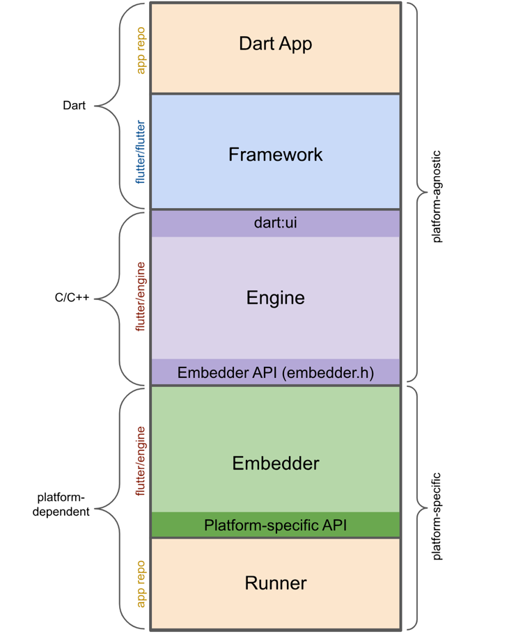
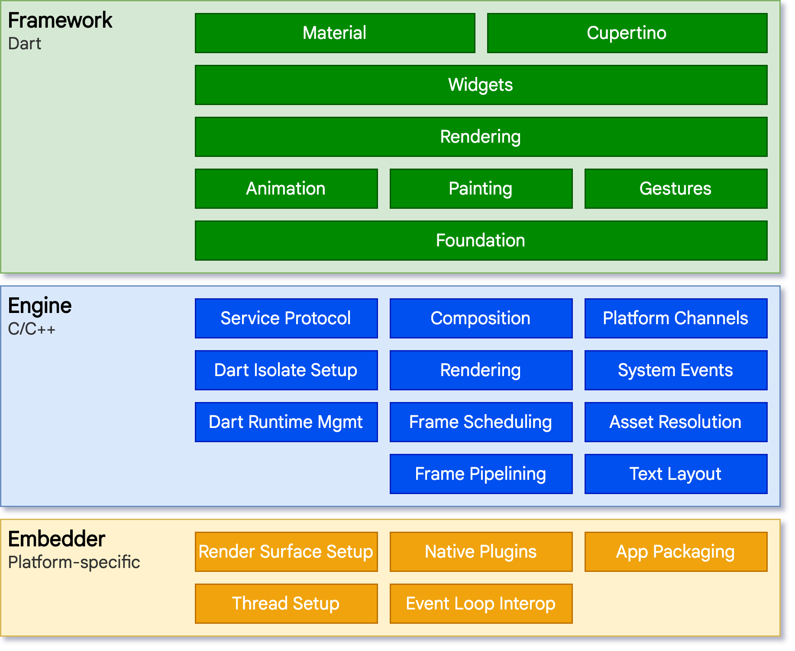
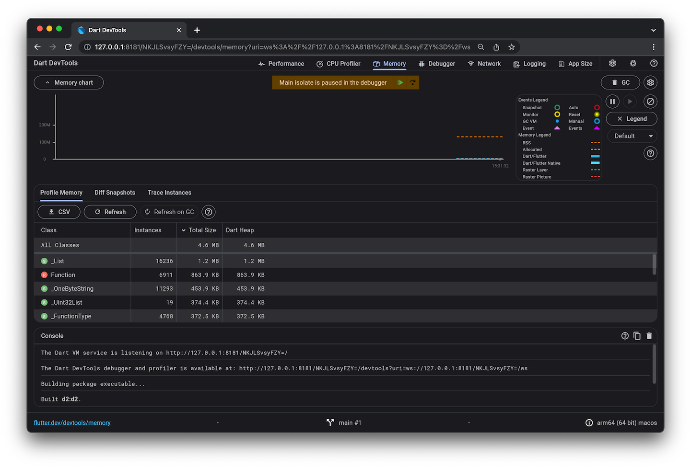

https://www.ambitionbox.com/profiles/flutter-developer/interview-questions
https://medium.com/@kalidoss.shanmugam/flutter-interview-questions-and-answers-for-experienced-developers-171a7cbbfef5
flutter architecture interview questions
https://github.com/thisissandipp/flutter-interview-questions


# Flutter FAQ : https://docs.flutter.dev/resources/faq (check questions and answers)

Here is the list of questions from the document, formatted as requested.

## Please give a brief introduction about your technical experience & projects.

## What are the different launch modes in Android?

Android provides different launch modes to control how activities are created and managed in the back stack:

- **standard** – Default mode. A new instance of the activity is created every time it is launched.
- **singleTop** – If an instance of the activity is already at the top of the stack, no new instance is created; otherwise, a new one is created.
- **singleTask** – Only one instance of the activity exists in the system. If it exists, it is brought to the front, and all activities above it are cleared.
- **singleInstance** – The activity is launched in its own separate task. No other activities can be part of this task.
- **singleInstancePerTask** – Similar to `singleInstance`, but allows multiple instances across different tasks while ensuring only one per task.

## What is ProGuard, and why is it used?

ProGuard is an Android tool that **shrinks, optimizes, and obfuscates code** to reduce APK size, improve performance, and make reverse engineering harder.

## How would you design a booking service system and manage slot selection in Flutter?

I would design the booking system with a backend that manages slot availability and validates bookings using transactions to prevent double-booking. In Flutter, I would:

- Fetch available slots from the backend.  
- Display slots in a selectable UI (chips/grid).  
- Manage selection using state management (Provider, Bloc, or Riverpod).  
- Confirm booking by calling an API, letting the backend re-verify the slot to ensure accuracy and prevent conflicts.

## How do you securely store and retrieve a user's private key in a Flutter wallet app?

Store the private key using **platform-secure storage** (`flutter_secure_storage`), which relies on Android Keystore and iOS Keychain. Encrypt the key at rest, decrypt it only in memory when needed, protect access with biometrics, avoid logging, and clear it from memory immediately after use. **Never store private keys in SharedPreferences or local storage.**

## How to keep a wallet app secure against attacks?

To secure a wallet app:

- Store private keys in device secure hardware (Keystore/Keychain).  
- Protect the app with PIN or biometrics.  
- Encrypt all sensitive data and use HTTPS/TLS for network calls.  
- Block rooted/jailbroken devices and prevent screenshots.  
- Implement 2FA and rate limits, and monitor suspicious transactions.  
- Never store private keys in SharedPreferences; use secure storage.

## What are the advantages of using Firebase Realtime Database?

- **Real-time sync:** Data updates are synchronized across all connected devices instantly.  
- **Offline capabilities:** Data is cached locally for offline access.  
- **Automatic scaling:** Handles large datasets without manual server management.  
- **NoSQL database:** Uses JSON-based key-value storage for fast and flexible access.

## How do you handle real-time data updates in Flutter?

- **Streams & StreamBuilder:** Listen to real-time changes asynchronously.  
- **WebSockets:** Establish persistent connections for real-time communication.  
- **Firebase Firestore:** Provides real-time updates via snapshots.  
- **State management (Provider, Riverpod, Bloc):** Efficiently manage and update UI with real-time data.

## What are the limitations of Firebase Realtime Database?

- **Limited queries:** Supports only simple key-value lookups.  
- **Scalability issues:** Can become slow with a large number of concurrent users.  
- **Data structure sensitivity:** Poor structuring can impact performance.  
- **No built-in analytics:** Lacks detailed analytics tools compared to Firestore.

## What is the difference between Firebase Realtime Database and Firestore for real-time data in Flutter?
 
 
## If your Flutter app is crashing only in release mode, how do you debug it?

- Run `flutter run --release` and check device logs via `adb logcat`.  
- Ensure no `assert` statements or debug-only code is being used.  
- Use crash reporting tools like **Sentry** or **Firebase Crashlytics** to capture release crashes.

## How would you optimise a list of 10,000+ items in a Flutter app?

- Use `ListView.builder` with `itemCount` for lazy loading.  
- Use `const` widgets to avoid unnecessary rebuilds.  
- Implement `AutomaticKeepAliveClientMixin` if list items maintain state.  
- Consider pagination or lazy loading to reduce memory usage.

## Explain how isolate works in Flutter and when you would use it.

- **Isolates** provide multithreading in Flutter; they do not share memory.  
- **Use cases:** Heavy computations like parsing large files, encryption, or image processing.  
- Use `compute()` for simple one-off tasks and `Isolate.spawn` for complex or long-lived tasks.

## What is your approach to testing a Flutter application?

- **Unit tests:** For business logic and pure functions.  
- **Widget tests:** For UI and interaction using `WidgetTester`.  
- **Integration tests:** End-to-end flows with `integration_test` or `flutter_driver`.  
- **Mocks:** Use `mockito` or `mocktail` for dependencies.  
- **CI automation:** Run tests via GitHub Actions, Bitrise, or other CI tools.

## What are some performance optimization techniques you've applied in production apps?

- Use `const` widgets to reduce rebuilds.  
- Avoid rebuilding large widget trees (use `shouldRebuild`, `Selector`, etc.).  
- Cache images using `cached_network_image`.  
- Compress images and limit FPS in animations.  
- Use `RepaintBoundary` to isolate heavy rendering areas.

## How would you architect a Flutter app with multiple modules or teams working on it?

- Use a **feature-based folder structure** (e.g., `features/user`, `features/dashboard`).  
- Apply **clean architecture** with proper separation of data, domain, and presentation layers.  
- Use **internal packages** or a **monorepo** (`packages/feature_x`) for modularization.  
- Keep shared components in a **core module** or shared library.

## How do you handle background tasks and notifications on Android?

- Use **WorkManager**, **Foreground Services**, or **AlarmManager** for scheduled/background tasks.  
- Example: Schedule recurring tasks like pill reminders with WorkManager, respecting exact time and battery optimization constraints.

## How do you reduce APK or IPA size?

- Remove unused assets and fonts.  
- Use `flutter build apk --split-per-abi`.  
- Compress images (e.g., TinyPNG).  
- Use deferred components or code-splitting where supported.  
- Avoid large third-party libraries unless necessary.

## Describe your process when upgrading a Flutter project to a new version.

- Run `flutter upgrade`.  
- Check `pubspec.yaml` for outdated packages.  
- Use `flutter pub outdated` and update dependencies.  
- Run the app and resolve breaking changes.  
- Follow Flutter migration guides for major updates.

## What is the use of const in Flutter widgets?

Using `const` makes widgets **immutable**, reduces unnecessary rebuilds, and improves performance by reusing the same widget instance.

## What is the purpose of mainAxisAlignment and crossAxisAlignment?

Used to **align children** inside `Row` and `Column` widgets along the main and cross axes.

## What is the WillPopScope widget used for?

`WillPopScope` is used to **control or prevent the back button action**, allowing you to decide whether the screen should be popped.

## Material vs Cupertino Widget

- **Material widgets:** Follow Android’s design guidelines.  
- **Cupertino widgets:** Provide iOS-style UI components.  
- Use **Material** for Android look and **Cupertino** for iOS look.

## What are custom widgets in Flutter, and why are they important?

Custom widgets are **user-defined widgets** that encapsulate UI components for **reusability and maintainability**.  
Benefits:  
- Reduce code duplication  
- Improve readability  
- Enhance modularity  
- Simplify complex UI  

They can be `StatelessWidget` or `StatefulWidget` depending on state management needs.

## What is the difference between GetBuilder, Obx, and GetX in GetX?

- **GetBuilder:** Updates UI only when `update()` is called manually; memory-efficient.  
- **Obx:** Automatically updates UI when an Rx variable changes.  
- **GetX:** Combines features of `Obx` and `GetBuilder` with additional dependency management.

## How do you pass arguments between screens in GetX?
 - Get.to(NextScreen(), arguments: "Hello GetX"); var data = Get.arguments

## What are Bindings in GetX?
 - Bindings help manage dependencies automatically when a screen is opened.

## What are the core components of the Bloc architecture?

- **Bloc/Cubit:** Handles business logic.  
- **Events:** Trigger state changes.  
- **States:** Represent UI states emitted by Bloc/Cubit.  
- **BlocProvider:** Provides the Bloc instance to widgets.  
- **BlocBuilder:** Rebuilds UI when state changes.  
- **BlocListener:** Listens to state changes without rebuilding UI.

## How do you integrate Stripe in a Flutter app? Like Using SDK or WEB
 - You integrate Stripe in Flutter either by using the official Stripe Flutter SDK for native payments or by using a WebView/Stripe Checkout page. The SDK gives native UI and better control, while the web approach is simpler and PCI-compliant using Stripe’s hosted payment page."

## What is a Paymentintent in Stripe?
 - A PaymentIntent represents a payment that a customer intends to make. It handles authentication, processing, and confirmation of payments. ● Created on the server to ensure security. ● Client receives a client_secret to process the payment. ● Supports SCA (Strong Customer Authentication

## Have you used social login? If yes, how to apply social logins?
 - Yes, social logins are added by using platform SDKs like Google Sign-In, Apple Sign-In, or Facebook Login, then exchanging the obtained token with Firebase or your backend for authentication. In Flutter, packages like google_sign_in or sign_in_with_apple handle the login flow and return user credentials."

## Please tell me some important steps for Firebase auth
 - For Firebase Auth, I first enable the login providers in the Firebase console, add Firebase to my Flutter app, and install firebase_auth. Then I initialize Firebase, implement login/signup methods, handle errors, listen to auth state changes, and secure backend access using Firebase security rules.

## What are the common issues faced while implementing social login in Flutter?

- Invalid **SHA-1** or **SHA-256** keys (Google Sign-In).  
- Facebook app not configured properly.  
- Platform-specific setup issues (missing `Info.plist` or `AndroidManifest.xml` entries).  
- Expired OAuth tokens.  
- Handling errors when users deny permissions.

## What permissions are required for location services in Flutter?

**Android permissions:**

```xml
<uses-permission android:name="android.permission.ACCESS_FINE_LOCATION"/>
<uses-permission android:name="android.permission.ACCESS_COARSE_LOCATION"/>
<uses-permission android:name="android.permission.FOREGROUND_SERVICE" />
<uses-permission android:name="android.permission.ACCESS_BACKGROUND_LOCATION"/>
```

**iOS permissions (Info.plist):**

```xml
<key>NSLocationWhenInUseUsageDescription</key>
<string>We need your location to show nearby places.</string>
<key>NSLocationAlwaysUsageDescription</key>
<string>We need your location to provide accurate results.</string>
```

## How do you track the user's live location in Flutter?

Use the **Geolocator** package to get a stream of location updates:

```dart
StreamSubscription<Position>? positionStream;

void startLocationTracking() {
  positionStream = Geolocator.getPositionStream(
    locationSettings: LocationSettings(accuracy: LocationAccuracy.high),
  ).listen((Position position) {
    print("Live Location: ${position.latitude}, ${position.longitude}");
  });
}

void stopLocationTracking() {
  positionStream?.cancel();
}
```

## How do you calculate the distance between two locations in Flutter?

Use the **Geolocator.distanceBetween()** method:

```dart
double distanceInMeters = Geolocator.distanceBetween(
  startLatitude, startLongitude,
  endLatitude, endLongitude
);
```

## Have you worked on an iOS app? If yes, how and where to add permissions? How to generate profiles and a certificate? Difference between certificate and profiles.

* iOS permissions are added in **Info.plist** (e.g., camera, location, photos).
* For app signing, generate an iOS **certificate** and **provisioning profile** from Apple Developer Portal.

  * **Certificate:** Used to sign the app.
  * **Provisioning profile:** Defines device/app permissions and links the app ID with the signing certificate.

## What happens if you call setState() inside build()?

* Causes an **infinite loop** because `setState()` triggers `build()`, which calls `setState()` again.
* Update state in a **FutureBuilder** or an event callback instead.

## What is the difference between setState(), Provider, and Bloc for state management in Flutter?

* **setState():** Manages local widget state; triggers rebuilds but doesn’t persist state across widget recreation.
* **Provider:** Simple, scalable solution for app-wide state using dependency injection.
* **Bloc (Business Logic Component):** Uses streams to handle state changes reactively; ideal for complex applications with structured state management.

## What are Flutter's best practices for writing clean and maintainable code?

* Follow **MVVM** or **Clean Architecture** for separation of concerns.
* Use **Dart linting** for consistent code standards.
* Write **reusable widgets** to avoid duplication.
* Implement **dependency injection** with `get_it` or `riverpod`.
* Use **async/await** properly for asynchronous operations.
* Keep widgets **small and modular** for better readability.

## Which are the most popular apps that use Flutter?

* Google Ads, Alibaba, Hamilton, Hookle

## What is an AspectRatio widget used for?

* The **AspectRatio widget** in Flutter is a powerful tool that allows us to control the **aspect ratio** of a child widget.
* It's particularly useful for maintaining a **width-to-height ratio**, ensuring consistent proportions across different screen sizes and orientations.
* Example: For a square widget:

```dart
AspectRatio(
  aspectRatio: 1.0,
  child: Container(color: Colors.blue),
)
```
## How to build an app with responsive UI in Flutter

To build a responsive UI in Flutter, follow these best practices:

* **MediaQuery:** Get screen size and adapt UI accordingly.

```dart
double width = MediaQuery.of(context).size.width;
```

* **LayoutBuilder:** Adjust layout based on available constraints.

```dart
LayoutBuilder(builder: (context, constraints) {
  return constraints.maxWidth > 600 ? TabletView() : MobileView();
})
```

* **Flexible & Expanded:** Allow widgets to resize dynamically.
* **FittedBox:** Scale widgets to fit within constraints.
* **flutter_screenutil package:** Manage scalable dimensions and fonts.

```dart
ScreenUtil().setSp(16) // Scalable font size
```

* **SizedBox & AspectRatio:** Maintain proportional spacing and layout.
* **responsive_builder package:** Simplifies creating responsive UI.

  * Provides **ScreenTypeLayout** for different devices.
  * Uses **ResponsiveBuilder** to customize breakpoints.
  * Lightweight and easy to implement.

## How do you handle platform-specific code in Flutter?

* Use **Platform Channels** to communicate between Flutter and native Android (Kotlin/Java) or iOS (Swift/Obj-C) code for accessing device-specific features.
* **MethodChannel:** For one-time method calls, e.g., fetching current battery level or device name.
* **EventChannel:** For continuous data streams, e.g., sensor data, location updates.

## Explain the difference between BlocBuilder and BlocConsumer.
 - BlocBuilder handles building widgets based on state changes and is used for UI rendering. BlocConsumer is a combination of a BlocBuilder and a BlocListener, allowing it to both build widgets and execute side effects (like showing a Snackbar or navigation) based on state changes.

## Which widget allows us to refresh the screen?
 - The RefreshIndicator Widget enables us to refresh the screen. When the user pulls down on the
widget, the onRefresh callback is triggered, which typically involves fetching new data from a
server or updating the UI somehow

## How do you upload a **1GB+ video** without blocking the UI?
 - - Use `Isolate` for background processing.
- Implement **chunked uploading** with `dio` or `http`.
- Store the temporary file in the cache (`path_provider`).
- Use Firebase Storage, AWS S3, or Cloudflare R2 for resumable uploads.

## How do you handle **multiple large image uploads** in Flutter?
 - - Use `flutter_image_compress` to reduce size.
- Batch process images in `compute()` to avoid UI freeze.
- Optimize network calls with `dio` using parallel requests (`Future.wait`).

## What is the difference between **obfuscation and encryption** in Flutter?
 - **Obfuscation** scrambles method/class names to prevent reverse engineering.
 - **Encryption** protects data at runtime using AES/RSA algorithms

## what is the difference between listview builder widgets and SliverList.builder? (check on google again)
 - ListView.builder: A high-level, standalone widget for displaying a scrollable list. Efficient for large lists — it builds items on demand (lazy loading). Handles its own scrolling, viewport, and padding. More limited in customization: doesn’t easily support advanced scroll effects (like collapsing app bars).
  - sliverlist builder: A low-level sliver, meaning it’s a piece of a scrollable area — not a full widget on its own. Must be used inside a CustomScrollView via its slivers list. Allows combining with other slivers (SliverAppBar, SliverGrid, SliverToBoxAdapter) for advanced scroll effects. Uses SliverChildBuilderDelegate to lazily build its children, making it efficient for large or dynamic lists. 


## Talk about listviews in flutter, what is the difference between widgets and slivers.
 - ListViews in Flutter are used to display scrollable lists. Regular ListView widgets are high-level, standalone scrollable lists that handle their own scrolling. Slivers, like SliverList, are low-level building blocks that represent a piece of a scrollable area inside a CustomScrollView, allowing advanced scroll effects and combining multiple scrollable components.

## How can building an Instagram Reels-like feature using PageView with video_player in Flutter? However, when scrolling quickly, videos do not load in time, leading to a blank screen for a few seconds. How do you ensure smooth playback with proper video initialization when the user stops scrolling?
 - Use a PageController with onPageChanged to detect when the user stops on a page. Preload videos for the current, previous, and next pages (buffered preloading) to reduce loading delays. Dispose old video controllers for off-screen pages to free resources. Initialize and start playing the video only when scrolling stops on the current page.

## What is Flutter In-App Purchase?
 - Flutter In-App Purchase allows apps to sell digital content, subscriptions, or features directly inside the app on iOS and Android. You use platform-specific stores (Google Play Store, Apple App Store) via packages like in_app_purchase to handle purchase flow, verify transactions, and deliver content securely.

## What types of in-app purchases are supported in Flutter? What is the difference between **consumable, non-consumable, and subscription** purchases?
 - Flutter supports two main types of in-app purchases via the in_app_purchase package: Consumable – Items that can be bought, used, and bought again (e.g., coins, tokens). Non-Consumable – One-time purchases that unlock permanent features (e.g., premium upgrade, ad remova). Subscriptions – Recurring purchases for time-based access to content or features (e.g., monthly or yearly plans)."

## How do you get directions between two locations in Flutter?
 - Use the Google Directions API.

## How would you execute multiple asynchronous tasks in parallel and wait for all of them to complete?
 - Use Future.wait():
Future<void> fetchAllData() async {
List responses = await Future.wait([
fetchData1(),
fetchData2(),
fetchData3(),
]);
}

## How do you enable background location tracking in Flutter for Android and iOS?
 - Add permissions in AndroidManifest.xml: (ACCESS_COARSE_LOCATION,
ACCESS_FINE_LOCATION, ACCESS_BACKGROUND_LOCATION)
 Add the foregroundServiceType="location" inside <service>:
 Add the following keys in Info.plist:
 <key>NSLocationWhenInUseUsageDescription</key>
 <string>We use your location to provide better services</string>
 <key>NSLocationAlwaysUsageDescription</key>
 <string>We need background location access to track your movement</string>
 <key>UIBackgroundModes</key>
 <array>
 <string>location</string>
 </array>

## What is the difference between foreground and background location tracking?
 - 

## How would you solve the "setState() called after dispose()" error?
 - if (mounted) {
setState(() {
data = newData;
});}
Or use a Completer to ensure async operations are complete before the widget is disposed.

## I will share the number list in chat Please tell me how to get an odd number list from this list
 - List<int> numbers = [1, 2, 3, 4, 5];
List<int> numbers = [1, 2, 3, 4, 5];
numbers.removeWhere((num) => num.isEven);
print(numbers)

## I will share the code in chat Please tell me what output is for the below code
 - String text = "Flutter";
text.replaceAll("F", "D");
print(text)

## What happens if you use setState() inside initState()?
 - Using setState() inside initState() is generally unnecessary and can cause errors because the widget is still being initialized. If needed, you should schedule it using WidgetsBinding.instance.addPostFrameCallback to update state after the first build.

## Can I use the global key on multiple widgets?
 - Runtime error: Multiple widgets cannot have the same GlobalKey.
A GlobalKey must be unique per widget.

## How would you troubleshoot a deep linking issue in iOS?
 - To troubleshoot deep linking issues in iOS, I first check that the URL scheme or Universal Link is correctly configured in the Xcode project and Info.plist. Then I verify that the associated domain is set up properly and the apple-app-site-association file is accessible. I also test the link in Safari, ensure the app delegate handles the URL correctly, and use logs to confirm the deep link is received and parsed as expected.

## What is BLE (Bluetooth Low Energy)
 - BLE (Bluetooth Low Energy) is a wireless communication protocol designed for low-power
applications, such as IoT devices, smartwatches, fitness trackers, and medical sensors. It
consumes significantly less power than Classic Bluetooth, making it ideal for applications
requiring prolonged battery life.

## What permissions are required for BLE in Flutter (Android & iOS)?
 - <uses-permission android:name="android.permission.BLUETOOTH" />
<uses-permission android:name="android.permission.BLUETOOTH_ADMIN" />
<uses-permission android:name="android.permission.BLUETOOTH_SCAN" />
<uses-permission android:name="android.permission.BLUETOOTH_CONNECT" />
<uses-permission android:name="android.permission.ACCESS_FINE_LOCATION" />
For iOS:
<key>NSBluetoothAlwaysUsageDescription</key>
<string>App needs Bluetooth access</string>

## What is the difference between Write Without Response and Write With Response in BLE?
 - Write With Response: The device acknowledges the data sent. Reliable but slower.
Write Without Response: The device does not send an acknowledgment. Faster but may cause
data loss

## What are GATT services and characteristics in BLE?
 - GATT (Generic Attribute Profile) defines how BLE devices communicate.
Service: A collection of characteristics (e.g., Heart Rate Service).
Characteristic: A specific data point (e.g., Heart Rate Measuremen

## Why do some BLE operations require a delay between them?
 - BLE communication is asynchronous, and some operations (like reading characteristics or
writing values) require time to process. Without delays, multiple requests may overlap and fail.

## Why is ACCESS_FINE_LOCATION required for BLE scanning on Android?
 - Android considers BLE scanning as a location-based activity, so it requires location permissions
for scanning nearby BLE devices.
Android 6+ (API 23+): Requires ACCESS_FINE_LOCATION
Android 10+ (API 29+): ACCESS_BACKGROUND_LOCATION (for background scanning)
Android 12+ (API 31+): BLUETOOTH_SCAN and BLUETOOTH_CONNECT

## How do you differentiate between multiple BLE devices of the same type?
 - You can distinguish devices using:
Device ID (MAC address on Android, UUID on iOS)
Service UUIDs (e.g., Heart Rate Service, Battery Service)
RSSI (Signal Strength) - To estimate proximity.

## What is an MTU in BLE, and how do you set it in Flutter?
 - MTU (Maximum Transmission Unit) defines the maximum size of a single BLE packet.
● The default MTU is 23 bytes, but can be increased for faster data transfer.
flutterReactiveBle.requestMtu(deviceId: deviceId, mtu: 512).then((mtu) {
print('MTU set to: $mtu');
});
Higher MTU = Faster data transfer, but depends on device support

## What are notification channels, and why are they needed in Android?
 - Notification channels are used in Android 8.0 (API 26+) to categorize notifications. Every notification must be assigned to a channel, which defines its behavior, such as importance, sound, and vibration. They help users control notification settings per category and ensure consistent notification management across the app.

## What is MQTT, and why is it used in loT?
 - MQTT (Message Queuing Telemetry Transport) is a lightweight, publish-subscribe messaging
protocol designed for low-bandwidth, high-latency, and unreliable networks, making it ideal for
IoT applications. It ensures efficient communication between IoT devices and cloud services
while consuming minimal power.

## What is the difference between MQTT and HTTP in AWS IoT?
 - MQTT: Lightweight, publish/subscribe protocol designed for real-time messaging. Maintains a persistent connection, supports bidirectional communication. Efficient for devices with limited bandwidth or battery. HTTP: Request/response protocol, stateless. Each message requires a new connection. Less efficient for frequent or real-time updates. Key Difference: MQTT is ideal for real-time, low-latency IoT communication, while HTTP is better for occasional, request-driven data exchange.

## What are the limitations of AWS IoT Core with MQTT?
 - Message size limit: Maximum payload size is 128 KB.
Limited topic depth: AWS IoT allows up to 7-level topic hierarchy.
Connection limits: Each account has a quota on concurrent connections.
Cost considerations: Frequent high-volume messaging can lead to increased costs.
No retained messages: AWS IoT Core does not support MQTT retained messages.

## What is SQLite, and why is it used in Flutter?
 - SQLite is a lightweight, embedded database that does not require a separate server process. In
Flutter, SQLite is used for local data storage when offline persistence is required. The sqflite
package is commonly used to interact with SQLite databases in Flutter

## How do you check if a table exists in SQLite?
 - Future<bool> doesTableExist(Database db, String tableName) async {
final result = await db.rawQuery(
"SELECT name FROM sqlite_master WHERE type='table' AND name=?",
[tableName]
);
return result.isNotEmpty;
}

## How do you handle migrations in SQLite with Flutter?
 - Migrations are handled using the onUpgrade callback in openDatabase:
Future<Database> initDB() async {
String path = join(await getDatabasesPath(), 'my_database.db');
return await openDatabase(
path,
version: 2, // Increment version
onUpgrade: (db, oldVersion, newVersion) async {
if (oldVersion < 2) {
await db.execute("ALTER TABLE users ADD COLUMN email TEXT");
}
},
);
}

## What is the Flutter rendering pipeline and how does it work? Explain the process from widget creation to rendering on the screen.
 - Flutter Rendering Pipeline Flutter’s rendering pipeline is the process by which your widgets are converted into pixels on the screen. It has several layers: 
 1. Widget Layer You create widgets (StatelessWidget or StatefulWidget). Widgets are immutable configurations describing the UI. 
 2. Element Tree Flutter converts widgets into elements. Elements are mutable objects that hold the widget instance and its position in the tree. This tree keeps track of stateful widgets and updates when widgets rebuild. 
 3. RenderObject Tree Elements create RenderObjects, which are responsible for layout, painting, and hit-testing. The RenderObject tree is mutable and maintains actual UI layout information. 
 4. Layout Phase Each RenderObject calculates its size and position based on constraints from its parent. Flutter traverses the RenderObject tree top-down to determine layout. 
 5. Painting Phase Each RenderObject paints itself onto a canvas. The painting is batched into layers for efficient compositing. 
 6. Compositing & Rasterization The Flutter Engine (C++ layer with Skia) composites layers and converts them into pixels. These pixels are sent to the GPU for rendering on the screen. Summary Flow Widget tree → Element tree → RenderObject tree → Layout → Paint → Compositing → Screen pixels

## What is Flutter’s architecture?

Answer: Flutter uses a layered architecture:

Framework Layer: Widgets, rendering, gestures, animation.

Engine Layer: Skia-based rendering engine, C++ code for graphics, text, and platform channels.

Embedder Layer: Platform-specific code for Android, iOS, Web, Desktop.

## What are the main layers in Flutter?

Widget Layer – UI components.

Rendering Layer – Handles layout, painting.

Foundation Layer – Basic classes, async, collections, and services.

Engine Layer – Skia rendering and platform interface.

Embedder Layer – Runs the engine on different platforms.

## Explain the Flutter widget tree.

Answer: Flutter builds a widget tree, where every UI element is a widget. Widgets are lightweight and immutable; the tree is rebuilt on state changes, and the framework efficiently updates only affected parts via Element and RenderObject trees.

## Explain Flutter state management approaches

Answer: Flutter separates UI and state. Common approaches:

setState – Simple local state.

Provider / ChangeNotifier – Lightweight reactive state.

Bloc / Cubit – Event-driven state with separation of UI and logic.

Riverpod – Improved dependency injection and reactive state.

## What is the difference between InheritedWidget and Provider?

InheritedWidget – Built-in Flutter widget for sharing data down the widget tree.

Provider – A wrapper over InheritedWidget offering simpler syntax, dependency injection, and rebuild management.

## What is the role of Flutter Engine?

Answer: The engine handles rendering (Skia), platform channels, text layout, and low-level graphics, providing the bridge between Dart code and native platforms.

## Explain reactive programming in Flutter

Answer: UI reacts to state changes automatically. Streams, ValueNotifier, or RxDart can notify listeners when data changes, triggering UI rebuilds.

## How do you structure a large Flutter project?

Answer: Common approaches:

Feature-based: Separate folders per feature (screens, models, providers/blocs).

Layered: Separate UI, business logic, and data layers.

Clean Architecture: Layers like presentation, domain, data; separation of concerns and testable code.

## Explain the role of widgets in Flutter's architecture. 
 - Widgets are the basic building blocks of Flutter’s UI. They are immutable descriptions of the interface, defining how the UI should look and behave. Flutter’s architecture uses the widget tree to manage these descriptions, and whenever state changes, widgets are rebuilt. The widget layer sits at the top of the rendering pipeline, which eventually translates widgets into elements, render objects, and finally pixels on the screen.

## how to improve app perfomance to make it fast
 - To make a Flutter app fast, use const widgets, efficient state management to rebuild only necessary widgets, lazy-load lists, cache images and data, and offload heavy computations to isolates. Profiling with DevTools helps find and fix performance bottlenecks.

## How do you ensure data synchronization between a local SQLite database and a remote server?
 - Timestamp-based Sync:
Store a last_updated timestamp in the local database.
Fetch new/updated records from the server based on last_updated.
Two-way Sync Strategy:
Send local changes to the server.
Pull new data from the server.
Merge conflicts if the same record is modified on both sides.
Use Background Services:
Use workmanager or flutter_background_fetch to sync periodically.
REST API-based Sync:
Use the http or dio package to fetch data and update the local database

## How do you handle offline mode with SQLite and synchronize when back online?
 - Detect Network Status:
Use connectivity_plus to check internet availability.
final connectivityResult = await Connectivity().checkConnectivity();
Queue Offline Requests:
Store unsynced requests in SQLite with a sync_status column (0 for pending, 1 for
synced).
Sync When Online:
When online, send pending requests to the server and update sync_status.
Use a Background Sync Service:
Implement workmanager to sync data periodically in the background


## Which method is used to upload a file or image in Flutter?
 - In Flutter, you typically use the http package’s MultipartRequest or Dio package to upload files or images to a server.

## How do you navigate between screens in Flutter?
 - Navigator.push()

## What is the default axis for Column and Row widgets?
 - Column: Vertical (MainAxisAlignment.vertical).
 - Row: Horizontal (MainAxisAlignment.horizontal).

## How do you handle null safety in Dart?
 - In Dart, null safety is handled by using non-nullable types by default, adding ? for nullable types, and using the ! operator to assert non-null values. You also use null-aware operators like ?., ??, and ??= to safely work with nullable variables.
 
## Have you used social login in Flutter? How do you implement it?
 - Yes, using firebase_auth, google_sign_in, flutter_facebook_auth, etc

## How do you handle API calls efficiently in Flutter?
 - Using Dio or http, caching responses, and handling errors with try-catch.

## What is BLOC, and how does it differ from Provider?
 - BLoC uses streams and events, while Provider is a simpler state management solution.

## How do you optimize list rendering in Flutter?
 - Using ListView.builder, const widgets, and AutomaticKeepAliveClientMixin

## How to manage dependencies in a Flutter project?
 - Using pubspec.yaml and dependency_overrides if needed.

## What is deep linking in Flutter?
 - It allows opening a specific screen in an app from an external URL.

## Have you worked on an iOS app? Where do you add permissions?
 - Yes, in ios/Runner/Info.plist

## How do you generate iOS profiles and certificates?
 - Using Apple Developer Account → Certificates, Identifiers & Profiles

## What is isolate in Dart, and how does it help in performance?
 - Isolate is used for parallel execution to avoid blocking the main UI thread.

## How does Flutter handle memory management?
 - Using Dart's garbage collector and efficient widget rebuilding.

## How to prevent widget rebuilding in Flutter?
 - Use const widgets, ValueKey, AutomaticKeepAliveClientMixin, and select() in state management.

## Explain how to handle background tasks in Flutter.
 - Using workmanager or flutter_background_service packages.

## How do you handle socket connections in Flutter?
 - Using web_socket_channel or socket.io-client-dart.

## How do you implement push notifications in Flutter?
 - Using firebase_messaging or onesignal_flutter

## How would you debug performance issues in Flutter?
 - Using Flutter DevTools, Performance Overlay, and profiling tools.

## what is debounce in dart.
 - In Dart, debounce is a technique to delay executing a function until a certain period has passed since the last call, preventing it from being called too frequently—commonly used with search inputs or scroll events. 

## Convert a JSON string to a Dart model.
 - To convert a JSON string to a Dart model, you first create a model class with a fromJson factory constructor, then use jsonDecode from dart:convert.

## Optimize a large list to avoid excessive memory usage.
 - Use lazy loading (pagination) with ListView.builder().

## How would you design an offline-first app?
 - Use hive or sqflite for local storage.
 - Cache API responses using dio_cache_interceptor.
 - Sync data with the server when online

## How would you ensure security in a Flutter app?
 - Use HTTPS for API calls. ○ Store sensitive data in Flutter Secure Storage instead of SharedPreferences. ○ Obfuscate Dart code using dart compile options

## What is the Android Manifest file?
 - A configuration file (AndroidManifest.xml) that declares permissions, activities, services, and app metadata.

# 🚀 Flutter Interview Questions and Answers 💡

# Flutter Overview and Key Concepts

## 1. What is Flutter? How Does It Work? Is It a Language?

Flutter is a free, open-source UI framework by Google for building cross-platform apps from a single
codebase. It uses **Dart** as its programming language and runs on a custom rendering engine called
**Skia**.

🔹 **Not a language** – Flutter is an SDK, not a programming language.  
🔹 **Works across platforms** – Build apps for Android, iOS, web, desktop, and more.  
🔹 **Fast & smooth UI** – Uses its own widgets instead of native components for high performance.

## 2. What is Flutter Inspector?

Flutter Inspector is a built-in tool that helps **debug and analyze** your app's UI. It shows the *
*widget tree**, layout details, and helps you fix design issues.

Think of it like a **magnifying glass** for your app's UI—helping you see how everything is
structured and rendered.

## Features of Flutter Inspector:

- Select widget mode
- Toggle platform
- Show paint baselines
- Show debug paint
- Refresh widget
- Enable slow animations
- Show/hide performance overlay

## 3. Advantages of Flutter 🚀

✅ **Beautiful UI** – Customizable widgets with smooth animations.  
✅ **Fast Development** – *Hot reload* lets you see changes instantly.  
✅ **Single Codebase** – Write once, run on Android & iOS.  
✅ **High Performance** – Compiles to native ARM code for fast execution.  
✅ **Rich Widget Library** – Pre-built widgets for quick UI building.  
✅ **Strong Community** – Plenty of plugins, support, and resources.

---

## 4. Features of Flutter ✨

🔹 **Hot Reload** – See updates instantly without restarting the app.  
🔹 **Flexible & Scalable** – Works for mobile, web, and desktop.  
🔹 **Native Performance** – Optimized for smooth experiences.  
🔹 **Rich Widget Library** – Pre-built and customizable widgets.  
🔹 **Easy Integration** – Works with Firebase, APIs, and native code.

---

## 5. Limitations of Flutter ⚠️

❌ **Large App Size** – Includes its own engine, making apps bigger.  
❌ **Limited Native API Access** – Custom platform code may be needed.  
❌ **Performance for Heavy Graphics** – Not ideal for advanced 3D/AR apps.  
❌ **Library Gaps** – Some native features require custom plugins.

## 6. What is Dart?

Dart is a **general-purpose, object-oriented** programming language developed by **Google** in 2011.
It’s designed for building web and mobile apps and is the **core language** of Flutter.

🔹 **C-style syntax** – Easy for JavaScript & Java developers.  
🔹 **Fast execution** – Uses **JIT (Just-in-Time)** for development and **AOT (Ahead-of-Time)** for
production.  
🔹 **Strong typing** – Helps catch errors early.

---

## 7. What is Flutter SDK?

- The Flutter SDK (Software Development Kit) is a framework developed by Google for building
  cross-platform mobile applications. It provides a complete set of tools, libraries, and resources
  to
  create native-like user interfaces (UI) for both Android and iOS platforms using a single
  codebase.

## 8. Why Does Flutter Use Dart?

Flutter **chose Dart** because it’s:

✅ **Declarative & programmatic** – No need for XML or JSX.  
✅ **Fast performance** – JIT for fast development, AOT for high-speed production.  
✅ **Cross-platform friendly** – Works on Android, iOS, web, and desktop.

💡 **But building apps takes time** because Flutter compiles to native machine code using **Xcode (
iOS)** and **Gradle (Android)**.

---

## 9. Full Form of API

🔹 **API** – Application Programming Interface

## 10. Difference Between Package and Plugin in Flutter:

- **Package:** Contains only Dart code.
- **Plugin:** A special kind of package that includes native Kotlin/Java (for Android) or
  Swift/Objective-C (for iOS) code.

### Examples:

#### Package:

- `http`: API for making HTTP requests from a Flutter app.
- `shared_preferences`: Store and retrieve key-value pairs in persistent storage.
- `intl`: Internationalization and localization support.

#### Plugin: (You need a plugin when you need to communicate with native OS.)

- `camera`: Access the device's camera, take pictures, and record videos.
- `firebase_messaging`: Receive and handle push notifications using Firebase Cloud Messaging.
- `google_maps_flutter`: Display interactive maps using the Google Maps API.

## 11. Dart Compilation Modes: AOT and JIT

### **JIT (Just-in-Time) Compilation**

✅ **Pros:**

- Allows **hot reload** for fast development.
- Provides **runtime debugging tools**.
- Offers **better peak performance** in long-running apps.

❌ **Cons:**

- **Slower startup time** due to runtime compilation.
- Uses **more memory** as it includes the JIT compiler.

🔹 **Best for:** Development and testing.

### **AOT (Ahead-of-Time) Compilation**

✅ **Pros:**

- **Faster startup times**, ideal for production.
- Produces **smaller binaries**, reducing memory usage.
- Ensures **consistent performance** without runtime overhead.

❌ **Cons:**

- **No debugging tools** at runtime.
- **No hot reload**, requiring full rebuilds for changes.

🔹 **Best for:** Production releases.

## 12. Flutter Widgets:

- Widgets are the **building blocks** of a Flutter app’s UI. They define **how things look and
  behave**. When the app’s state changes, Flutter **rebuilds the widget tree** to update the UI
  automatically.

## 9. Flutter architecture

 - 


## Framework Layer (Dart)

- This is the part of Flutter where developers work to build their apps.
- It helps you compose widgets to design the UI and implement the app’s business logic.
- It provides higher-level tools like widgets, gesture detection, accessibility, and text input.
- This layer also takes the app’s widget tree and prepares it to be rendered on the screen.

## Engine Layer (C, C++)

- This is the core part of Flutter responsible for rendering the app onto the screen.
- It handles tasks like graphics rendering, text layout, and running Dart code.
- The `dart:ui` API is used to connect this layer with the framework.
- The engine is built using C and C++ and relies on the Skia graphics library for rendering.

## Embedder Layer (Platform-Specific Code)

- This layer connects Flutter to the operating system (like Android, iOS, Windows, etc.).
- It handles tasks like managing input (touch, keyboard), rendering surfaces, and accessibility.
- It also manages the event loop and enables communication between Flutter and native APIs.



## 10. Interface in Dart

Dart does not have an `interface` keyword. Instead, you can achieve interface-like behavior using
the `abstract` keyword.

```dart
abstract class Animal {
  void makeSound();
}

class Dog implements Animal {
  @override
  void makeSound() {
    print("Bark");
  }
}

void main() {
  Dog dog = Dog();
  dog.makeSound(); // Output: Bark
}
```

### 11. GraphQL vs REST

🔹 **GraphQL** → Flexible API that allows clients to request specific data from a single endpoint.  
✅ Efficient data fetching  
✅ Scalable & flexible  
❌ Requires learning & setup

🔹 **REST** → Uses multiple fixed endpoints (GET, POST, etc.) to serve data.  
✅ Simple & widely used  
✅ Easy to cache  
❌ Can over-fetch or under-fetch data

**Key Difference:** GraphQL gives **exact data** as requested, while REST may return **fixed,
predefined data** from multiple endpoints.

### 12. What is an Extension?

An **extension** allows you to **add new methods** to existing classes **without modifying** their
original code.

🔹 Useful for adding functionality to built-in types (e.g., `String`, `List`).  
🔹 Helps keep code **clean** and **organized**.

**Example:**

```dart
extension StringExtension on String {
  String get capitalizeFirst => '${this[0].toUpperCase()}${substring(1)}';
}

void main() {
  print('hello'.capitalizeFirst); // Output: Hello
}
```

## 13. Dart – Standard Input and Output

### Input

In Dart, you can take standard input from the user via the `stdin.readLineSync()` function. You need
to import the `dart:io` library.

```dart
import 'dart:io';

void main() {
  print("Enter your name:");
  String? name = stdin.readLineSync();
  print("Hello, $name!");
}
```

### Output

Use the `print` statement or `stdout.write()` method to display output in the console.

```dart
void main() {
  // Printing using print statement
  print("Welcome!");

  // Printing using stdout.write
  stdout.write("Welcome again!");
}
```

## 14. What is the `late` keyword used for?

The `late` keyword in Dart is used to declare a non-nullable variable that will be initialized
later. It supports lazy initialization of variables and throws a `LateInitializationError` if the
variable is used before being initialized.

```dart
late String description;

void main() {
  description = "This is a late variable";
  print(description);
}
```

## 15. What is Generic in Dart?

Generics in Dart allow you to create reusable functions, classes, and types that can work with
multiple data types, while still providing type safety.

```dart
class Dropdown<T> {
  final List<T> items;

  Dropdown(this.items);
}

// Using the generic class
void main() {
  Dropdown<String> stringDropdown = Dropdown(['Apple', 'Banana', 'Cherry']);
  Dropdown<int> intDropdown = Dropdown([1, 2, 3, 4, 5]);
}
```

Generics ensure that you cannot add a string to an `intDropdown` or vice versa, providing type
safety and reusability.

# Dart and Flutter Key Concepts

### 15. What is `Expanded` and `Flexible` in Flutter?

🔹 **Expanded** → Forces the child to take **all available space** in a `Row`, `Column`, or `Flex`.  
🔹 **Flexible** → Allows the child to **take space if needed**, but doesn’t force it to fill
everything.

**Example:**

```
 Row(
      children: [
        Expanded(child: Container(color: Colors.red)), // Takes full space
        Flexible(child: Container(color: Colors.blue)), // Takes only needed space
      ],
    );
```

**Key Difference:** `Expanded` fills **all** space, while `Flexible` only takes **as much as needed
**.

### 16. `Flex` Widget in Flutter

🔹 **Definition:** `Flex` arranges its children **horizontally** (`Axis.horizontal`) or **vertically
** (`Axis.vertical`), similar to `Row` and `Column`.

🔹 **Key Difference:** Unlike `Row` and `Column`, `Flex` **requires** an explicit `direction`.

**Example:**

```
Flex(
  direction: Axis.horizontal, // Change to Axis.vertical for vertical layout
  children: [
    Container(width: 100, height: 100, color: Colors.red),
    Container(width: 200, height: 100, color: Colors.green),
    Container(width: 50, height: 100, color: Colors.blue),
  ],
)
```  

**When to Use?**  
✅ When dynamically deciding between **horizontal or vertical** layout.

### 17. **`didChangeDependencies()` vs `didUpdateWidget()` (Short & Clear)**

🔹 **`didChangeDependencies()`** → Called when **dependencies change** (like `Theme.of(context)`,
`MediaQuery`, or `Provider`).  
✅ Runs **after `initState()`** and when an **inherited widget updates**.

🔹 **`didUpdateWidget()`** → Called when **the parent widget passes new props** (like updated
`counter` value).  
✅ Runs when **the parent rebuilds with new data**.

| Feature             | `didChangeDependencies()`         | `didUpdateWidget()`                     |
|---------------------|-----------------------------------|-----------------------------------------|
| **Triggered When?** | Theme, locale, provider changes   | Parent widget updates props             |
| **Runs After?**     | `initState()` & dependency change | Parent `setState()` updates child props |
| **Use Case?**       | Listen for external changes       | Handle new props from parent            |

🚀 **Rule of Thumb:**

- Use **`didChangeDependencies()`** for **theme, locale, provider changes**.
- Use **`didUpdateWidget()`** when **parent widget updates child props**.

### **18. What Does `context.mounted = false` Mean?**

- **Meaning:** It means the widget is **no longer in the widget tree** (removed or disposed).
- **Why Important?** Before calling `setState()`, check `if (context.mounted)` to avoid errors.

---

### **19. `as` vs `is` in Dart**

🔹 **`as` (Type Casting)** → Converts an object from one type to another.  
✅ Use when **you’re sure** the object is of that type.

```
var obj = 'Hello';
String str = obj as String; // Safe because obj is a String
```

🔹 **`is` (Type Checking)** → Checks if an object is of a certain type.  
✅ Returns `true` or `false`.

```
var obj = 'Hello';
if (obj is String) {
  print('obj is a String'); // ✅ True
}
```  

🚀 **Rule of Thumb:**

- Use **`is`** to **check** before casting.
- Use **`as`** when **you’re sure** of the type.

# Dart and Flutter Key Concepts

### **15. What is State & Why Use State Management Instead of `setState`?**

#### **State in Flutter**

- State is **data** that affects a widget’s **appearance and behavior**.
- Example: A button’s color changing after being clicked is a **state change**.

#### **Using `setState()`**

- ✅ **Directly updates** state and **rebuilds** the widget.
- ❌ **Inefficient** for large apps because it rebuilds the **entire widget tree**.

#### **Why Use State Management?**

- **Efficient** → Only updates **specific widgets**, not the whole tree.
- **Scalable** → Works well for **large apps**.
- **Popular Solutions** → `Provider`, `Riverpod`, `Bloc`.

---

### **16. `var` vs `dynamic` in Dart**

🔹 **`var` (Type Inference)** → **Type is fixed** after assignment.  
✅ Value **can change**, but **type cannot**.

```
var name = 'Flutter';
name = 'Dart'; // ✅ Allowed
// name = 123; // ❌ Error: Can't assign int to a String variable
```

🔹 **`dynamic` (Flexible Type)** → **Type and value can change** anytime.  
✅ Useful when **type is unknown** at compile time.

```
dynamic value = 'Hello';
value = 42; // ✅ Allowed (Type changed from String to int)
```

🚀 **Rule of Thumb:**

- Use **`var`** when type is **known**.
- Use **`dynamic`** when type is **uncertain**.

### **17. `Future` vs `Future.microtask` in Flutter**

#### **`Future`**

- Runs **after all microtasks** are completed.
- Used for **asynchronous operations** (e.g., API calls, file reading).

```dart
void main() {
  Future(() => print('future 1'));
  Future(() => print('future 2'));
  print('main');
  // Output: main, future 1, future 2
}
```

#### **`Future.microtask`**

- Runs **before any `Future`** tasks.
- Useful for **high-priority small tasks** (e.g., state updates).

```dart
void main() {
  Future(() => print('future 1'));
  Future(() => print('future 2'));
  Future.microtask(() => print('microtask 1'));
  Future.microtask(() => print('microtask 2'));
  print('main');
  // Output: main, microtask 1, microtask 2, future 1, future 2
}
```

🚀 **Rule of Thumb:**

- Use **`Future.microtask`** for small high-priority tasks.
- Use **`Future`** for general asynchronous operations.

---

### **19. Queues in Dart**

🔹 **Definition:**

- A **FIFO (First-In-First-Out)** data structure.
- Elements are **processed in order** of addition.

🔹 **Example:**

```dart
import 'dart:collection';

void main() {
  Queue<String> queue = Queue<String>();

  queue.addAll(["A", "B", "C"]);
  print(queue); // {A, B, C}

  queue.addFirst("First");
  queue.addLast("Last");
  print(queue); // {First, A, B, C, Last}

  queue.removeFirst();
  queue.removeLast();
  print(queue); // {A, B, C}
}
```

🚀 **When to Use Queues?**

- **Task scheduling**
- **Message processing**
- **Managing ordered data**

## 21. Routes vs Route Generator in Flutter

### Routes

- **Definition:** Static map of route names to widgets.
- **Limitation:** Cannot pass arguments to widgets or implement custom `PageRoute`.

### Route Generator

- **Definition:** Dynamically generates routes, allowing for passing arguments and implementing
  custom navigation logic.
- **Usage:** Implemented using the `onGenerateRoute` property of `MaterialApp`.

#### Example

```dart
void main() {
  runApp(
    MaterialApp(
      routes: {
        '/': (_) => HomePage(),
        '/foo': (_) => FooPage(),
      },
      onGenerateRoute: (settings) {
        if (settings.name == '/bar') {
          final value = settings.arguments as int;
          return MaterialPageRoute(builder: (_) => BarPage(value));
        }
        return null;
      },
    ),
  );
}
```

### HomePage

```dart
class HomePage extends StatelessWidget {
  @override
  Widget build(BuildContext context) {
    return Scaffold(
      appBar: AppBar(title: Text('HomePage')),
      body: Center(
        child: Column(
          children: [
            ElevatedButton(
              onPressed: () => Navigator.pushNamed(context, '/foo'),
              child: Text('Go to FooPage'),
            ),
            ElevatedButton(
              onPressed: () => Navigator.pushNamed(context, '/bar', arguments: 42),
              child: Text('Go to BarPage'),
            ),
          ],
        ),
      ),
    );
  }
}
```

### FooPage

```dart
class FooPage extends StatelessWidget {
  @override
  Widget build(_) => Scaffold(appBar: AppBar(title: Text('FooPage')));
}
```

### BarPage

```dart
class BarPage extends StatelessWidget {
  final int value;

  BarPage(this.value);

  @override
  Widget build(_) => Scaffold(appBar: AppBar(title: Text('BarPage, value = $value')));
}
```

## 22. Push vs PushNamed Methods

### push

- **Definition:** Requires a `Route` object.
- **Usage:** Used for navigating to routes dynamically created at runtime.

### pushNamed

- **Definition:** Requires a `String` argument, the name of the route.
- **Usage:** Used for navigating to routes defined in the `routes` map or `onGenerateRoute`.

## 23. Enum in Dart

### Definition

- **Definition:** Special kind of class used to represent a fixed number of constant values.
- **Usage:** Makes the code easier to read and maintain by giving names to constants.

### Example

```dart
enum Status { active, inactive, pending }

void main() {
  Status currentStatus = Status.active;

  switch (currentStatus) {
    case Status.active:
      print('The status is active');
      break;
    case Status.inactive:
      print('The status is inactive');
      break;
    case Status.pending:
      print('The status is pending');
      break;
  }
}
```

### **24. Casting in Dart**

#### **🔹 Definition**

- **Casting** is converting an object from one type to another.
- **Explicit Cast:** Uses `as` for manual conversion.
- **Implicit Cast:** Dart **automatically** converts types if it's safe.

---

### **📌 Explicit Casting (Using `as`)**

Used when we are sure of the type.

```dart
void main() {
  Object x = 12;
  int y = x as int; // Explicit cast from Object to int
  print(y.runtimeType); // Output: int
}
```

⚠️ **Be Careful!**  
If `x` isn't actually an `int`, Dart throws an error.

---

### **📌 Implicit Casting (Automatic Conversion)**

Dart automatically converts compatible types.

```dart
void main() {
  int integer = 10;
  double doubleValue = integer.toDouble(); // Implicit conversion
  print(doubleValue); // Output: 10.0
}
```

🚀 **When to Use?**

- **Use explicit casting (`as`)** when you're sure of the type.
- **Implicit casting** happens automatically for safe conversions.

## 25. Implicit Interface in Dart

### Definition

- **Definition:** Defined using abstract classes.
- **Usage:** Any class extending the abstract class must implement all its abstract methods.

### Example

```dart
abstract class Printable {
  void print();
}

class Document implements Printable {
  @override
  void print() {
    print('Printing a document...');
  }
}

class Image implements Printable {
  @override
  void print() {
    print('Printing an image...');
  }
}
```

## 26. `assert` in Dart

### Definition

- assert is a debugging tool that checks if a condition is true.
- If false, it throws an AssertionError (only in debug mode).

### Example

```dart
void greet(String name) {
  assert(name != null, "Name cannot be null");
  print("Hello, $name!");
}

void main() {
  greet("Alice"); // Assertion passes, "Hello, Alice!" is printed
  greet(null); // Assertion fails, throws AssertionError with message
}
```

### 28. **📌 Why Mixins in Dart?**

 - Mixins are a way to reuse a class's code in multiple class hierarchies.
✅ **Dart doesn’t support multiple inheritance** – Mixins provide reusable functionality without
affecting class hierarchy.  
✅ **Used to share behavior between classes** without creating a base class.

---

### **📌 Mixin Example Using `on`**

```dart
class Musician {
  musicianMethod() {
    print('Playing music!');
  }
}

mixin MusicalPerformer on Musician {
  performerMethod() {
    print('Performing music!');
    super.musicianMethod();
  }
}

class SingerDancer extends Musician with MusicalPerformer {}

void main() {
  SingerDancer().performerMethod();
}
```

📌 **Key Point:** `on` ensures that the mixin is only used by classes extending `Musician`.

---

### **📌 Mixin Example Using `with`**

```dart
mixin Musician {
  void playInstrument(String instrumentName) {
    print('Plays the $instrumentName');
  }
}

class Virtuoso with Musician {}

void main() {
  Virtuoso().playInstrument('Guitar');
}
```

📌 **Key Point:** `with` allows adding mixin functionality to any class.

### 13. **📌 Spacer in Flutter**

✅ **Definition:** A `Spacer` widget is used in a `Row`, `Column`, or `Flex` layout to take up
available space **between** or **around** widgets.

✅ **Why use `Spacer`?**

- Helps **align** widgets dynamically without using **SizedBox** or **Expanded**.
- Distributes available space **proportionally** when multiple `Spacer`s are used.

---

### **📌 Example 1: Basic Usage**

```dart
class MyWidget extends StatelessWidget {
  const MyWidget({super.key});

  @override
  Widget build(BuildContext context) {
    return Row(
      children: <Widget>[
        Text('Start'),
        Spacer(), // Takes up remaining space
        Text('End'),
      ],
    );
  }
}
```

📌 **Behavior:** `Start` aligns to the left, `End` aligns to the right.

---

### **📌 Example 2: Using Multiple Spacers**

```
Row
(
children: [
Text('A'),
Spacer(flex: 1), // Takes 1x space
Text('B'),
Spacer(flex: 2), // Takes 2x space
Text('C'),
],
);
```

📌 **Behavior:** `B` is positioned **twice as far** from `C` as `A` is from `B`.

### **📌 14. Stateful vs Stateless Widget in Flutter** or What are the types of widgets present in Flutter?

---

### **📌 Stateless Widget**

✅ **Definition:** A widget that **does not change** over time.  
✅ **State:** Immutable (fixed once created).  
✅ **Common Use Cases:** UI elements like `Text`, `Icon`, `ElevatedButton`, etc.

#### **Example: Stateless Widget**

```dart
class MyStatelessWidget extends StatelessWidget {
  @override
  Widget build(BuildContext context) {
    return Center(
      child: Text('I am Stateless!'),
    );
  }
}
```

📌 **Behavior:** Always shows `"I am Stateless!"` and never updates.

---

### **📌 Stateful Widget**

✅ **Definition:** A widget that **can change** over time.  
✅ **State:** Mutable (changes when `setState()` is called).  
✅ **Common Use Cases:** Counters, animations, user inputs.

#### **Lifecycle Methods in Stateful Widget**

1️⃣ **`createState()`** → Creates the state object.  
2️⃣ **`initState()`** → Called once when the widget is inserted.  
3️⃣ **`didChangeDependencies()`** → Called when inherited widgets change.  
4️⃣ **`build()`** → Rebuilds the UI when `setState()` is triggered.  
5️⃣ **`didUpdateWidget()`** → Called when widget is updated.  
6️⃣ **`deactivate()`** → Called before widget is removed from the tree.  
7️⃣ **`dispose()`** → Cleans up resources before widget is removed.

#### **Example: Stateful Widget**

```dart
class MyStatefulWidget extends StatefulWidget {
  @override
  _MyStatefulWidgetState createState() => _MyStatefulWidgetState();
}

class _MyStatefulWidgetState extends State<MyStatefulWidget> {
  int _counter = 0;

  void _incrementCounter() {
    setState(() {
      _counter++; // Updates UI
    });
  }

  @override
  Widget build(BuildContext context) {
    return Column(
      children: [
        Text('Counter: $_counter'),
        ElevatedButton(
          onPressed: _incrementCounter,
          child: Text('Increment'),
        ),
      ],
    );
  }
}
```

📌 **Behavior:** Clicking the button updates the `_counter` value, triggering `build()`.

---

### **📌 15. What is `setState()` in Flutter?**

✅ **Definition:** A method that updates the state of a `StatefulWidget` and triggers a UI rebuild.  
✅ **Usage:** Modifies a variable inside `setState()`, which refreshes the widget.

#### **Example of `setState()`**

```dart
void _incrementCounter() {
  setState(() {
    _counter++; // UI updates when value changes
  });
}
```

📌 **Without `setState()`,** the UI will **not** reflect any changes.

### **📌 16. `pubspec.yaml` vs `pubspec.lock` in Flutter**

---

### **📌 `pubspec.yaml`**

✅ **Definition:** A configuration file in every Flutter project that **manages dependencies, assets,
fonts, and metadata.**  
✅ **Usage:** Specifies the **libraries and their versions** to be used in the project.

#### **Example `pubspec.yaml`**

```yaml
name: my_flutter_app
description: A new Flutter project.

dependencies:
  flutter:
    sdk: flutter
  http: ^0.13.5 # Version constraint
  provider: ^6.0.5

dev_dependencies:
  flutter_test:
    sdk: flutter
```

📌 **Key Sections:**

- `dependencies`: Packages required for the app.
- `dev_dependencies`: Tools needed for development/testing.
- `flutter`: Flutter-specific configurations (e.g., assets, fonts).

---

### **📌 `pubspec.lock`**

✅ **Definition:** A **generated file** that locks the specific versions of installed dependencies.  
✅ **Usage:** Ensures consistency across environments by fixing dependency versions.

#### **Example `pubspec.lock`**

```yaml
packages:
  http:
    version: "0.13.5"
  provider:
    version: "6.0.5"
```

📌 **Why is it important?**

- Guarantees that all developers on a project use the **same dependency versions**.
- Prevents unexpected bugs due to different package versions.

---

### **📌 17. `main()` vs `runApp()` in Flutter**

---

### **📌 `main()`**

✅ **Definition:** The **entry point** of every Dart program, including Flutter apps.  
✅ **Usage:** Calls `runApp()` to start the Flutter app.

#### **Example**

```dart
void main() {
  runApp(MyApp()); // Calls runApp() to launch the Flutter UI
}
```

---

### **📌 `runApp()`**

✅ **Definition:** A **Flutter-specific function** that **renders the widget tree** on the screen.  
✅ **Usage:** Takes a widget (usually `MaterialApp`) and makes it the root of the app.

#### **Example**

```dart
void main() {
  runApp(
    MaterialApp(
      home: Scaffold(
        appBar: AppBar(title: Text('Hello, Flutter!')),
        body: Center(child: Text('Welcome!')),
      ),
    ),
  );
}
```

📌 **Key Differences:**  
| Feature | `main()` | `runApp()` |
|---------------|---------|------------|
| **Purpose**   | Entry point of the app | Initializes and displays the UI |
| **Defined in** | Dart | Flutter |
| **Executes**  | Calls `runApp()` | Takes a widget and renders it |

🚀 **Conclusion:**

- `main()` starts the Dart app.
- `runApp()` initializes the Flutter UI.### **📌 16. `pubspec.yaml` vs `pubspec.lock` in Flutter**

---

### **📌 `pubspec.yaml`**

✅ **Definition:** A configuration file in every Flutter project that **manages dependencies, assets,
fonts, and metadata.**  
✅ **Usage:** Specifies the **libraries and their versions** to be used in the project.

#### **Example `pubspec.yaml`**

```yaml
name: my_flutter_app
description: A new Flutter project.

dependencies:
  flutter:
    sdk: flutter
  http: ^0.13.5 # Version constraint
  provider: ^6.0.5

dev_dependencies:
  flutter_test:
    sdk: flutter
```

📌 **Key Sections:**

- `dependencies`: Packages required for the app.
- `dev_dependencies`: Tools needed for development/testing.
- `flutter`: Flutter-specific configurations (e.g., assets, fonts).

---

### **📌 `pubspec.lock`**

✅ **Definition:** A **generated file** that locks the specific versions of installed dependencies.  
✅ **Usage:** Ensures consistency across environments by fixing dependency versions.

#### **Example `pubspec.lock`**

```yaml
packages:
  http:
    version: "0.13.5"
  provider:
    version: "6.0.5"
```

📌 **Why is it important?**

- Guarantees that all developers on a project use the **same dependency versions**.
- Prevents unexpected bugs due to different package versions.

---

### **📌 17. `main()` vs `runApp()` in Flutter**

---

### **📌 `main()`**

✅ **Definition:** The **entry point** of every Dart program, including Flutter apps.  
✅ **Usage:** Calls `runApp()` to start the Flutter app.

#### **Example**

```dart
void main() {
  runApp(MyApp()); // Calls runApp() to launch the Flutter UI
}
```

---

### **📌 `runApp()`**

✅ **Definition:** A **Flutter-specific function** that **renders the widget tree** on the screen.  
✅ **Usage:** Takes a widget (usually `MaterialApp`) and makes it the root of the app.

#### **Example**

```dart
void main() {
  runApp(
    MaterialApp(
      home: Scaffold(
        appBar: AppBar(title: Text('Hello, Flutter!')),
        body: Center(child: Text('Welcome!')),
      ),
    ),
  );
}
```

📌 **Key Differences:**  
| Feature | `main()` | `runApp()` |
|---------------|---------|------------|
| **Purpose**   | Entry point of the app | Initializes and displays the UI |
| **Defined in** | Dart | Flutter |
| **Executes**  | Calls `runApp()` | Takes a widget and renders it |

🚀 **Conclusion:**

- `main()` starts the Dart app.
- `runApp()` initializes the Flutter UI.

## 18. **📌 Method vs Function in Dart**

### **📌 Method**

A method is a function that is declared inside a class and is associated with an object.

✅ **Usage:** Called using dot notation (e.g., `object.method()`).  
✅ **Purpose:** Can modify or access the state of an object.

#### **Example: Method**

```dart
class Person {
  String name;

  Person(this.name);

  void sayHello() {
    print('Hello, my name is $name.');
  }
}

void main() {
  var person = Person('Alice');
  person.sayHello(); // Calls the method
}
```

📌 **Key Points:**

- Methods belong to a class and work with object properties.
- Can modify instance variables and use `this`.

---

### **📌 Function**

A function is a top-level function that is declared outside of a class and is not associated with
any object.

✅ **Usage:** Called using its function name (e.g., `function()`).  
✅ **Purpose:** Cannot modify the state of an object directly.

#### **Example: Function**

```dart
void greet(String name) {
  print('Hello, $name!');
}

void main() {
  greet('Bob'); // Calls the function
}
```

📌 **Key Points:**

- Functions are independent and do not belong to any class.
- Used for reusable logic that does not rely on object state.

---

### **📌 Key Differences Between Method and Function**

| Feature                      | Method            | Function         |
|------------------------------|-------------------|------------------|
| **Declared inside a class?** | ✅ Yes             | ❌ No             |
| **Called as**                | `object.method()` | `functionName()` |
| **Can modify object state?** | ✅ Yes             | ❌ No             |

🚀 **Conclusion:**

- Use **methods** inside classes to work with objects.
- Use **functions** for general-purpose logic that does not depend on object state.

---

## **📌 19. Types of Keys in Flutter**

### **📌 Why Use Keys?**

Keys **help Flutter identify and differentiate widgets** during tree rebuilds.  
They prevent **unnecessary rebuilds** and **maintain state correctly**.

---

### **📌 1️⃣ ValueKey**

✅ **Definition:** Uses a **specific value** (`String`, `int`, etc.) to identify a widget.  
✅ **Usage:** Helps when widgets **depend on dynamic values** (like list items).

#### **Example: ValueKey in a ListView**

```
ListView(
children: items.map((item) => Text(item, key: ValueKey(item))).toList(),
);
```

📌 **Best for:** Lists with unique values.

---

### **📌 2️⃣ ObjectKey**

✅ **Definition:** Uses an **object's memory location** to identify widgets.  
✅ **Usage:** Differentiates **different instances** of the same object type.

#### **Example: ObjectKey in a List**

```
ListView(
children: items.map((item) => Text(item.name, key: ObjectKey(item))).toList(),
);
```

📌 **Best for:** When **objects contain the same data** but are **different instances**.

---

### **📌 3️⃣ UniqueKey**

✅ **Definition:** Generates a **unique identifier** for each widget.  
✅ **Usage:** Used for **new dynamically created widgets** (prevents duplication).

#### **Example: UniqueKey in Dynamic Widgets**

```
ElevatedButton(
onPressed: () {
setState(() {
widgets.add(Container(key: UniqueKey(), color: Colors.blue));
});
},
child: Text('Add Widget'),
);
```

📌 **Best for:** When you want **each widget to be unique**, even with the same content.

---

### **📌 4️⃣ GlobalKey**

✅ **Definition:** A special key that allows **access to a widget's state globally**.  
✅ **Usage:** Used for **forms, scaffold drawers, and accessing StatefulWidget state**.

#### **Example: GlobalKey for a Form**

```
final GlobalKey<FormState> _formKey = GlobalKey<FormState>();

Form(
key: _formKey,
child: TextFormField(
validator: (value) => value!.isEmpty ? 'Enter something' : null,
),
);

ElevatedButton(
onPressed: () {
if (_formKey.currentState!.validate()) {
print('Form is valid!');
}
},
child: Text('Submit'),
);
```

📌 **Best for:** **Forms, scaffold state, or accessing widget state from anywhere**.

---

### **📌 Key Usage Scenarios**

| **Scenario**            | **Best Key** |
|-------------------------|--------------|
| Unique list items       | `ValueKey`   |
| Object instances        | `ObjectKey`  |
| Dynamic widget creation | `UniqueKey`  |
| Accessing widget state  | `GlobalKey`  |

🚀 **Conclusion:**

- Use **`ValueKey` for list items**.
- Use **`ObjectKey` when instances contain similar data**.
- Use **`UniqueKey` for dynamic widgets**.
- Use **`GlobalKey` when you need widget state access**.

## **📌 20. Future.wait in Dart**

### **📌 Definition**

`Future.wait()` waits for **multiple async tasks** to complete **together**. It takes a **list of
Futures** and returns a **new Future** that completes when **all input Futures** finish.

✅ **Runs tasks in parallel** instead of one by one.  
✅ **Returns a list of results** from all Futures.

---

### **📌 Example**

```dart
Future<void> fetchData() async {
  List<String> results = await Future.wait([
    fetchUser(),
    fetchPosts(),
  ]);

  print(results); // ['User data loaded', 'Posts loaded']
}
```

📌 **Key Points:**

- **Runs multiple async functions at the same time.**
- **Waits for all tasks** before proceeding.

🚀 **Use `Future.wait()`** for **better performance** when handling **multiple async tasks.**

## **📌 21. Flutter Hot Reload**

### **📌 Definition**

🚀 **Hot Reload** updates the UI **instantly** when code changes, without **restarting the app**.

✅ **Faster Development** – See results immediately.  
✅ **Quick Debugging** – Fix bugs without losing state.

---

### **📌 How it Works**

⚡ **Injects new code** into the **running Dart VM**, updating classes and rebuilding the widget
tree.

📌 **Key Points:**

- Works best for **UI changes**.
- **Does not reset app state** unless a full restart is needed.

## **📌 22. Structure of a Flutter App**

### **📌 Components**

1️⃣ **MaterialApp**  
✅ **Defines app structure & theme.**  
✅ **Entry point for Material UI.**

2️⃣ **Scaffold**  
✅ **Provides basic screen layout.**  
✅ **Includes AppBar, body, floating buttons, etc.**

3️⃣ **Widgets**  
✅ **Building blocks of UI (Text, Buttons, Images, etc.).**  
✅ **Can be Stateless or Stateful.**

📌 **Flutter apps are built using Widgets inside MaterialApp & Scaffold.**

## **📌 23. Difference Between Set and List**

### **📌 Set**

✅ **Stores unique elements.**  
✅ **Unordered collection.**

### **📌 List**

✅ **Can have duplicate elements.**  
✅ **Ordered collection.**

### **📌 Example**

```dart

Set<int> mySet = {1, 2, 3, 4, 5, 5}; // Removes duplicate 5
List<int> myList = [1, 2, 3, 4, 5, 5]; // Keeps duplicate 5
```  

📌 **Use Set for uniqueness, List for maintaining order.**

## 24. Stream and Future in Dart

#### **Stream**

- **Purpose:** Delivers **multiple values** or events over time (e.g., real-time updates).
- **Types:**
    - **Single-subscription:** One listener at a time.
    - **Broadcast:** Multiple listeners can subscribe.

#### **Future**

- **Purpose:** Delivers **one value** (or error) when an asynchronous operation finishes (e.g.,
  network requests).
- **Features:**
    - `Future.value()`: Provides a predefined value.
    - `Future.error()`: Provides an error.
    - `.then()`: Runs when completed successfully.
    - `.catchError()`: Runs when an error occurs.

#### **Key Differences**

- **Stream:** Many values over time, like a video stream, chat messages, etc.
- **Future:** One result, like downloading a file, fetching data, etc.

## 25. What is a List?

- **Definition:** A collection of objects that can include duplicates and maintains order.

## 26. What is a HashMap?

- **Definition:** An unordered collection of key-value pairs based on a hashtable. Keys must be
  unique objects.
- In summary, a HashMap is an efficient, unordered collection in Dart that allows for quick access
  to values using unique keys, making it ideal for many use cases where fast lookups are required.

## 27. What is a Set?

- **Definition:** A collection of unique elements; no duplicates allowed.

## 28. What is an Iterable?

- **Definition:** A collection of elements that can be accessed sequentially.
- **Usage:** Abstract class; can be instantiated by creating a List or Set.

### 29. Flutter `Future` vs `Completer`

#### `Future`

- **Definition:** Represents a delayed computation or result that will be available in the future.
- **Usage:** Used to retrieve results from asynchronous operations.

#### `Completer`

- **Definition:** A way to create and control a `Future` manually.
- **Usage:** Allows you to complete a `Future` with a value or an error programmatically.

### Example

```dart
void main() {
  // Example Future usage
  Future<int> fetchData() {
    return Future.delayed(Duration(seconds: 2), () => 42);
  }

  fetchData().then((value) => print('Fetched data: $value'));

  // Example Completer usage
  Completer<int> completer = Completer<int>();

  fetchDataWithCompleter(completer);

  completer.future.then((value) => print('Completed with completer: $value'));
}

void fetchDataWithCompleter(Completer<int> completer) {
  Future.delayed(Duration(seconds: 3), () {
    completer.complete(84);
  });
}
```

### Output

```
Fetched data: 42
Completed with completer: 84
```

In this example, `fetchData` returns a `Future` that completes after a delay,
while `fetchDataWithCompleter` uses a `Completer` to manually complete a `Future`.

## **📌 30. What is an Instance?**

✅ **Definition:** An **instance** is an object created from a class.  
✅ **Usage:** Holds **its own state & behavior** based on class properties & methods.

### **📌 Example**

```dart
class Car {
  String model;

  Car(this.model); // Constructor

  void showModel() {
    print('Car model: $model');
  }
}

void main() {
  Car myCar = Car('Tesla'); // Creating an instance
  myCar.showModel(); // Output: Car model: Tesla
}
```

📌 **Each instance is independent with its own data.**

## **📌 30. What is `internal` in Dart?**

✅ **Definition:** Used to restrict access to **members within a library/package**.  
✅ **Usage:** Prevents access to constructors, methods, or variables **outside the library**.

### **📌 Example**

```dart
class MyClass {
  MyClass._internal(); // Private constructor

  factory MyClass() {
    return MyClass._internal(); // Accessible inside the library
  }
}
```

📌 **`_internal` makes the constructor private**, ensuring controlled instance creation.

## **📌 31. What is `extends` in Dart?**

✅ **Definition:** `extends` is used for **inheritance**, allowing a subclass to inherit properties
and methods from a superclass.  
✅ **Usage:** Helps **reuse** and **extend** functionality.

### **📌 Example**

```dart
class Animal {
  void sleep() => print('Animal is sleeping');
}

class Dog extends Animal {
  void bark() => print('Dog is barking');
}

void main() {
  Dog dog = Dog();
  dog.sleep(); // ✅ Inherited method
  dog.bark(); // ✅ Own method
}
```

📌 **`Dog` inherits `sleep()` from `Animal` but also has `bark()`.**

## **📌 32. What is `implements` in Dart?**

✅ **Definition:** `implements` forces a class to provide its **own implementation** of all methods
from an interface.  
✅ **Usage:** Ensures the class **adheres to a contract** without inheriting default behavior.

### **📌 Example**

```dart
abstract class Animal {
  void eat();
}

class Dog implements Animal {
  @override
  void eat() => print('Dog is eating');
}

void main() {
  Dog dog = Dog();
  dog.eat(); // ✅ Output: Dog is eating
}
```

📌 **Unlike `extends`, `implements` does not inherit methods—it just enforces their presence.**

## **📌 33. `extends` vs `implements` vs `with` in Dart**

### **📌 `extends`** (Inheritance)

✅ **Purpose:** Inherits properties and methods from a superclass.  
✅ **Use Case:** When a class is a specialized version of another.

```dart
class A {
  void methodA() => print('A');
}

class B extends A {} // ✅ B inherits methodA from A
```

---

### **📌 `implements`** (Interface Implementation)

✅ **Purpose:** Forces a class to **provide its own version** of all interface methods.  
✅ **Use Case:** When a class must follow a contract but not inherit behavior.

```dart
class C {
  void methodC();
}

class D implements C {
  @override
  void methodC() => print('D');
}
```

---

### **📌 `with`** (Mixin Composition)

✅ **Purpose:** Allows **code reuse** without inheritance.  
✅ **Use Case:** When multiple classes need shared functionality.

```dart
mixin M {
  void methodM() => print('M');
}

class E with M {} // ✅ E gets methodM from mixin M
```

📌 **Key Differences:**

- `extends` → Inherits from **one superclass**.
- `implements` → Provides **own implementation** of an interface.
- `with` → Mixes in **reusable code** from multiple mixins.

## **📌 34. Is `main()` Static or Dynamic?**

✅ **Answer:** `main()` is **static** in Dart.  
✅ **Reason:** It acts as the **entry point** of a Dart program and is called by the Dart runtime to
start execution.

---

## **📌 35. Constructor & Types in Dart**

### **📌 What is a Constructor?**

✅ **Definition:** A special method that initializes an object when it is created.  
✅ **Purpose:** Sets initial values for object properties.

### **📌 Types of Constructors**

1️⃣ **Default Constructor** → Auto-generated if no constructor is defined.  
2️⃣ **Parameterized Constructor** → Accepts arguments to initialize properties.  
3️⃣ **Named Constructor** → Allows multiple constructors with different names.  
4️⃣ **Constant Constructor** → Creates **immutable** objects.

---

### **📌 Example**

```dart
class MyClass {
  int number;

  // ✅ Parameterized Constructor
  MyClass(this.number);

  // ✅ Named Constructor
  MyClass.fromValue(int value) : number = value * 2;

  // ✅ Constant Constructor
  const MyClass.constant(this.number);
}

void main() {
  MyClass obj1 = MyClass(42); // Using Parameterized Constructor
  MyClass obj2 = MyClass.fromValue(21); // Using Named Constructor
  const MyClass obj3 = MyClass.constant(10); // Using Constant Constructor
}
```

📌 **Key Points:**

- `main()` is **static**.
- Constructors **initialize objects**.
- Named & constant constructors **provide flexibility**.

### 36. What is `fromJson` and `toJson`?

#### `fromJson` and `toJson` in Dart

- **`fromJson`:** Method used to convert JSON (text) into Dart objects.
- **`toJson`:** Method used to convert Dart objects into JSON (text).

### Example

```dart
class User {
  String name;
  int age;

  User(this.name, this.age);

  // Convert JSON to User object
  factory User.fromJson(Map<String, dynamic> json) {
    return User(json['name'], json['age']);
  }

  // Convert User object to JSON
  Map<String, dynamic> toJson() =>
      {
        'name': name,
        'age': age,
      };
}

void main() {
  // JSON to Dart object
  Map<String, dynamic> json = {'name': 'John', 'age': 30};
  User user = User.fromJson(json);

  // Dart object to JSON
  Map<String, dynamic> userJson = user.toJson();
}
```

## **📌 37. What is a Factory?**

✅ **Definition:** A `factory` constructor returns an instance of a class **without always creating a
new object**.  
✅ **Usage:** Used for **object caching** or **singleton patterns**.

---

### **📌 Example: Singleton Pattern**

```dart
class Singleton {
  static Singleton? _instance;

  // ✅ Factory constructor ensures only one instance
  factory Singleton() {
    _instance ??= Singleton._internal();
    return _instance!;
  }

  Singleton._internal();
}

void main() {
  Singleton singleton1 = Singleton();
  Singleton singleton2 = Singleton();

  print(identical(singleton1, singleton2)); // Output: true
}
```

📌 **Key Points:**

- **`factory` avoids new object creation** if an instance already exists.
- **Ensures a single instance (Singleton pattern).**
- **Useful for caching and object reusability.**

## **📌 38. Override vs Overloading in Dart**

### **✅ Override**

📌 **Definition:** A subclass replaces a method from its superclass with a new implementation.  
📌 **Usage:** Used to modify or extend inherited behavior.

```dart
class Parent {
  void greet() {
    print('Hello from Parent');
  }
}

class Child extends Parent {
  @override
  void greet() {
    print('Hello from Child');
  }
}

void main() {
  Child child = Child();
  child.greet(); // Output: Hello from Child
}
```

---

### **❌ Overloading (Not Supported in Dart)**

📌 **Definition:** Method overloading (same method name with different parameters) is **not allowed**
in Dart.  
📌 **Alternative:** Dart uses **optional and named parameters** to achieve similar functionality.

```dart
class Calculator {
  int add(int a, [int? b]) {
    return b != null ? a + b : a;
  }
}

void main() {
  Calculator calc = Calculator();
  print(calc.add(5)); // Output: 5
  print(calc.add(5, 10)); // Output: 15
}
```

📌 **Key Takeaways:**  
✅ **Override** allows modifying superclass methods.  
❌ **Overloading** is **not supported**, but **optional/named parameters** provide flexibility.

## **📌 39. What is `super` in Dart?**

### **✅ Definition**

📌 `super` refers to the **superclass (parent class)** of a subclass (child class).  
📌 It is used to **access superclass methods, properties, or constructors** from within the subclass.

---

### **📝 Example: Using `super` for Methods**

```dart
class Animal {
  void speak() {
    print('Animal speaks');
  }
}

class Dog extends Animal {
  @override
  void speak() {
    print('Dog barks');
    super.speak(); // Calls superclass method
  }
}

void main() {
  Dog dog = Dog();
  dog.speak();
  // Output:
  // Dog barks
  // Animal speaks
}
```

---

### **📝 Example: Using `super` for Constructor**

```dart
class Animal {
  String name;

  Animal(this.name);
}

class Dog extends Animal {
  Dog(String name) : super(name); // Calls Animal constructor
}

void main() {
  Dog dog = Dog('Buddy');
  print(dog.name); // Output: Buddy
}
```

📌 **Key Takeaways:**  
✅ **super.method()** → Calls a method from the superclass.  
✅ **super.property** → Accesses a property from the superclass.  
✅ **super(arguments)** → Calls the superclass constructor.

### 40. What is a Typedef in Dart?

- A typedef (or type alias) in Dart allows you to create a custom name for a function type (not only
  though). This can be super useful when you're dealing with complex function signatures or when you
  want to make your code more expressive.

### Example

```dart
typedef Compare<T> = int Function(T a, T b);

int sort(int a, int b) => a - b;

void main() {
  List<int> numbers = [3, 1, 2];
  numbers.sort(sort); // Using the typedef
  print(numbers); // Output: [1, 2, 3]
}
```

In this example, `typedef` `Compare<T>` is defined as a function type that takes two parameters of
type `T` and returns an `int`. It simplifies the use of the `sort` function in the `List.sort()`
method.

### 41. What are Anonymous Functions?

- **Definition:** In Dart, an anonymous function is a function without a name.
- **Usage:** Used for short, one-time operations where a full function definition is not necessary.

### Example

```dart
void main() {
  // Using an anonymous function
  var addNumbers = (int a, int b) {
    return a + b;
  };

  // Calling the anonymous function
  print(addNumbers(3, 7)); // Output: 10
}
```

In this example, `addNumbers` is an anonymous function that adds two numbers. It's defined and used
right where it's needed.

### 42. Can we send data from a GET request to the server?

- **Answer:** Yes, in a GET request, data can be sent as part of the URL parameters.
- **Limitation:** Typically limited to a maximum length (e.g., 2048 characters) depending on server
  configurations and browser limits.

### Example

```
GET /api/resource?param1=value1&param2=value2
```

### 43. Types of API Methods

- **GET:** Retrieves data of all users or specific resources.
- **POST:** Creates a new user or resource.
- **PUT:** Updates an existing user or resource with the specified ID.
- **PATCH:** Partially updates an existing user or resource.
- **DELETE:** Deletes a user or resource with the specified ID.
- **OPTIONS:** Retrieves supported HTTP methods for a specific endpoint.

### 44. Constant Constructor in Dart

- **Definition:** A constant constructor in Dart creates a constant object whose value cannot be
  changed after initialization.
- **Usage:** Used for objects that are immutable and have constant values.

### Example

```dart
class Circle {
  final double radius;
  static const double pi = 3.14;

  const Circle(this.radius);

  double calculateArea() {
    return pi * radius * radius;
  }
}

void main() {
  const Circle circle = Circle(5.0);
  print('Area of circle: ${circle.calculateArea()}'); // Output: Area of circle: 78.5
}
```

### 45. Sealed Class

- **Definition:** A sealed class restricts the inheritance hierarchy such that all subclasses of the
  sealed class must be declared in the same file where the sealed class is declared.
- **Usage:** It provides a way to define a closed set of possible types, ensuring exhaustive
  handling of all possible cases without allowing extension outside of the defined set.
- **Example:**

```dart
sealed class Result {
  const Result();
}

class Success extends Result {
  final String message;

  Success(this.message);
}

class Failure extends Result {
  final String errorMessage;

  Failure(this.errorMessage);
}
```

In this example, `Result` is a sealed class with `Success` and `Failure` as its subclasses. No other
subclasses can be created outside of this file.

### 46. Immutable and Mutable Class

- **Immutable Class:** An object whose state cannot be modified after it is created. All fields in
  an immutable class should be `final`.
- **Mutable Class:** An object whose state can be modified after it is created, allowing its fields
  to change values.

### 47. Hot Reload vs Hot Restart

- **Hot Reload:** Injects updated source code files into the running Dart Virtual Machine (VM). It
  maintains the app's state and updates the UI almost .
- **Hot Restart:** Restarts the entire app, including the Dart VM. It resets the app's state to its
  initial conditions before reloading the updated UI.

### 48. RefreshIndicator Widget

- **Purpose:** Enables pull-to-refresh functionality in Flutter apps.
- **Usage:** Wraps a scrollable widget (like ListView, GridView) and triggers a refresh action when
  the user pulls down the widget.

### 49. Build Modes in Flutter

Flutter provides three main build modes that determine how the app is compiled and executed. Each
mode serves a different purpose depending on the development or deployment stage.

- **Debug Mode**
    - Debug mode is used during development to enable debugging and rapid iteration. It includes
      debugging tools such as hot reload, asserts, and additional debug symbols to aid in debugging.
      This mode is not optimized for performance and is slower than the other modes due to the
      inclusion
      of debugging features.
    - Command: `flutter run`

- **Profile Mode**
    - Profile mode is designed for performance profiling and benchmarking. It is similar to release
      mode
      but includes additional profiling information for performance analysis. It helps to identify
      performance bottlenecks without the overhead of debugging features. This mode is typically
      used to
      test the app's performance before deploying it to production.
    - Command: `flutter run --profile`

- **Release Mode**
    - Release mode is optimized for production deployment. It disables debugging features, removes
      asserts, and minimizes the size of the application. The app is fully optimized for
      performance,
      making it the fastest mode. This mode is used for final app distribution to end-users through
      app
      stores.
    - Command: `flutter run --release`

Each build mode offers a different balance of debugging features, performance, and app size.

### 50. `NetworkImage` vs `Image.network` in Flutter

- **`NetworkImage`:** A class that represents an image obtained from a URL, used to fetch an image
  programmatically but not directly display it on the screen.
- **`Image.network`:** A widget that displays an image obtained from a URL. It internally
  uses `NetworkImage` to fetch the image and display it on the screen.

### 51. `Navigator.push` and `Navigator.pop` Function

- **`Navigator.push`:** Adds a route to the stack of routes managed by the navigator, navigating to
  a new screen.
- **`Navigator.pop`:** Removes the current route from the stack of routes managed by the navigator,
  returning to the previous screen.

### 52. `double.INFINITY`

- **Usage:** Represents positive infinity in Dart's `double` type.
- **Purpose:** Used to indicate an unbounded or infinitely large value, often in mathematical
  computations or when calculating maximum values.

### 53. Fat Arrow Notation in Dart

- **Syntax:** `=>`
- **Purpose:** Provides a concise syntax for defining short, one-line functions or expressions that
  immediately return a value.
- **Example:** `void function(int a) => print('Value is $a');`

### 54. ScopedModel/BLoC Pattern

- **ScopedModel:** A state management pattern and library that allows passing data down the widget
  tree without rebuilding parent widgets.
- **BLoC (Business Logic Components):** A pattern for managing state and handling data flow using
  streams and reactive programming.

### 55.`BuildContext` in Flutter

- **Definition**  
  `BuildContext` is an immutable object that represents the location of a widget in the widget tree.
  It provides access to the widget's context, which contains information about the widget's position
  and state within the widget hierarchy.

- **Usage**  
  `BuildContext` is used by widgets to:
    - **Access Parent Widgets:** It allows a widget to locate its parent widget in the widget tree,
      which is essential for tasks like navigation and obtaining inherited data.
    - **Access Theme Data:** Widgets can use `BuildContext` to fetch theme data, such as colors,
      text styles, and other UI settings, via `Theme.of(context)`.
    - **Navigate through the Widget Tree:** It enables navigation by providing access to the
      `Navigator` (for pushing or popping routes) and other inherited widgets or services.
    - **Access Inherited Widgets:** `BuildContext` is used to access data from inherited widgets
      like `InheritedWidget` and `Provider` to share data throughout the widget tree.

`BuildContext` is essential for managing the relationship between widgets and their environment,
enabling things like context-based theming and state management.

### 56. `WidgetsApp` vs `MaterialApp` in Flutter

- **`WidgetsApp`:** Provides basic navigation and widget management capabilities without specific
  material design components.
- **`MaterialApp`:** Builds upon `WidgetsApp` by implementing Material Design, offering additional
  widgets and styling for consistent UI across platforms.

### 57. Nesting `Scaffold` in Flutter

- **Feasibility:** Yes, you can nest `Scaffold` widgets.
- **Purpose:** Allows building complex UI structures with multiple layers of material components
  like app bars, drawers, and bottom sheets.

### 58. `SafeArea` Widget in Flutter

- **Purpose:** Ensures that child widgets are positioned within safe areas of device screens,
  avoiding overlap with system UI elements like status bar and notch.

### 63. Android and iOS folders in Flutter Project

- **Android Folder:** Contains the entire Android project necessary for building a Flutter
  application for the Android platform. It includes configurations, resources, and native code
  components specific to Android.

- **iOS Folder:** Contains the entire iOS project necessary for building a Flutter application for
  the iOS platform. It includes configurations, resources, and native code components specific to
  iOS.

### 64. `async`, `await`, `.then()`, `.whenComplete()` and `Future` in Dart

- **`async`:** Keyword used to mark a function as asynchronous, allowing it to use `await`.
- **`await`:** Pauses the execution of a function marked with `async` until a `Future` is complete,
  and then returns the result.
- **`.then((value) { ... })`:** Method called on a `Future` object that registers a callback to be
  executed when the `Future` completes successfully.
- **`.whenComplete(() { ... })`:** Method called on a `Future` object that registers a callback to
  be executed when the `Future` completes, regardless of whether it completes successfully or with
  an error.
- **`Future`:** Represents a value or error that will be available at some point in the future. It
  allows asynchronous operations to be performed and provides a way to retrieve their results.

### 65. FutureBuilder in Flutter

- **Purpose:** Widget used to build UI components based on the state of a `Future`.
- **States:**
    - **Waiting:** Future is ongoing, and data has not yet been received.
    - **Done:** Future has completed successfully, and data is available.
    - **Error:** Future has completed with an error.

### 66. StreamBuilder in Flutter

- **Purpose:** Widget used to build UI components that react to the state of a `Stream`.
- **Usage:** Responds to asynchronous events or updates from a `Stream`, allowing real-time updates
  in the UI based on the stream's state.

### 67. Difference between FutureBuilder and StreamBuilder

**FutureBuilder:**

- Used for handling one-time asynchronous operations, like fetching data from an API.
- Works with a `Future` object.
- Displays UI based on the completion state of a `Future`.

**StreamBuilder:**

- Used for handling continuous asynchronous operations, like real-time data updates.
- Works with a `Stream` object.
- Continuously updates UI based on events received from the stream.

### 68. Channel Socket in Flutter

- **Definition:** Communication channel facilitating real-time data exchange between Flutter
  applications or between Flutter and native platform components.
- **Types:**
    - **Method Channels:** Synchronous communication channels for invoking methods between Flutter
      and native platform.
    - **Stream Channels:** Asynchronous communication channels for streaming data between Flutter
      and native platform.


### 70. MVVM (Model-View-ViewModel) Structure

#### Components

1. **Model:**
    - Responsible for managing the application’s data and business logic.
    - Handles data fetching, storage, and updates.
    - Does not depend on the View or ViewModel.

2. **View:**
    - Represents the user interface components that users interact with.
    - Displays data provided by the ViewModel.
    - Reacts to user actions and passes them to the ViewModel.

3. **ViewModel:**
    - Acts as a bridge between the Model and the View.
    - Exposes data and commands from the Model to the View in a format that the View can easily use.
    - Maintains the state and logic to process user interactions.
    - Uses binding or other mechanisms to notify the View of changes.

---

#### How it Works

- **View** observes changes in the **ViewModel** and updates the UI accordingly.
- **ViewModel** fetches or manipulates data via the **Model**.
- **Model** provides data or executes business logic when requested by the **ViewModel**.

---

#### Key Features

| **Component** | **Responsibilities**                                                                  | **Example in Flutter**                                                        |
|---------------|---------------------------------------------------------------------------------------|-------------------------------------------------------------------------------|
| **Model**     | Data layer; handles API calls, database operations, or any data processing logic.     | Repository classes or services managing Firebase, REST APIs, or SQLite.       |
| **View**      | UI layer; displays data and responds to user interactions.                            | StatelessWidget or StatefulWidget for screens or widgets.                     |
| **ViewModel** | Mediates between the View and Model; provides processed data and commands for the UI. | ChangeNotifier or Riverpod/Provider to handle state and notify UI of changes. |

---

#### Example in Flutter

```dart
// Model
class User {
  final String name;
  final int age;

  User({required this.name, required this.age});
}

// ViewModel
import 'package:flutter/foundation.dart';

class UserViewModel extends ChangeNotifier {
  late User _user;

  User get user => _user;

  void fetchUser() {
    // Simulating data fetching
    _user = User(name: "John Doe", age: 25);
    notifyListeners();
  }
}

// View
import 'package:flutter/material.dart';
import 'package:provider/provider.dart';

class UserScreen extends StatelessWidget {
  @override
  Widget build(BuildContext context) {
    final userViewModel = Provider.of<UserViewModel>(context);

    return Scaffold(
      appBar: AppBar(title: Text('User Details')),
      body: Center(
        child: userViewModel.user == null
            ? ElevatedButton(
          onPressed: () => userViewModel.fetchUser(),
          child: Text('Load User'),
        )
            : Text('Name: ${userViewModel.user.name}, Age: ${userViewModel.user.age}'),
      ),
    );
  }
}

void main() {
  runApp(
    ChangeNotifierProvider(
      create: (_) => UserViewModel(),
      child: MaterialApp(home: UserScreen()),
    ),
  );
}
```

---

#### Advantages of MVVM

- **Separation of Concerns:** Clear distinction between UI, business logic, and data.
- **Reusability:** ViewModel can be reused with different Views.
- **Testability:** ViewModel logic can be easily tested without relying on the UI.

#### Disadvantages of MVVM

- **Complexity:** Can be overkill for small applications.
- **Learning Curve:** Requires understanding of bindings and state management tools.

### 71. MVC (Model-View-Controller) Structure

#### Components

1. **Model:**
    - Responsible for managing the application’s data and business logic.
    - Handles tasks like fetching, updating, and storing data.
    - Does not interact directly with the View but provides data to the Controller.

2. **View:**
    - Represents the user interface components.
    - Displays data provided by the Model.
    - Captures user interactions and sends them to the Controller.

3. **Controller:**
    - Acts as a mediator between the Model and the View.
    - Handles user input from the View, processes it, and updates the Model.
    - Updates the View when the Model changes.

---

#### How it Works

- **User Interaction:** The user interacts with the **View** (e.g., clicks a button).
- **Controller Action:** The **Controller** interprets the interaction, updates the **Model**, and
  requests the **View** to refresh.
- **Model Updates:** The **Model** changes its state based on the Controller’s instructions.
- **View Refresh:** The **View** fetches updated data from the **Model** and displays it to the
  user.

---

#### Key Features

| **Component**  | **Responsibilities**                                                           | **Example in Flutter**                                      |
|----------------|--------------------------------------------------------------------------------|-------------------------------------------------------------|
| **Model**      | Manages data and logic; interacts with APIs, databases, or other data sources. | Repository class handling API calls or database operations. |
| **View**       | Displays data and captures user input; focuses on the user interface.          | StatelessWidget or StatefulWidget widgets.                  |
| **Controller** | Handles user actions and updates both the Model and the View.                  | Methods in a dedicated class or state management logic.     |

---

#### Example in Flutter

```dart
// Model
class Counter {
  int value = 0;

  void increment() => value++;
}

// Controller
class CounterController {
  final Counter counter;

  CounterController(this.counter);

  void incrementCounter() {
    counter.increment();
  }
}

// View
import 'package:flutter/material.dart';

class CounterView extends StatefulWidget {
  final CounterController controller;

  CounterView(this.controller);

  @override
  _CounterViewState createState() => _CounterViewState();
}

class _CounterViewState extends State<CounterView> {
  @override
  Widget build(BuildContext context) {
    return Scaffold(
      appBar: AppBar(title: Text('MVC Counter Example')),
      body: Center(
        child: Column(
          mainAxisAlignment: MainAxisAlignment.center,
          children: [
            Text('Count: ${widget.controller.counter.value}',
                style: TextStyle(fontSize: 24)),
            SizedBox(height: 20),
            ElevatedButton(
              onPressed: () {
                setState(() {
                  widget.controller.incrementCounter();
                });
              },
              child: Text('Increment'),
            ),
          ],
        ),
      ),
    );
  }
}

void main() {
  final counter = Counter();
  final controller = CounterController(counter);

  runApp(MaterialApp(home: CounterView(controller)));
}
```

---

#### Advantages of MVC

- **Separation of Concerns:** Clearly separates data, UI, and logic.
- **Scalability:** Easy to maintain and extend with additional features.
- **Testability:** Model and Controller can be tested independently.

#### Disadvantages of MVC

- **Complexity:** Adding new features can sometimes require changes in multiple components.
- **Tight Coupling:** The Controller tightly depends on the Model and the View, which can make
  changes more challenging.

### 74. Difference between `async` and `async*` in Dart

- **`async`:**
    - You add the async keyword to a function that does some work that might take a long time. It
      returns the result wrapped in a Future.
    - In Short: async gives you a Future.
    - **Example:**
      ```dart
      Future<int> fetchData() async {
        return 42;
      }
      ```
- **`async*`:**
    - You add the async* keyword to make a function that returns a bunch of future values one at a
      time. The results are wrapped in a Stream.
    - In Short: async* gives you a Stream.
    - **Example:**
      ```dart
      Stream<int> fetchMultipleData() async* {
        yield 1;
        yield 2;
        yield 3;
      }
      ```

### 75. `yield` and `yield*` in Dart

- **`yield`:**
    - yield provides a single value in an Iterable or a Stream.
    - **Example:**
      ```dart
      Iterable<int> generateNumbers() sync* {
        yield 1;
        yield 2;
        yield 3;
      }
      ```
    - The yield statement sends each number into the stream, and the function pauses after each
      yield until it’s called again to fetch the next value.


- **`yield*`:**
    - yield* provides multiple values from another Iterable or Stream.
    - With yield*, you can combine them into one stream or list like this:
    - ** Example:**
        ```dart
        Stream<int> combined() async* {
            yield* Stream.fromIterable([1, 2]);  // Yield all values from the first stream
            yield* Stream.fromIterable([3, 4]);  // Yield all values from the second stream
        }
        ```
    - In this example, the combined stream will emit values 1, 2, 3, 4 in sequence.

### 76. `yield` vs `return` in Dart

- **`yield`:**
    - Returns a value from a generator function and suspends the function's execution.
    - Used for iterative operations that produce a sequence of values.

- **`return`:**
    - Terminates the execution of a function and optionally returns a value.
    - Used to exit from a function once its task is complete.

### 77. Differences between `var`, `final`, and `const` in Dart

- **`var`:**
    - Used for declaring variables with implicit type inference.
    - Allows the variable's value to change.

- **`final`:**
    - Used for declaring variables whose value can be set only once.
    - Typically initialized at runtime and cannot change thereafter.

- **`const`:**
    - Used for declaring compile-time constants whose value is known at compile time.
    - Requires the type to be explicitly specified and remains constant throughout the program.

### 78. Callback Functions and Asynchronous Programming in Dart

- **Callback Function:**
    - A function passed as an argument to another function, to be executed later when a specific
      event or condition occurs.
    - Essential in Dart's asynchronous programming to handle tasks that complete at a later time,
      like fetching data or I/O operations.

### 79. Dependency Injection in Dart

- **Dependency Injection:**
    - A design pattern where objects receive their dependencies from an external source rather than
      creating them internally.
    - Improves modularity, testability, and reusability of code by decoupling dependencies from the
      objects that use them.
    - Implemented in Dart by passing dependencies as parameters manually or using tools/libraries
      like `get_it` or `Provider` in Flutter.

### 80. Built-in Libraries in Dart

1. **`dart:core`:**
    - Includes fundamental classes and utilities for Dart programming.
    - Provides basic data types (e.g., `String`, `List`, `Map`) and core functionalities like
      exception handling and basic operators.

2. **`dart:io`:**
    - Facilitates input and output operations in Dart.
    - Allows interaction with files, directories, and system operations.
    - Essential for building applications that require direct interaction with the device's
      filesystem.

3. **`dart:async`:**
    - Provides classes and utilities for asynchronous programming in Dart.
    - Includes futures, streams, and timers for handling asynchronous tasks.
    - Crucial for managing operations that require non-blocking execution and handling asynchronous
      events.

### 81. Memory Management and Garbage Collection in Dart

- **Memory Management in Dart:**
    - Dart utilizes automatic memory management with a garbage collector.
    - Garbage collection automatically identifies and frees up memory that is no longer in use.
    - Developers do not need to manually allocate or deallocate memory, reducing memory-related
      errors and improving developer productivity.
    - Dart's automatic memory management system ensures efficient memory usage across different
      platforms without requiring manual intervention.

### 84. Types of Tests in Flutter

- **Unit Tests:**
    - Unit tests focus on testing individual pieces of logic, typically functions or methods, in
      isolation. The goal is to verify that a specific unit of code behaves as expected. Unit tests
      are fast, as they don't require a UI or external resources, but they do not replicate the real
      environment, so they might not uncover UI-related issues or integration problems.

  **Example:**
    ```dart
    import 'package:flutter_test/flutter_test.dart';

    void main() {
      test('Addition test', () {
        expect(2 + 2, 4); // Testing a simple mathematical operation
      });
    }
    ```
  **When to use:** To ensure that specific logic or functions are working as expected.

- **Widget Tests:**
    - Widget tests are used to test individual widgets in isolation. These tests focus on ensuring
      that the widget is rendered correctly, interacts with user input, and behaves as expected when
      part of the app’s UI. Widget tests simulate a UI environment, making them more robust than
      unit tests for UI-related issues.

  **Example:**
    ```dart
    import 'package:flutter/material.dart';
    import 'package:flutter_test/flutter_test.dart';

    void main() {
      testWidgets('Widget test example', (WidgetTester tester) async {
        // Build the widget
        await tester.pumpWidget(MyWidget());

        // Verify the widget's behavior
        expect(find.text('Hello, World!'), findsOneWidget);  // Check if the widget contains the text
      });
    }
    ```
  **When to use:** To verify that individual widgets are displayed, behave, and interact correctly.

- **Integration Tests:**
    - Integration tests combine unit and widget testing to check how well different parts of the
      application work together. These tests simulate user interactions, connect with databases, and
      validate the flow of data across various components, such as network requests and UI updates.
      They offer a more comprehensive test but can be more complex and slower to run.

  **Example:**
    ```dart
    import 'package:flutter_test/flutter_test.dart';

    void main() {
      testWidgets('Integration test example', (WidgetTester tester) async {
        // Simulate user interaction and verify that the system behaves as expected.
        await tester.pumpWidget(MyApp());
        
        // Example: Simulate tapping a button and checking the resulting screen
        await tester.tap(find.byIcon(Icons.add));
        await tester.pumpAndSettle();
        
        expect(find.text('Updated Data'), findsOneWidget);
      });
    }
    ```
  **When to use:** To test end-to-end functionality, including interactions between multiple widgets
  and external systems (e.g., APIs, databases).

---

### Summary

| **Type of Test**     | **Purpose**                                                                                  | **Scope**                                | **Example Use Case**                                                           |
|----------------------|----------------------------------------------------------------------------------------------|------------------------------------------|--------------------------------------------------------------------------------|
| **Unit Test**        | Verifies the behavior of a single unit of code (e.g., a function).                           | Isolated logic (e.g., functions/methods) | Testing mathematical operations, business logic                                |
| **Widget Test**      | Verifies the behavior and rendering of a single widget in isolation.                         | UI elements (widgets)                    | Ensuring a widget displays correctly or responds to user input                 |
| **Integration Test** | Verifies that multiple components work together as expected in a more realistic environment. | UI, services, databases, network calls   | Testing user interactions and ensuring data is correctly fetched and displayed |

### 85. Debug Mode, Profile Mode, and Release Mode in Flutter

- **Debug Mode:**
    - Used during app development.
    - Enables hot reload for rapid iteration and debugging.
    - Provides detailed error messages and debugging information.

- **Profile Mode:**
    - Used for performance profiling and optimization.
    - Enables some optimizations like JIT (Just-in-Time) compilation.
    - Provides performance metrics and insights into app performance.

- **Release Mode:**
    - Used when preparing the app for deployment or release.
    - Disables debugging features and enables full optimizations (AOT - Ahead-of-Time compilation).
    - Optimized for speed and efficiency, suitable for production deployment.

### 86. Deploying a Flutter App on Play Store

- For detailed steps on deploying a Flutter app on Google Play Store, you can refer to
  this [Medium article](https://medium.com/@bernes.dev/deploying-flutter-apps-to-the-playstore-1bd0cce0d15c).

### 87. Deploying a Flutter App on App Store

- For a comprehensive guide on releasing your Flutter app for iOS and Android, you can refer to
  this [Instabug blog post](https://www.instabug.com/blog/how-to-release-your-flutter-app-for-ios-and-android).

### 89. What is IPv4?

- **IPv4 (Internet Protocol version 4):**
    - Fourth version of the Internet Protocol (IP).
    - Uses a 32-bit address scheme, typically represented in dotted decimal format (e.g.,
      192.168.1.1).
    - Widely used to identify devices on a network and route data packets across the Internet.

### 90. MQTT (Message Queuing Telemetry Transport)

- **MQTT:**
    - A lightweight messaging protocol for small sensors and mobile devices.
    - Uses a publish/subscribe architecture.
    - Efficiently sends messages over low-bandwidth networks, making it ideal for IoT (Internet of
      Things) applications.

### 91. Name the famous database packages utilized in Flutter? and SqFlite and Comparison with Hive

- The Famous and Most used database packages in Flutter are: Firebase Database, SqFlite database ,
  hive , ObjectBox etc

- **Sqflite:**
    - A lightweight, SQL-based relational database management system (RDBMS) for Flutter.
    - Supports a wide range of SQL features and is suitable for complex applications.

- **Hive:**
    - A lightweight, NoSQL database for Flutter.
    - Offers fast performance and simplicity, ideal for simpler applications or scenarios requiring
      fast data storage and retrieval.

### 92. State Management in Flutter

- **State Management in Flutter:**
    - Facilitates managing and updating the state of widgets in response to user interactions and
      data changes.
    - Popular approaches/libraries include `setState`, `Provider`, `Bloc`, and `GetX`.
    - Each approach offers different levels of complexity and scalability, catering to various app
      architectures and requirements.

### 93. Creating Responsive UI in Flutter

- **Responsive UI Techniques:**
    - **MediaQuery:** Retrieve device size and orientation.
    - **LayoutBuilder:** Construct UI based on parent constraints.
    - **OrientationBuilder:** Adapt UI based on device orientation.
    - **Expanded/Flexible Widgets:** Manage widget sizes dynamically.
    - **Aspect Ratio Widget:** Maintain aspect ratio of child widgets.
    - **Fractionally Sized Box Widgets:** Size widgets as fractions of the available space.
    - **Custom MultiChild Layouts:** Create custom layouts for different screen sizes.

### 94. Tween Animation in Flutter

- **Tween Animation:**
    - Defines the start and end values of an animation.
    - Interpolates between these values over a specified duration.
    - Utilizes the `Tween` class to animate properties such as opacity, position, and size smoothly.

### 95. SizedBox vs Container

- **SizedBox:**
    - Specifies a fixed size for its child widget.
    - Does not provide decoration or styling options like color or padding.

- **Container:**
    - Provides styling, padding, margins, and decoration for its child widget.
    - Offers more control over the appearance of its child widget.

### 96. Runes in Dart

- **Runes:**
    - Represent integer code points of Unicode characters in Dart.
    - Useful for handling characters beyond the Basic Multilingual Plane (BMP).
    - Accessed using the `runes` property of the `String` class in Dart.

### 97. Ticker in Flutter

- **Ticker in Flutter:**
    - Manages the timing of animations.
    - Ensures smooth and consistent frame updates.
    - Essential for creating fluid and responsive animations in Flutter applications.

### 98. `MediaQuery` in Flutter

- **Definition:** A widget that provides information about the current media, such as the size,
  orientation, and padding of the screen.
- **Usage:** Allows widgets to adapt their layout and behavior based on the device's screen
  properties.
- **Example:**

```dart

Size screenSize = MediaQuery
    .of(context)
    .size;
double screenWidth = screenSize.width;
double screenHeight = screenSize.height;
```

- **Avoid Unnecessary Rebuilds:** By using `MediaQuery.sizeOf()`, `MediaQuery.paddingOf()`, and
  `MediaQuery.orientationOf()`, your widget will only rebuild when the specific property (size,
  padding, or orientation) changes, leading to better performance.

### 99. What makes Flutter unique?

- **Single Codebase:** Write once, run anywhere. Flutter allows you to write a single codebase that
  works for Android, iOS, web, and desktop apps, saving time and effort in development.
- **Fast Development with Hot Reload:** Flutter's hot reload feature allows developers to instantly
  see the changes made to the code reflected in the app, speeding up the development process.
- **Expressive and Customizable UIs:** Flutter offers a rich set of customizable widgets and tools
  to create visually appealing and interactive user interfaces.
- **Close-to-Native Performance:** Flutter's architecture and rendering engine enable
  high-performance apps with smooth animations and transitions, providing a native-like experience
  across platforms.
- **No Dependency on Web Browsers:** Unlike some cross-platform frameworks, Flutter doesn't rely on
  web browser technology nor the set of widgets that ship with each device, ensuring consistent
  behavior and appearance across platforms.

### 100. What is tree shaking in Flutter?

- Tree Shaking is the optimization technique for removing the unutilized module in the bundle in the
  build process. It is also the code elimination technique used for optimizing our application.
- Command to run the tree shaking in Flutter:
  `flutter build apk --split-debug-info=app --tree-shake-icons`

### 101. Name some famous applications that use Flutter?

- **Google Ads:** Google Ads is a popular advertising platform that uses Flutter for its mobile app.
- **Alibaba:** Alibaba, the Chinese e-commerce giant, uses Flutter for its Xianyu app.
- **Reflectly:** Reflectly, a popular journaling app, is built using Flutter.
- **GPay:** Google Pay, the digital payment platform, uses Flutter for its mobile app development.

### 102. What is the difference between InkWell and GestureDetector ?

- **GestureDetector:**
    - Detects various gestures, such as taps, drags, and swipes, but doesn’t provide any visual
      feedback by default.
    - It only detects gestures on the widget's area, so padding areas or empty spaces won’t trigger
      interactions. for example, if you have a container with padding and you tap on the padding
      area it won't trigger the gesture.
    - **Example:**
  ```dart
      GestureDetector(
        onTap: () {
          print("Tapped on the widget!");
        },
        child: Container(
          padding: EdgeInsets.all(20),
          color: Colors.blue,
          child: Text("Tap me!"),
        ),
      )
      ```
      
    In this example, the `GestureDetector` will only detect taps on the text or the blue container. The padding area won't trigger the tap event.

- **InkWell:**
    - Provides a material design "ripple" effect when tapped, giving users visual feedback.
    - It makes the entire area of the child widget (including padding) responsive, so any tap on the
      widget, including on the padding, triggers the interaction.
    - **Example:**
  ```dart
      InkWell(
        onTap: () {
          print("Tapped on the widget!");
        },
        child: Container(
          padding: EdgeInsets.all(20),
          color: Colors.blue,
          child: Text("Tap me!"),
        ),
      )
      ```
      

### 103. How does Flutter run the code on Android?

- The engine's C and C++ code are compiled with Android's NDK. The Dart code (both the SDK's and
  yours) are ahead-of-time (AOT) compiled into native, ARM, and x86-64 libraries. Those libraries
  are included in a "runner" Android project, and the whole thing is built into an .apk. When
  launched, the app loads the Flutter library. Any rendering, input, or event handling, and so on,
  is delegated to the compiled Flutter and app code. This is similar to the way many game engines
  work.

During debug mode, Flutter uses a virtual machine (VM) to run its code in order to enable stateful
hot reload, a feature that lets you make changes to your running code without recompilation. You'll
see a "debug" banner in the top right-hand corner of your app when running in this mode, to remind
you that performance is not characteristic of the finished release app.

### 104. How does Flutter run the code on iOS?

- The engine's C and C++ code are compiled with LLVM. The Dart code (both the SDK's and yours) are
  ahead-of-time (AOT) compiled into a native, ARM library. That library is included in a "runner"
  iOS project, and the whole thing is built into an .ipa. When launched, the app loads the Flutter
  library. Any rendering, input or event handling, and so on, are delegated to the compiled Flutter
  and app code. This is similar to the way many game engines work.

During debug mode, Flutter uses a virtual machine (VM) to run its code in order to enable stateful
hot reload, a feature that lets you make changes to your running code without recompilation. You'll
see a "debug" banner in the top right-hand corner of your app when running in this mode, to remind
you that performance is not characteristic of the finished release app.

### 105. What is Inherited Widget and how to use it?

- An `InheritedWidget` in Flutter is like a parent widget that holds some data. It makes that data
  available to all its child widgets (and their descendants) without having to manually pass the
  data down through each widget. This way, any child widget can access the data directly, making it
  easier to manage and update the state in your app, while also improving performance by avoiding
  unnecessary updates.
- To use an `InheritedWidget`, you need to:
    1. Create a class that extends `InheritedWidget` and holds the data you want to share.
    2. Implement the `updateShouldNotify` method to determine when the data has changed.
    3. Wrap your app's root widget with the `InheritedWidget` using the `of` method to access the
       data in any child widget.
- Here's an example of how to use an `InheritedWidget` in Flutter:

```dart
import 'package:flutter/material.dart';

// Step 1: Create an InheritedWidget class
class MyInheritedWidget extends InheritedWidget {
  final String data;

  // Constructor to accept data and the child widget tree
  MyInheritedWidget({required this.data, required Widget child}) : super(child: child);

  // Step 2: A method to access the inherited widget from the context
  static MyInheritedWidget? of(BuildContext context) {
    return context.dependOnInheritedWidgetOfExactType<MyInheritedWidget>();
  }

  // Step 3: Decide when to notify dependents (widgets that depend on this data)
  @override
  bool updateShouldNotify(covariant InheritedWidget oldWidget) {
    return true; // Always notify dependents when data changes
  }
}

// Step 4: Create a widget that uses the inherited data
class MyChildWidget extends StatelessWidget {
  @override
  Widget build(BuildContext context) {
    // Step 5: Access the inherited data using MyInheritedWidget.of(context)
    final inheritedData = MyInheritedWidget
        .of(context)
        ?.data ?? "No Data";

    return Scaffold(
      appBar: AppBar(title: Text('InheritedWidget Example')),
      body: Center(
        child: Text('Inherited Data: $inheritedData'),
      ),
    );
  }
}

// Step 6: Wrap the widget tree with the MyInheritedWidget
void main() {
  runApp(
    MyInheritedWidget(
      data: "Hello from InheritedWidget!",
      child: MaterialApp(home: MyChildWidget()),
    ),
  );
}
```

### 106. What is an Event Loop?

The **event loop** is a fundamental part of Dart's concurrency model that manages the execution of
tasks and events in a controlled and orderly fashion. It ensures that asynchronous operations like
callbacks, events, and micro tasks are executed at the right time. The event loop is continuously
running, making sure that the tasks in your Dart program are processed in the correct sequence.

The Dart event loop operates using **two main queues**:

1. **Event Queue:**
    - This queue stores tasks related to **external events** such as user interactions (e.g., mouse
      clicks, button taps), I/O operations, or network responses.
    - The event loop processes the tasks in the event queue **one at a time** after the current task
      finishes.
    - Example: A network request completing and triggering a callback.

2. **Microtask Queue:**
    - This queue is specifically for **short, high-priority tasks** that should run before any
      events in the event queue.
    - These tasks are typically small asynchronous operations or internal actions within your Dart
      code (e.g., `Future.microtask()`).
    - Tasks in the microtask queue are executed **immediately after the currently running code**,
      before processing events in the event queue.

#### How the Event Loop Works:

1. The event loop begins by executing the **synchronous code** (code that runs without waiting for
   external resources) in the main thread.
2. Once all the synchronous code finishes, it starts processing tasks in the **microtask queue**.
3. After the microtasks are completed, it moves on to the **event queue**, processing each event
   sequentially.
4. If there are new microtasks added during the event queue processing, those will be executed
   before the next event is handled.

#### Example:

Consider the following code:

```dart
void main() {
  print('Start');

  // Adding a microtask
  Future.microtask(() {
    print('Microtask 1');
  });

  // Adding a delayed event (event queue)
  Future.delayed(Duration(seconds: 1), () {
    print('Event 1');
  });

  // Adding another microtask
  Future.microtask(() {
    print('Microtask 2');
  });

  print('End');
}

// Output:
// Start
// End
// Microtask 1
// Microtask 2
// Event 1
```

### 107. What are Collections?

- In Dart, a collection is an ordered group of items
- **Collections** in Dart are used to store and manage multiple values in a single variable. Dart
  provides several collection types, each with its own characteristics and use cases. The main
  collection types in Dart include:
    - **List:** An ordered collection of elements that allows duplicates.
    - **Set:** An unordered collection of unique elements.
    - **Map:** A collection of key-value pairs where each key is unique.
    - **Queue:** A collection that allows adding and removing elements from both ends.
    - **Runes:** A collection of Unicode code points representing characters.

### 108. Is Dart a statically typed language?

- **Dart** is a **statically typed language**. This means that the type of a variable is known at
  compile time and cannot change during runtime. When you declare a variable in Dart, you specify
  its
  type, and the compiler enforces type checking to ensure that the variable is used correctly
  throughout the program.

### 109. What is the difference between Functions and Methods ?

- Function can be made globally accessible within the app or program.
    - For example: main or print method.
- Method is a function that is associated with an object or class.
    - For example: toString() method in the Object class.

### 110. What is the Difference Between Dependency Injection and Service Locator?

- **Dependency Injection (DI):**
    - **Definition:** A design pattern where objects receive their dependencies from an external
      source rather than creating them internally.
    - **Purpose:** Improves modularity, testability, and reusability of code by decoupling
      dependencies from the objects that use them.
    - **Implementation:** Dependencies are typically passed as parameters to a class's constructor
      or
      methods.
    - **Example:** Constructor injection, method injection, and setter injection are common forms of
      DI.
- **Service Locator:**
    - **Definition:** A design pattern where a central registry or service locator is used to
      provide
      dependencies to classes.
    - **Purpose:** Centralizes the management of dependencies and allows classes to access services
      without knowing their concrete implementations.
    - **Implementation:** Classes request dependencies from the service locator, which resolves and
      provides the required services.
    - **Example:** The `Provider`, `get_it` package in Flutter is an example of a service locator
      that manages
      state and provides dependencies to widgets.

_"Service Locator and Dependency Injection are just implementations of Dependency Inversion
Principle (DIP)."_

Presentation Layer (UI):
This layer deals with user interaction (widgets, state management).

Domain Layer (Business Logic):
The core of your app. It contains entities, business rules, and use cases.

Data Layer (Data Management):
Manages how data is fetched, saved, and updated (APIs, databases).

### 111. What is clean architecture in Flutter?

**Clean Architecture** is a design pattern that helps create apps that are easy to scale, maintain,
and test. It splits the app into different layers, each with its own job, making the app **modular**
and **flexible**. This way, you can add new features, refactor, and test your app without affecting
other parts.

---

#### **Key Layers in Clean Architecture:**

1. **Presentation Layer (UI)**
    - **Responsibility:** Manages user interaction and UI components.
    - **Components:**
        - **Pages:** Screens (e.g., `HomePage`, `LoginPage`).
        - **Widgets:** Reusable UI elements (e.g., buttons, cards).
        - **State Management:** (e.g., `Cubit`, `Bloc`, `Provider`).

2. **Domain Layer (Business Logic)**
    - **Responsibility:** Contains core app logic, free from framework dependencies.
    - **Components:**
        - **Entities:** Core data models (e.g., `User`, `Todo`).
        - **Use Cases:** Business rules (e.g., `GetTodos`, `AddTodo`).
        - **Repositories (Interfaces):** Defines contracts for data access, abstracting the data
          layer.

3. **Data Layer (Data Management)**
    - **Responsibility:** Manages data handling, including fetching, saving, and updating data.
    - **Components:**
        - **Datasources:** APIs, databases, local storage.
        - **Repositories (Implementations):** Concrete data access methods.
        - **Mappers:** Convert data models to domain entities and vice versa.

4. **Core Layer (Shared Utilities)**
    - **Responsibility:** Provides shared functionalities across the app.
    - **Components:**
        - **Utils:** Helpers (e.g., formatters, validators).
        - **Exceptions:** Custom exceptions (e.g., `NetworkException`).
        - **Constants:** Shared constants (e.g., API URLs, color schemes).

---

### **Folder Structure Example:**

```
lib/
├── presentation/      # UI Layer
│   ├── pages/         # Screens (e.g., HomePage, LoginPage)
│   ├── widgets/       # Reusable widgets (e.g., buttons, cards)
│   ├── blocs/         # State management (Cubit/Bloc/ViewModel/Controller)
│
├── domain/            # Business Logic Layer
│   ├── entities/      # Core models (e.g., Todo, User)
│   ├── usecases/      # Business logic (e.g., GetTodos, AddTodo)
│   ├── repositories/  # Data access contracts
│
├── data/              # Data Management Layer
│   ├── datasources/   # APIs, databases, local storage
│   ├── repositories/  # Data access implementations
│   ├── mappers/       # Data to entity conversion
│
├── core/              # Shared utilities
│   ├── utils/         # Helpers (e.g., formatters)
│   ├── exceptions/    # Custom exceptions
│   ├── constants/     # Shared constants
```

#### **How it's works:**

- The UI (Presentation) talks to the business logic (Domain) to perform tasks.
- The Domain layer calls the Data layer to get or send data.
- The Data layer fetches data from APIs, databases, or other sources and returns it to the Domain
  layer.
- Each layer is independent and doesn't depend on the others, making it easy to test, maintain, and
  scale.

### 112. mvc vs mvvm vs clean architecture.

- Choosing the right architecture for your Android project depends on various factors such as
  project size, complexity.
    - While MVC and MVP are suitable for
      smaller projects,
    - MVVM, Clean Architecture, and MVI offer better scalability, testability, and
      maintainability for larger and more complex projects.

### 113. Dart DevTools

- Dart DevTools is a suite of tools for debugging and profiling Flutter apps, offering
  insights into your app's performance, memory usage, and state management. It helps you visualize
  what's happening inside your app, making it easier to identify issues and optimize performance.



- **Debugger:** Allows you to pause the app, inspect variables, step through the code, and find bugs
  more easily.
- **Logging View:** Displays logs and error messages from your app to help track down issues and
  understand app behavior.
- **App Size Tool:** Helps you analyze the size of your app, identifying large assets or
  dependencies that may increase the app size.
- **CPU Profiler:** Visualizes CPU usage and performance, helping you identify parts of your code
  that are using excessive CPU time.
- **Memory View:** Monitors memory usage to detect memory leaks and optimize memory management in
  your app.
- **Network View:** Tracks network requests and responses, allowing you to monitor API calls and
  data flow in your app.
- **Performance View:** Shows real-time frame rendering performance, helping you detect rendering
  issues or performance bottlenecks.
- **Flutter Inspector:** Displays the widget tree and allows you to inspect widget properties and
  layout issues directly within the app.

### 114. Navigator in Flutter (Navigator 1.0 vs Navigator 2.0).

| Feature                      | **Navigator 1.0 (Imperative API)**                                              | **Navigator 2.0 (Declarative API)**                                                               |
|------------------------------|---------------------------------------------------------------------------------|---------------------------------------------------------------------------------------------------|
| **Usage**                    | Direct manipulation using methods like `push()`, `pop()`.                       | Describes routes and state declaratively via `RouterDelegate`.                                    |
| **Control Type**             | Imperative, i.e., direct changes in navigation stack.                           | Declarative, i.e., UI responds to state changes.                                                  |
| **Navigation Flow**          | Manual control, changes made explicitly in code.                                | Driven by app state, with the UI reflecting route changes.                                        |
| **Complexity**               | Simpler for small apps; gets complex with deep links, nested routes.            | Handles complex scenarios (deep links, nested navigation) easily.                                 |
| **Deep Linking**             | Harder to implement. Requires manual handling of deep links.                    | Built-in support for deep linking and URL-based navigation.                                       |
| **State Management**         | Requires external management tools or manual updates.                           | Navigation state is tied to app state, simplifying state management.                              |
| **URL Support**              | No built-in support for URL-based navigation.                                   | URL-based navigation is built-in and easier to implement.                                         |
| **Back Navigation Handling** | Handled manually, based on the `Navigator` stack.                               | Customizable through `RouterDelegate` and state management.                                       |
| **Route Management**         | Routes managed via `push()` and `pop()` calls.                                  | Routes are tied to app’s state, managed by the router’s delegate.                                 |
| **Example Usage**            | `Navigator.push(context, MaterialPageRoute(builder: (context) => NextPage()));` | `Router(routerDelegate: MyRouterDelegate(), routeInformationParser: MyRouteInformationParser());` |

**Summary:**

- **Navigator 1.0** is simpler for small apps and involves direct manipulation of the navigation
  stack. However, it becomes complex for apps requiring deep linking or nested navigation.
- **Navigator 2.0** offers a more flexible, declarative approach, making it ideal for larger apps
  with complex navigation requirements like URL-based navigation, deep linking, and state-driven
  navigation.

### 114. What is layout builder in Flutter?

- `LayoutBuilder` is a Flutter widget that helps you create flexible layouts. It gives you access to
  the size and constraints of the parent widget, so you can build UI elements that adjust
  automatically based on the available space. This makes it easy to create responsive designs that
  adapt to different screen sizes.

### 115. What are the similarities and differences between extension, mixin, and abstract class?

**Extensions**, **Mixins**, and **Abstract Classes** are all features in Dart that allow you to add
or modify functionality in classes.

#### **Differences:**

| Feature                  | **Extension**                                                                            | **Mixin**                                                               | **Abstract Class**                                                                             |
|--------------------------|------------------------------------------------------------------------------------------|-------------------------------------------------------------------------|------------------------------------------------------------------------------------------------|
| **Purpose**              | Adds new functionality to an existing class without modifying it directly.               | Allows multiple classes to share common functionality.                  | Provides a blueprint for other classes, requiring them to implement certain methods.           |
| **Usage**                | Used to extend the functionality of an existing class or type.                           | Used to share common functionality across multiple classes.             | Used as a base class that can't be instantiated and needs subclasses to implement methods.     |
| **Multiple Inheritance** | Can be applied to a class to add functionality, but a class can only have one extension. | Can be mixed into many classes simultaneously.                          | Can't be mixed into multiple classes, but can have multiple subclasses.                        |
| **Inheritance**          | Doesn't require inheritance. It adds methods/properties to existing classes.             | Doesn't create a new class; adds shared behavior to other classes.      | Must be extended by subclasses, which must implement its abstract methods.                     |
| **Abstract Methods**     | Cannot have abstract methods. It only provides additional methods.                       | Can contain implemented methods. No requirement for abstract methods.   | Can contain abstract methods (methods without implementations) that subclasses must implement. |
| **Instance Creation**    | Can't create instances of an extension.                                                  | Can't create instances of a mixin directly. Only used in other classes. | Can't create instances of an abstract class. Only used as a base class.                        |

#### **When to Use Each:**

- **Extension**: Use when you want to add functionality to an existing class or library without
  modifying the original code.
- **Mixin**: Use when you need to share common behavior across multiple classes but don’t need to
  create a new class.
- **Abstract Class**: Use when you want to define a common interface for other classes to follow,
  but you don’t want the abstract class to be instantiated.

### 116. What are the three types of trees in Flutter?

1. **Widget Tree**:
    - This is the blueprint of your app's UI. It contains all the widgets (like buttons, text, and
      images) that define how your app looks.
    - **Example**: If you have a `Text` widget that says "Hello," it will be part of the widget
      tree.

2. **Element Tree**:
    - This tree manages the actual state of the widgets at runtime. It keeps track of the widgets'
      behavior and updates when needed.
    - **Example**: When you press a button, the element tree helps track the state change (like
      changing color or text).

3. **Render Object Tree**:
    - This tree is responsible for the actual layout and drawing of the widgets on the screen. It
      determines how the widgets should be sized and positioned.
    - **Example**: It decides the exact position and size of the "Hello" text on the screen.

In short:

- **Widget Tree** = Describes what the app looks like.
- **Element Tree** = Manages the behavior and state of widgets.
- **Render Object Tree** = Handles the layout and drawing of the UI on the screen.

### 117. What is the use of ‘freezed’ and ‘json_serializable’ in flutter?

- **Freezed:**
    - Used for creating immutable data classes, handling equality, copying, and creating sealed
      classes.
    - freezed provides an immutable class with built-in methods like copyWith, ==, and hashCode..
- **json_serializable:**
    - Used for automating the conversion between JSON and Dart objects (serialization and
      deserialization).
    - json_serializable automatically generates the fromJson() and toJson() methods to convert
      between User objects and JSON.

### 118. What are the navigation methods and what is the difference between them?

- **Navigation Methods in Flutter:**
    - **Navigator.push():** Pushes a new route onto the navigator stack.
    - **Navigator.pop():** Pops the current route off the navigator stack.
    - **Navigator.pushReplacement():** Replaces the current route with a new route.
    - **Navigator.pushNamed():** Pushes a named route onto the navigator stack.
    - **Navigator.popUntil():** Pops routes off the stack until a given predicate is true.
    - **Navigator.pushAndRemoveUntil():** Pushes a new route and removes all previous routes until a
      given predicate is true.

## How to pass values between Flutter screens?

* **Via Navigator:** Pass data using the constructor when navigating to the next screen.
* **Named Routes:** Use `arguments` and retrieve them with `ModalRoute.of(context)!.settings.arguments`.
* **State Management:** Use tools like GetX, Provider, or Bloc to share data reactively across screens.

### 120. What are they ??, ??=, ?., …? in Dart?

- ??: Used for null checking and providing default values.
- ??=: Assigns a value only if the variable is null.
- ?.: Safely accesses members of an object if the object is not null.
- ...?: Spreads elements of an iterable, skipping null values.

### 121. What is Dart runtime?

- Dart runtime refers to the environment where Dart code is executed.
  The Dart runtime is responsible for interpreting or compiling Dart code into machine code that can
  be executed by the target platform.

### 122. What is Dart VM?

- The Dart VM (Virtual Machine) is a runtime environment that executes Dart code. It is responsible
  for running Dart programs, whether they're running as a command-line tool, a web server, or a
  Flutter app. The Dart VM provides features like Just-in-Time (JIT) compilation and garbage
  collection to efficiently execute Dart code.

### 123. Differences between streams and sockets in Flutter?

- Sockets is a real time technology related to server side which enables your back-end to push data
  to your client side without the need for continuous polling your server.

- Streams in flutter is an object that hold reference to changing data that you can tap into it and
  react to the change.

### 124. Differences between the navigator and router in Flutter?

- **Routing** is the process of defining and mapping routes (URLs) to specific screens or views in
  your app.
- **Navigation** is the action of moving between these screens or views by transitioning from one
  route to another.

### 125. MQTT vs WebSockets in Flutter?

- **MQTT**: Great for low-power devices and situations with slow or unstable internet. It works well
  for sending small messages, often used in IoT (like sensors or smart devices).

- **WebSocket**: Best for real-time communication, like chats or live updates. It needs a stable
  connection and uses more resources than MQTT.

---

#### **Key Differences**

| **Aspect**             | **MQTT**                              | **WebSocket**                             |
|------------------------|---------------------------------------|-------------------------------------------|
| **Communication**      | Sends messages from clients to topics | Two-way communication (client and server) |
| **Use Case**           | IoT, smart devices, sensors           | Chat apps, live notifications, updates    |
| **Reliability**        | Ensures message delivery              | No guaranteed message delivery            |
| **Server Requirement** | Needs an MQTT server                  | No server needed (direct connection)      |

---

#### **Summary**

- **MQTT** is best for low-power, low-bandwidth devices like sensors or IoT devices.
- **WebSocket** is better for apps needing real-time updates, like messaging or live tracking. *
  *WebSockets** are suited for real-time, two-way communication apps, requiring a stable connection
  and providing low-latency communication for continuous data exchange.

### 126. Time Complexity vs Space Complexity in Flutter?

#### **Time Complexity**:

- **What it means**: How much time an operation takes as data size increases.
- **In Flutter**: For example, searching or sorting a large list. The more items, the more time it
  takes.

#### **Space Complexity**:

- **What it means**: How much memory an operation uses as data size increases.
- **In Flutter**: Storing data like images or videos. More items mean more memory usage.

---

#### **In Simple Terms**:

- **Time Complexity**: How fast your app runs.
- **Space Complexity**: How much memory your app uses.

#### **Summary**:

- **Time Complexity**: Matters when you want your app to be fast.
- **Space Complexity**: Matters when you need to manage memory, especially on devices with limited
  resources.

If an interviewer asks, "Which one would you prioritize—time complexity or space complexity?", your
answer should depend on the context of the app you're developing.

If an interviewer asks, **"Which one would you prioritize—time complexity or space complexity?"**,
your answer should depend on the context of the app you're developing. Here’s a simple way to
respond:

#### **Answer Example**:

"It depends on the specific needs of the app:

- **If speed is critical**, like in apps that process or display large amounts of data (e.g.,
  sorting lists, searching), **time complexity** would be a priority. I’d focus on optimizing the
  code to ensure fast execution.

- **If the app has limited memory** (e.g., running on devices with low resources or dealing with
  large media like images and videos), **space complexity** becomes more important. I would optimize
  memory usage to prevent crashes or slowdowns.

#### Key Considerations:

- For apps that **require real-time updates** (like messaging or live feeds), focus on **time
  complexity**.
- For apps that handle **media content** (like photo or video apps), **space complexity** is crucial
  to manage memory effectively.

---------
PENDING QUESTIONS
---------

- Memory leaks in Flutter
- what is the issue with multiple inheritence in dart?
- mixin - handle diffrent class which have same variable.
- Diff between InheritedWidget & InheritedModel
- All State management in Flutter
- how to optimize the performance of a Flutter app
- Web render types and it's benifits
- Mediaquery.of(context) vs Mediaquery.sizeOf(context).
- Crashalytics vs Analytics
- MQTT vs web socket in deep.
- flutter inside - how it's works like tress, render, etc...
- Caching mechanism in Flutter
- What you'll do for Performance optimization in Flutter
- Which design pattern is best for Flutter?
- What is the architecture design pattern in
  Flutter (https://docs.flutter.dev/app-architecture/design-patterns)?
- telescopy constructor in flutter
- Why we need class in dart?
- Flutter bloc vs using cubit.
- copyWith what is the use of it?
